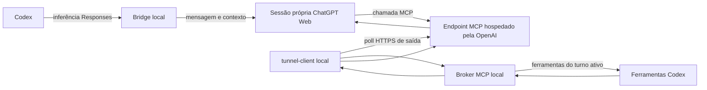

# Apps, desenvolvimento, IA e contas — proposta de produto v1

Data: 2026-09-24. Base examinada: `889d132`. Estado: **implementação iniciada; aceites pendentes**.
Solicitação: reorganizar escolhas e gestão de apps, preparar ambientes de desenvolvimento,
centralizar contas e avaliar a integração opt-in apresentada no vídeo de Elton Machado.

## 1. Diagnóstico e limites da evidência

A arquitetura de execução já oferece peças reutilizáveis. O principal problema de produto
é a distribuição das decisões: a pessoa precisa conhecer a implementação para encontrar
uma ferramenta. Mover botões, sem unificar identidade e estado, apenas muda essa dificuldade.

| Evidência no código | Consequência | Direção proposta |
|---|---|---|
| `linux/ui_native/catalog.py`: Perfis, Recursos, Ajustes, IA & Dev, Proxies IA e Roteamento IA são categorias separadas | Mesmo objetivo exige navegar por vocabulários técnicos diferentes | Navegação por objetivo, destino canônico por app |
| `profiles/dev-ai.json`: linguagens, editores, bancos, containers, IA e scripts; habilita Docker, Ollama, SSH e Tailscale | Escolher desenvolvimento pode trazer serviços além da necessidade inicial | Receitas compostas, dependências explícitas, serviços opt-in |
| `pages/profiles.py`: seleção de perfil e instalação | Pouco apoio para comparar alternativas e entender custo de recursos | Assistente por objetivo com revisão do plano |
| `linux_hub.py`, `pages/linux_hub.py`, capabilities e `ActionSpec` já integram ações | Há infraestrutura útil; não é necessário outro instalador | Reutilizar plan/apply, runner e ledger |
| Hermes/LLM aparecem em contextos de servidor e IA; IDEs e runtimes também em Recursos | App, instância e finalidade ficam visualmente misturados | Um registro de produto; várias instâncias e atalhos contextuais |
| `pages/ai_proxies.py` apresenta inventário de autenticação agregado e explicitamente sem identidade | Não atende foto, conta individual e autorização por consumidor | Visão privada de contas separada da telemetria redigida |
| `linux/ai/auth-registry.sh` agrega grupos; presença local de credencial participa de estados de autenticação | Credencial encontrada não prova sessão válida; indisponibilidade pode parecer logout | Evidência, validade e frescor explícitos por dimensão |

Contagem do catálogo nesta base: 90 ações em IA & Dev, 37 em Proxies IA, 10 em
Roteamento IA, 98 em Recursos e 15 em Perfis. São ações registradas, **não** botões
simultaneamente expostos. Duplicação de apresentação não prova instalação duplicada.

Análise estática do código e documentação; não certifica usabilidade ou operação real.
Windows VM e Homelab permanecem destinos próprios. A avaliação positiva do usuário é
premissa de escopo, não nova certificação técnica dessas superfícies.

## 2. Organização proposta

| Destino | Pergunta respondida | Conteúdo principal |
|---|---|---|
| Início | O que precisa da minha atenção? | Jornadas, operações pendentes e retomar trabalho |
| Aplicativos | O que usar e o que já tenho? | Descobrir, comparar, instalados, atualizar, remover |
| Desenvolvimento | Como preparar este projeto? | Ambientes, linguagens, versões, editor, bancos e containers |
| Inteligência artificial | Qual assistente e qual origem usar? | Assistentes, modelos locais/nuvem, conexões e diagnóstico |
| Contas e conexões | Quem está conectado e quem pode usar? | Contas, chaves, permissões, instâncias, cotas e canais disponíveis |
| Plataformas | Onde executar? | Windows VM, Homelab, Steam Deck, Waydroid, Emulação e Servidor |
| Sistema | Como personalizar esta máquina? | Linux, recursos de sistema, ajustes, boot e temas |
| Atividade | O que aconteceu e como recuperar? | Resultados, operações, falhas e reversões disponíveis |

Destinos podem ser grupos com páginas; não transformar cada seção em outro item lateral.
Perfis vira entrada contextual “Preparar máquina” no Início e modelos de ambiente em
Desenvolvimento. Flatpak vira fonte de instalação em Aplicativos. Recursos de sistema
continuam em Sistema; linguagens e ferramentas recebem atalhos nas jornadas adequadas.
Proxies e roteamento ficam em **Inteligência artificial → Conexões → Avançado**.
Disponibilidade, custo e origem efetiva continuam visíveis no modo simples.

Mudança de escopo deliberada em relação ao “não adicionar superfície nova” de
`control-center-surfaces-v1.md` e ao escopo anterior de `linux-ux-v1.md`: esta solicitação
autoriza propor nova organização. Não remove gates operacionais daqueles roadmaps.

### Um app, vários contextos

Introduzir `appId` estável e registro canônico: nome, finalidade, alternativas, plataformas,
fontes de instalação, ações existentes, requisitos, conflitos, maturidade e capacidades.
Instância separada: `instanceId`, `appId`, host, escopo, versão, gerenciador, recursos e
estado observado. Exemplo: Ollama local e Ollama no Homelab são duas instâncias do mesmo
produto. Seus dados, portas e consumidores não podem ser confundidos.

Atalhos de Desenvolvimento, IA e Servidor abrem o mesmo detalhe, com contexto preservado.
Não duplicar backend nem remover IDs antigos: aliases de navegação mantêm busca e favoritos.
Catálogo global indexa finalidade e sinônimos (“Python”, “programar”, “chat local”).

Cada detalhe mostra: para que serve; quando escolher; local/nuvem; conta necessária;
recursos estimados e medidos separados; origem; status; ação principal; alternativas.
Comparação começa pela categoria funcional: editor, agente, runtime de modelos, router,
proxy de provedor, monitor de consumo. Ferramentas de categorias diferentes não são
apresentadas como substitutas. VS Code/VSCodium são comparáveis; Ollama/9Router não.

Estado orienta CTA: não instalado → Preparar; instalado sem configuração → Configurar;
configurado sem evidência recente → Verificar; pronto → Abrir/Usar; falha → Resolver.
“Instalado” nunca equivale automaticamente a “pronto”. Remover informa dependentes e dados
preservados. Detectar instalação externa não autoriza adotá-la ou removê-la silenciosamente.

### Desenvolvimento por objetivo

Fluxo: objetivo → projeto/escopo → escolhas recomendadas → revisão → preparação → validação.
Receitas iniciais: Web JS/TS, Python/dados, Rust, C/C++, Java/.NET e desenvolvimento com IA.
Escolha de editor independente; IA, banco, Docker e acesso remoto opcionais. Não selecionar
todos os runtimes nem habilitar serviços por escolher “desenvolvimento”.

Reusar `linux/capabilities` e perfis existentes como backend. Primeiro transformar o perfil
atual em receita legada claramente descrita; depois introduzir composição. Ambiente por
projeto pode fixar versões sem substituir Python do sistema. Revisão mostra downloads,
espaço, administrador, serviços, reinício, conflitos e o que já existe. Instalação retomável,
idempotente, cancelável entre etapas seguras; falha informa etapa e recuperação.

Registrar propriedade e dependentes antes de oferecer remoção compartilhada. Nunca remover
runtime ainda usado por outra receita ou pacote preexistente. Em Windows, escolher uma fonte
por pacote e detectar duplicidade entre winget/Chocolatey; não unificar seus executores com
`linux/pz`. Arch limpo e Windows limpo exigem aceites separados.

### Modo simples e avançado

Simples padrão: estado, recomendação explicada, próximo passo e ação principal. Opções
avançadas persistentes por usuário/dispositivo: versões, gerenciadores, endpoints, rotas,
políticas e logs. Avisos de custo, permissões, reinício e perda de dados nunca ficam ocultos.
Não usar o modo avançado como requisito para recuperar uma falha comum.

## 3. Contas, conexões e cotas

Não existe login universal: cada integração declara quais dados pode consultar e quais
consumidores suporta. Conectar conta não autoriza exportar cookies/chaves para todos os apps.

Modelo proposto, versionado e compatível com o resumo atual:

- `Account`: ID opaco, provedor, workspace/tenant, apelido, identidade opcional, avatar opcional,
  referência ao armazenamento seguro. Nenhum segredo no payload da UI.
- `Connection`: conta + adaptador + instância + habilitação; capacidades declaradas e observadas.
- `Grant`: consumidor/instância, conta/conexão, escopo e consentimento. Revogação independente.
- `Observation`: origem, instante observado, instante efetivamente verificado, expiração, erro
  tipado. Não carimbar “verificado agora” apenas porque um arquivo existe.
- `Quota`: dimensão/modelo, unidade, total/restante quando conhecido, janela/reset quando
  informado, fonte e confiança (`official`, `local_estimate`, `unknown`).

Dimensões independentes: credencial armazenada; sessão válida/expirada/desconhecida;
instância online/offline/desconhecida; acesso ao modelo/ferramenta permitido/negado/desconhecido;
cota disponível/esgotada/desconhecida. Timeout não significa logout. Cota desconhecida não
vira zero nem ilimitada. Saldo de API, mensagens de assinatura e estimativas locais não se somam.

Tela “Minhas contas”: avatar ou iniciais, apelido, provedor/workspace, estado com horário,
cota com fonte, consumidores autorizados; ações conectar novamente, verificar, pausar uso,
revogar consumidor e desconectar. “Adicionar conexão” lista canais compatíveis, requisitos,
tipo de login e maturidade. “Chaves de API” mostra rótulo, escopo e identificação mascarada.

Identidade só mediante interface suportada e consentida; se indisponível, permitir apelido
local. Avatar não bloqueia login: cache com limite de bytes, tipo validado, sem SVG ativo,
sem URL arbitrária acessando rede local, iniciais como fallback. Modo privacidade oculta
identidade na tela. Exportações e diagnósticos continuam redigidos; não desfazer mascaramento
recém-corrigido no AISR. Segredos via cofre do SO/adaptador já proprietário; nunca argv ou logs.

Monitor assíncrono com cancelamento, prazo por adaptador e prazo global, cache, backoff e
jitter. Polling somente conexões habilitadas; sem prompts pagos para atualizar status.
Retornar resultados parciais; resposta tardia de outra conta não atualiza a seleção atual.
Limites iniciais propostos: cache de 60s e deadline agregado de 10s, ajustáveis após medidas.

Consumidor recebe referência/endpoint adequado, não cópia indiscriminada da credencial.
Conexão incompatível deve explicar o motivo. Mudança de conta, rota ou fonte cobrada exige
escolha explícita. Não alternar contas para contornar limites. Logout local, revogação no
provedor e remoção de credencial são ações distintas; informar o alcance de cada uma.

## 4. Solução do vídeo: avaliação e integração proposta

Vídeo: [Usei o Codex a semana inteira e gastei 2% da cota](https://www.youtube.com/watch?v=Hh8VYR_pOQ8&t=21s).
Título, descrição e capítulos consultados. Legenda retornou vazia; não houve análise integral
do áudio nem reprodução do experimento. A descrição aponta para
[codex-chatgpt-web](https://github.com/miuuyy/codex-chatgpt-web).

Snapshot upstream: `main` em `757942251222ee0f71953c35636679c6d92dd636`;
release publicada `v6.0.0`, 2026-09-23. Referências móveis devem ser novamente conferidas
na implementação; release observada não está certificada pelo PhaseZero.

É integração comunitária de ChatGPT Web no Codex, com consumo associado à conta ChatGPT.
O relato de 2% não demonstra economia universal: assinatura, limites, outros usos e modos
continuam relevantes. Os pacotes anunciados incluem Linux x64 e Windows x64, ainda sem
assinatura de plataforma. Verificar checksum não equivale a assinatura ou auditoria.
[Fonte: README](https://github.com/miuuyy/codex-chatgpt-web).

A arquitetura documenta bridge local, browser privado e ferramentas opcionais via MCP.
O launcher supervisiona runtime e pode ter início no login. Seus pacotes incluem componentes
de execução; modo completo usa tunnel-client separado. Isso não prova ausência de bibliotecas
nativas faltantes num Arch mínimo. Sua estimativa local de consumo não inclui uso externo.
[Fonte: arquitetura](https://github.com/miuuyy/codex-chatgpt-web/blob/main/docs/architecture.md).

O upstream reconhece fragilidade diante de mudanças na UI do ChatGPT e o limite de proteção
contra processos do mesmo usuário. Seu bridge não deve ser tratado como serviço multiusuário
seguro apenas por escutar em loopback.
[Fonte: modelo de segurança](https://github.com/miuuyy/codex-chatgpt-web/blob/main/docs/security-model.md).

O túnel oficial usa conexão de saída e requer identidade de túnel, chave de runtime e servidor
MCP alcançável. Não é licença automática para executar ferramentas.
[Fonte: Secure MCP Tunnel](https://developers.openai.com/api/docs/guides/secure-mcp-tunnels).
Disponibilidade de ferramentas de escrita depende de plano/workspace/admin; validar a capacidade
real, não inferir de “Pro” ou de login bem-sucedido.
[Fonte: Developer mode e MCP](https://help.openai.com/en/articles/12584461-developer-mode-and-mcp-apps-in-chatgpt).

### Revisão de arquitetura e segurança PXA-010 — 2026-09-26

O fluxo tem dois canais independentes:

Inferência percorre Codex → bridge → sessão própria do ChatGPT Web. O túnel não
transporta inferência e não garante economia de cota: limites da conta ChatGPT
continuam valendo. Chamadas MCP percorrem endpoint OpenAI → `tunnel-client` de
saída → broker local → ferramentas anunciadas pelo turno Codex vigente. Sandbox,
escopo da tarefa e aprovações do Codex continuam aplicáveis a cada ação.

O túnel oficial não exige porta pública, regra de entrada ou encaminhamento no
roteador. Criar/editar/remover túnel requer Tunnels Read + Manage; executar
`tunnel-client` ou selecionar túnel requer Tunnels Read + Use. A permissão de
Developer Mode do ChatGPT é separada e pertence ao workspace. [Secure MCP
Tunnel](https://developers.openai.com/api/docs/guides/secure-mcp-tunnels).
Runtime key é credencial de transporte, distinta da conta/sessão ChatGPT: usar
escopo mínimo Read + Use, guardar no cofre do SO, prever rotação e revogação, e
nunca gerar chave ampla/não expirável para todos os túneis. Operações administrativas
de túnel/conector são guiadas e executadas pelo operador autorizado.

Elegibilidade vem antes de oferecer ferramentas: a documentação OpenAI consultada
limita MCP completo com escrita a Business e Enterprise/Edu em beta; Pro permite
MCP read/fetch. Confirmar plano, workspace, Developer Mode, ações permitidas e
broker disponível. Login bem-sucedido não prova escrita disponível. Começar pelo
modo Web sem ferramentas locais; só então mostrar modo com ferramentas, capacidades
que o workspace realmente expõe e permissões necessárias.
[Disponibilidade oficial](https://help.openai.com/en/articles/12584461-developer-mode-and-mcp-apps-in-chatgpt).

Liberação é gradual: Browser-only pode aparecer quando seus próprios gates de perfil,
sessão, pacote e reversão passarem; não inicia broker, MCP nem túnel. Full com ferramentas
é outro gate e só aparece após elegibilidade do workspace, permissões e broker comprovados.
Até o primeiro gate passar, manter produto fora do catálogo; a aprovação do modo Web-only
nunca promove automaticamente o modo Full.

Não importar cookies, local storage nem perfil do browser pessoal. Login acontece
por ação explícita no perfil privado do launcher. `Authentication: None` só cabe
no fluxo esperado túnel + broker; não substitui autorização por tarefa. Não habilitar
“Allow all actions” nem aprovação automática. Usar `tunnel_id` para túnel e a
identidade MCP fixa da release (v6.0.0: `Codex Native2`); nome visível do túnel
não precisa coincidir com o nome do conector.
[Modelo de segurança v6.0.0](https://github.com/miuuyy/codex-chatgpt-web/blob/v6.0.0/docs/security-model.md),
[arquitetura v6.0.0](https://github.com/miuuyy/codex-chatgpt-web/blob/v6.0.0/docs/architecture.md).

Bridge Responses escuta em loopback, mas processos sob o mesmo usuário podem
alcançá-lo. Loopback não isola aplicações locais. Full mode exige conta local
individual confiável e ausência de processos/código não confiáveis sob esse usuário;
máquina compartilhada fica inelegível até existir isolamento provado.

Fixar release/commit antes de qualquer pacote, conferir SHA-256 publicado e
comparar após download. Hash detecta alteração em relação ao valor publicado; não
prova identidade do publicador. O upstream informa que pacotes não têm assinatura
de plataforma: avisar sobre SmartScreen/Gatekeeper e nunca instruir a ignorar o
bloqueio. v6.0.0 segue referência de auditoria; release v6.1.0 apareceu em
25/09/2026 e exige revisão própria antes de qualquer mudança de pin.
[README v6.0.0](https://github.com/miuuyy/codex-chatgpt-web/blob/v6.0.0/README.md),
[release v6.1.0](https://github.com/miuuyy/codex-chatgpt-web/releases/tag/v6.1.0).

Instalação do launcher não ativa rota. Ativação Codex separada exige preview,
backup atômico e comparação exata do antes/depois. Desativação restaura primeiro
a rota; depois reinicia Codex, encerra bridge e só então fecha/remove launcher.
Edição externa conflitante para e pede resolução; não sobrescrever configuração
do usuário. Sem gates reais de conta, permissão, isolamento, falha e rollback, não
oferecer escrita local, autostart ou troca automática de conta/modelo. Medidor do
upstream é estimativa local de mensagens enviadas pelo launcher, não saldo/cota
oficial nem prova do relato “2%”.

### Contrato desejado no PhaseZero — requisitos, não funcionalidades já comprovadas

Nome de produto: **ChatGPT no Codex — experimental**. Entrada em IA → Integrações, registro
no catálogo e conexão em Contas. Não classificá-lo como mais um provedor genérico do 9Router
sem comprovar compatibilidade. Não associar automaticamente a Hermes, OpenCode ou Claude Code.

Assistente: preflight de plataforma, versão e elegibilidade/plano/workspace antes de baixar
ou instalar; explicar requisitos do modo Web e do modo com ferramentas separadamente. Começar
no modo Web sem ferramentas locais; oferecer o modo com ferramentas somente depois de validar
plano, workspace, permissões e broker. Login ocorre por ação explícita no perfil privado do
launcher; nunca importar cookies, local storage ou perfil do browser pessoal. Guiar a pessoa
autorizada nas ações administrativas do túnel/conector. Mapear mutações reais de setup/uninstall
upstream antes de automatizar.

1. **Desligado por padrão:** sem processo, porta, túnel, autostart ou alteração de rota.
2. **Escopo:** preferir launcher/perfil Codex dedicado, com HOME de aplicação isolado e
   compatibilidade comprovada. Se upstream não permitir, parar integração automática e
   apresentar alternativa explícita; não sobrescrever configuração global por conveniência.
3. **Modos claros:** browser sem ferramentas; modo manual assistido; modo com ferramentas.
   Usar nomes descritivos, nunca prometer “risco zero”. Ausência de permissão de escrita não
   impede oferecer modo limitado com aviso claro antes da ativação.
4. **Ferramentas:** consentimento distinto; broker limitado a ferramentas do turno e escopo
   autorizados; sandbox e aprovações do Codex preservados; rejeitar ação fora do workspace/turno.
   `Authentication: None` não remove essa autorização. Não permitir “Allow all actions” nem
   aprovação automática.
5. **Instalação:** versão fixada, origem e hashes conferidos; preflight de elegibilidade,
   libs, disco, arquitetura e portas. Hash não prova identidade do publicador. Arquivos
   duráveis fora do worktree e de mounts temporários.
   Dados sensíveis em filesystem com permissões reais, nunca assumir proteção de SD/fuseblk.
6. **Reversão:** journal de alterações e hashes, backup atômico, restore somente do trecho
   ainda pertencente ao PhaseZero. Edição posterior pelo usuário gera conflito visível.
   Desativar restaura primeiro rota/entrada próprias e reinicia Codex; depois drena/encerra
   bridge e remove launcher. Edição externa conflitante pede resolução. Sessão fica preservada
   até pedido de exclusão.
7. **Falhas:** erro de DOM, sessão, modelo, cota ou túnel interrompe com recuperação; nunca
   muda silenciosamente para API paga, outro modelo ou outra conta. Retry não reenvia pedido
   aceito sem prova de idempotência. Estado “incerto” é melhor que duplicar consumo.
8. **Atualizações:** revalidar versão Codex × bridge, regressões e rollback antes de promover;
   sem auto-update durante tarefa. Autostart permanece opção independente de instalar.

“Sem impacto” será objetivo mensurável: desligado sem execução residual; ativado com consumo
de RAM/CPU, disco e rede medido; limites apresentados antes de escolher. Não prometer impacto
zero de um browser e túnel ativos. Não incluir no `dev-ai` padrão até concluir os gates.

## 5. Backlog executável e ordem

Todos os itens abaixo: `planned`, evidência `design_only`. Cada implementação precisa de
commit, teste comportamental, SHA e limites registrados; documentação não fecha aceite.
Arquivos novos indicados como **novo**. Alvos são pontos de partida, não obrigação de
concentrar lógica em shell/UI. IDs `PXA-xxx` são exclusivos deste plano.

| ID / prioridade | Entrega e arquivos-alvo | Dependência | Aceite mínimo |
|---|---|---|---|
| PXA-001 / P1 | Inventário canônico e mapa de migração; `catalog.py`, `hub_overlay.json`, `linux/capabilities/catalog.py`; manifesto **novo** | — | Toda ação atual classificada como canônica, atalho ou legada; zero órfã; mesmo app/host não gera duas instalações |
| PXA-002 / P1 | Schema app/instância/estado e adaptadores; `models.py`, `linux_hub.py`, `status_loader.py` | 001 | Instalação externa, duas instâncias e status desconhecido representados sem “pronto” falso; leituras não mutam host |
| PXA-003 / P1 | Navegação, busca, comparação e detalhe único; `catalog.py`, `pages/registry.py`, `main_window.py`, `pages/workspace.py` | 002 | Todos atalhos resolvem mesmo app/contexto; favoritos antigos migram; modo simples permite instalar/abrir/recuperar sem conhecer proxy |
| PXA-004 / P1 | Receitas compostas e resolução; `profiles/dev-ai.json`, `linux/capabilities/{models,recipes,engine,state}.py` | 002 | JS sem IA não instala Ollama nem liga SSH; conflitos e espaço aparecem antes; repetir apply não duplica; remoção preserva dependência compartilhada |
| PXA-005 / P1 | Jornada Desenvolvimento; `pages/profiles.py`, `pages/ai_dev.py`, `provision_player.py` | 003,004 | Cliques públicos: objetivo→plano→preparar→validar→abrir; cancelamento/retomada e erro parcial testados; runtime do SO preservado |
| PXA-006 / P0 | Contrato de contas e observações; `linux/ai/auth-registry.sh`, adaptadores **novos**, `proxy_models.py` | 002 | Credencial presente, expirada, 401, timeout e backend ausente distintos; prazo global; resumo v1 compatível; nenhum segredo/identidade em export redigido |
| PXA-007 / P1 | Contas UI, avatar e canais; página **nova**, `pages/registry.py`, `pages/ai_proxies.py`, `preferences.py` | 003,006 | Duas contas mesmo provedor; troca não aceita callback anterior; identidade opcional; foto indisponível usa iniciais; teclado e privacidade funcionam |
| PXA-008 / P0 | Grants por consumidor e gestão de credenciais; adaptadores AI, `routing_manager.py`, managers existentes | 006 | Login não habilita consumidor automaticamente; grant/revogação idempotentes; referências seguras; incompatibilidade explícita; sem fallback pago tácito |
| PXA-009 / P1 | Cotas e saúde desacopladas; `auth-registry.sh`, `routing_manager.py`, `pages/ai_routing.py`, status loader | 006,008 | Unknown≠zero; fonte/horário/unidade visíveis; estimativa separada; timeout parcial não apaga conta; polling sem inferência paga |
| PXA-010 / P0 | Spike bridge em fixture; integração **nova** em `linux/ai/` e adapter Windows a definir após mapear bootstrap | 006 | Fixar versão/commit/hash; separar gates Browser-only e Full; comprovar elegibilidade, identidade, chave mínima, broker por turno, sandbox/aprovações, fronteira local, preview/backup/restore e viabilidade Arch/Windows; sem gate próprio, manter cada modo fora da descoberta/ativação |
| PXA-011 / P1 | Manager bridge: plan/install/enable/status/disable/remove/doctor, nomes propostos | 008,010 | Host simulado limpo, dependência ausente, download truncado, hash errado, porta ocupada, crash e edição externa; rollback só alterações próprias; nenhum processo quando desativado |
| PXA-012 / P1 | Wizard e seleção contextual do bridge; IA, Contas, catálogo e operação comum | 007,009,011 | Só cliques públicos; modo sem ferramentas explícito; grants antes de ativar; cota desconhecida honesta; opção aparece sem mudar modelo/rota atual |
| PXA-013 / P0 | Provas de integração e reversão; testes **novos**, suítes AI/UI existentes | 011,012 | Rejeitar tool fora do escopo, conta errada, replay e sessão expirada; falha sem fallback; disable durante tarefa; restore preserva edição externa; logs redigidos |
| PXA-014 / P1 | Validação limpa e usabilidade; relatório **novo**, Windows bootstrap existente | 005,007,009,013 | Arch e Windows descartáveis; boot/login/sem rede; 800×600 e 1280, 100/150/200%, claro/escuro; foco, hit-test, leitor de tela; evidência real separada de fixture |

Ordem recomendada: 001–002 → 006 → 003–005 → 007–009 → 010–013 → 014.
Prioridade P0 indica bloqueador de confiança/segurança da entrega, não defeito de produção
já reproduzido. PXA-010 pode antecipar investigação isolada para descobrir inviabilidade,
mas não libera ativação antes de contas e grants. Entregar em PRs pequenos por contrato/jornada.

Reusar AISR/AICR para defeitos existentes e LUX/REV/UX para gates já descritos. PXA não
reabre nem declara concluídos itens desses roadmaps. Se requisito coincidir, referenciar
ID original e compartilhar evidência, evitando dois estados contraditórios.

### Gates e provas

- G0 contrato: inventário completo, migração definida e spike sem hipótese crítica oculta.
- G1 hermético: testes de backend, UI por controles públicos, falhas e reversão; fixture
  HOME com um export por variável; nenhuma chamada real de pacote/serviço/login.
- G2 sistema limpo: snapshots Arch e Windows, installer real e dependências reais; documentar
  administrador/reboot/rede; repetir instalar→usar→desativar→reativar→remover.
- G3 conta real: operador com plano/credenciais; conta/modelo/túnel/permissões e consumo
  observados. Stubs não provam estes itens. Sem conta, registrar gate pendente, não sucesso.
- G4 UX: ao menos cinco participantes leigos em descoberta, comparação, ambiente, conta e
  recuperação; meta inicial ≥80% de tarefas sem ajuda e zero ação destrutiva involuntária.
  Incluir fluxo avançado de escolha de versão, rota e reversão. Ajustar copy após observação.

Testes da UI incluem visibilidade **e** habilitação, retângulo inteiro no viewport e hit-test
real; alternar estreito→largo→estreito com tema do MainWindow. Teste geométrico não prova
compreensão. Manter páginas Windows VM/Homelab alcançáveis e jornadas existentes sem regressão.

## 6. Handoff para execução

- Objetivo desta sessão: análise e proposta; nenhum item PXA implementado.
- Base: `889d132`; worktree `/mnt/sdcard/Projects/pz-product-apps-plan`;
  branch `codex/apps-dev-ai-accounts-plan`. Checkout principal preservado.
- Arquivo entregue: este roadmap. Nenhum pacote, serviço, login, modelo, porta, VM ou boot alterado.
- Provas desta sessão: leitura de código, inventário de catálogo, documentação upstream e
  fontes oficiais. Vídeo limitado à descrição/capítulos; nenhuma transcrição integral disponível.
- Validação documental: caminhos existentes referenciados e IDs/dependências conferidos;
  nenhum teste de implementação novo, pois não houve mudança de código.
- Riscos abertos: disponibilidade de identidade/cotas por adaptador, escopo real do setup
  upstream, compatibilidade do Codex instalado, permissões de escrita por plano, libs nativas,
  termos/políticas aplicáveis e instabilidade de automação de navegador. São gates de pesquisa.
- Próximo passo: assumir PXA-001, gerar mapa completo actionId→appId→instância/contexto→destino;
  em seguida schema PXA-002 e observações PXA-006. Não começar por mover todos os botões.
- Antes de executar: ler AGENTS/RTK, consultar ai-memory, conferir HEAD/status e roadmaps
  aplicáveis. Registrar fase/IDs, alterações, testes, SHA, estado do host e próximos passos.
- Trabalho de planejamento não autoriza implantação automática. Implementação futura em
  worktree dedicado; testes vivos de conta e host somente no escopo autorizado da execução.

## 7. Execução inicial — 2026-09-24

Branch `codex/apps-dev-ai-accounts-impl`, worktree
`/mnt/sdcard/Projects/pz-product-apps-impl`, base `889d132`. Esta seção é
posterior ao handoff de planejamento acima.

| Item | Estado | Evidência e limite |
|---|---|---|
| PXA-001 | `verified` | `38241a9`: manifesto gerado cobre as 597 ações estáticas do catálogo; teste exige snapshot atual, ID único e target para cada ação, rejeita ação sem classe e valida autoridade única por app/escopo. Gap encontrado no audit: ações runtime `hub.capability.install.<capabilityId>` aplicam plano via `capabilities apply`, sem verbo install/setup no argv, então não recebiam autoridade no mapa. Corrigido e testado para todas as capabilities: cada atalho Hub converge no mesmo `appId`/escopo host e em `linux/capabilities/engine.py`; manifesto declara essa autoridade dinâmica. Base focused: 14 testes passaram; regressão falhou antes da correção e suíte final `tests/test_product_inventory.py`: 15 passaram; `git diff --check` passou. Nenhuma mutação de host. Ações dinâmicas de status, remoção, tuning e roteamento seguem classificadas pelos padrões do manifesto e `target_for`; prova de autoridade de instalação aplica-se ao fluxo install. |
| PXA-002 | `verified` | `5b8ff98`, `70ebaca`: `ProductInstance` preserva origem/configuração/saúde; adaptadores de capability e status genérico geram instâncias distintas por host/escopo. Fixture prova instalação externa, duas instâncias do mesmo app e status unknown sem pronto falso. Falha de consulta ao gerenciador vira `unknown`, bloqueia apply/remoção e permanece desconhecida no Hub. `StatusLoader` aceita apenas ação read-only e descarta probe antigo ao trocar contexto. 128 testes direcionados passam em Qt offscreen. Navegação canônica permanece PXA-003. |
| PXA-003 | `verified` | `6aedd03`, `e07f2ea`, `260d522`, `ae9071f`, `0a44f6f`, `46d5062`, `e58a05e`, `48d3344`, `9f4c40c`: `Aplicativos` é registro pesquisável de 103 apps com detalhe reutilizado; atalhos e busca navegam por `appId` e preservam retorno/escopo. Manifesto contém termos de intenção como “programar”, “chat local” e “agente de código” (Claude Code/OpenCode). Status começa unknown e detalhe consulta só ação read-only; CTA deriva Verificar/Preparar/Configurar/Resolver/Abrir do estado observado. Apps GUI abrem por desktop entry XDG validado e `gio launch`, sem shell; Dashboard 9Router e UI Odysseus ficam bloqueados por PXA-008; serviço saudável não libera inferência. Open WebUI agora tem probe read-only por nome exato de container + resposta HTTP local e abre URL loopback observada somente quando saudável; origem continua unknown e backend/timeout não viram ausência ou online. ai-memory, UsageBar e três clientes desktop agora têm probes individuais; origem externa/desconhecida continua sem adoção. Comparação limitada a pares curados de editor, browser e mesh network. Ollama managed/offline usa setup canônico como recuperação com preview e impacto explícito; OpenCode managed/offline só oferece verificação read-only, e `ai.opencode-install` fica oculta por PXA-008; `9598ae5` bloqueia configuração/sincronização 9Router, execução gerenciada e inferência live sem vínculo por requisição, sem alterar configuração/credencial nem iniciar cliente; proxies só recebem Resolver/Configurar com origem aprovada; Hermes usa Doctor local. Instância externa nunca recebe adoção/start. Nenhuma preferência antiga de favoritos da UI encontrada (sem setting a migrar). Páginas AI, Contas e conexões, Desenvolvimento e Conexões avançadas agora agrupadas separadamente; IDs de página legados preservados. `8b812c9` fecha bypass de ações mutáveis secundárias e `172b5c0` fecha rotas secundárias de dashboard/browser: estado unknown e instalação external não expõem mutações nos 103 detalhes; recovery mutável e abertura só aparecem quando aquela ação exata corresponde à rota autorizada pelo estado observado. `8f48093` rejeita IDs de instância duplicados antes de construir seletor: estado fica ambíguo, ações mutáveis somem e só nova consulta read-only permanece. Limites fora do aceite mínimo PXA-003: uso de agentes CLI requer grants PXA-008 aplicados e isolamento contra fallback pago; outros managers e ações remotas ainda precisam de auditoria/execução; instâncias remotas e IDs ambíguos no mesmo escopo seguem sem executor. Resolver nunca escolhe silenciosamente `server.llm.restore`. |
| PXA-004 | `in_progress` | `e9dbce0`, `2cb6999`, `6833bd8`, `ce76ccb`, `a745299`: Planner expande dependências, rejeita conflitos selecionados e verifica conflito instalado; receitas `development-web-js` e `development-python` são opt-in e JS não seleciona Ollama, SSH, Docker ou serviços. Preview agrega transação por `pacman -Sp --needed --print-format` + `pacman -Si` em Arch, usa `apt-get --simulate` em Debian, `dnf install --cacheonly --assumeno` em Fedora e `zypper --no-refresh --non-interactive install --dry-run` em SUSE. Simuladores usam índices/cache locais sem aplicar pacotes; saída incompleta ou remoções mantém limite inferior e `partial`. `tests/test_capabilities.py`: 54 passaram com subprocessos herméticos, incluindo DNF4/5 e Zypper; nenhuma chamada DNF/Zypper no host. Prova read-only no host Manjaro: adaptador resolveu `rust` + dependência `lld`, 84.377.022 bytes de download e 324.723.015 bytes instalados; executou somente consultas `-Sp`/`-Si`, sem instalar ou atualizar índices. Apply revalida espaço livre e bloqueia quando limite conhecido já excede disco. Repetir plano não duplica pacote. Fixture instala Compose + Kind com Docker compartilhado uma vez, remove Compose sem retirar Docker usado por Kind, bloqueia remoção de Docker enquanto Kind está instalado e permite remover Docker após retirar Kind. `PreviewDialog` mostra no modo simples download, instalação estimada, espaço livre por filesystem e limite/incompletude antes de confirmar; bloqueios de conflito aparecem junto dos valores. Suíte conjunta de capabilities, Development e diálogos: 75 passaram. `profiles/dev-ai.json` permanece explicitamente rotulado como bundle legado opt-in. Limites: índices podem estar obsoletos; simulação APT sob usuário pode omitir configuração privada; totais DNF/Zypper arredondam; rpm-ostree permanece em lower-bound e Flatpak sem estimativa transacional segura, mantendo valores desconhecidos como `partial`; G2 Arch em overlays qcow2 limpos comprovou ciclo install/use/remove/reapply, remoção preservando Node.js, idempotência, falta de pacote e assinatura inválida fail-closed. CI Arch descartável no SHA c6a6ae1 prova cancelamento real no limite entre pacotes e crash do worker durante pacote e após commit antes do registro; O cancelamento público pela UI com pacman real passou em container Arch descartável (prova abaixo); Windows G2, ciclo completo em host limpo e G4 seguem pendentes. |
| PXA-005 | `in_progress` | `5fa5db8`, `8753d96`, `0254d01`, `5cc1035`, `a846827`, `70229e3`: Página `Desenvolvimento` oferece objetivo Web JS/TS, Python, Rust, C/C++, Java/JVM e .NET; editor VS Code/VSCodium permanece opcional e entra no mesmo preview. Planner/applier fake prova Rust, GCC C/C++, Java (OpenJDK + Maven) e .NET (SDK escolhido), sem pacote ou serviço real. UI pública abre detalhe canônico de cada runtime sem editor; testes existentes provam composição com editor. Copy Python preserva runtime do SO. Fixture interrompe após Node e retoma sem reinstalar Node. Nesta expansão, `test_development_page.py` + `test_capabilities.py` + snapshot: 61 passaram; shortcut canônico + inventário: 12 passaram. Desenvolvimento com IA segue pendente até enforcement de grants PXA-008; não usar login como grant implícito. CI PR `36524911753`, job Arch `109265800902`, executou modo guardado offscreen: UI pública cancelou `/usr/bin/pacman -S nodejs`, fim seguro, ledger retomável, pnpm ausente e rollback removeu Node.js; 1 passou em 3,73 s. Jornada em host limpo, G2 Windows e G4 seguem pendentes. |
| PXA-006 | `in_progress` | `3e39ac0`, `7b7f8ee`, `11c22fa`, `ae814d7`, `4c7ad31`, `91e5a6a`, `2ebb229`: contrato de `Account`, `Connection`, `Grant`, `Evidence`, `Quota` e exportação redigida; deadline agregado e adaptadores read-only para Claude, sessões de proxy e provedores 9Router. Evidência de credencial, sessão, serviço e acesso permanece separada; 401, expiração, timeout e backend ausente têm estados distintos. `lastVerifiedAt` não é inferido de leitura. Fixture executa `auth-registry.sh` real contra wrappers: contrato v1 preservado, nomes/IDs privados redigidos, erro do provider vira `backend-unavailable` com contagens null, timeout permanece `timeout`. `Evidence` exige ISO com fuso; estado efetivo e elegibilidade respeitam `expires_at`; coletor retorna no prazo mesmo quando probe atrasa cancelamento. Regressão hermética em `account_contract`, `auth_registry`, `account_grants`, `accounts_page`, `routing_manager` e `ai_session_ui`: 101 passaram; `git diff --check` passou. Falta sessão/cota de conta real fornecida pelo operador; fixtures não fecham G3. |
| PXA-007 | `verified` | Nova tela privada Contas e conexões usa adaptadores existentes em probes read-only acionados por Atualizar status. Abrir página não inicia probes. Dois registros OpenAI com IDs opacos aparecem separados; seleção por provider rejeita estado anterior e callback de probe de geração velha é ignorado. Apelido sem foto usa iniciais acessíveis; projeção exportada contém só contagens. `2c53c1c` adiciona toggle persistido “Ocultar identidade das contas”; nome, workspace, iniciais e nome acessível de seleção são mascarados, com teste de reabertura da tela e sem identidade em rótulos/acessibilidade. `60d53c6` testa alternância por teclado (Espaço). `e153251` lista canais observáveis, requisitos, login proprietário e maturidade; não inicia login nem recebe segredo. `001b863` abre e fecha diálogo real pelos controles públicos e Escape. `2d8a060` limita o modal à área lógica disponível. `test_accounts_page.py`: 8 passaram; teste do modal passou em offscreen com `QT_SCALE_FACTOR=1`, `1.5` e `2`; regressão combinada com `test_native_navigation.py` e `test_linux_native_ui.py`: 44 passaram, 1 caso foi excluído por limite do monitor atual. Execução completa falha apenas em `test_main_window_supports_documented_narrow_viewport[949-593]`: janela fica em 948×593 ao pedir 1280×800; `xrandr` mostra monitor primário eDP-1 girado, 800 px lógicos de largura. Caso repetiu isolado; não conta como prova de 1280 px. Limites fora do aceite mínimo PXA-007: sem fonte de avatar real; leitor de tela, hit-test físico, resolução 1280 em tela apta e revisão com participantes/conta real pendentes. Grants continuam PXA-008. |
| PXA-008 | `in_progress` | Fail-closed adicional: `ai routing apply` bloqueado em CLI e backend antes de abrir config/contatar 9Router; UI mantém só prévia, desabilita aplicação em lote e torna cadeia sugerida somente leitura. OmniRoute também falha fechado: health check sem POST de chat; install/start/restart/dashboard/provider sync/combo auto/OpenCode/client run bloqueados antes de efeitos; status e doctor não anunciam ação bloqueada; launcher gerado não carrega chave nem executa cliente. `GrantLedger` exige consentimento explícito e compatibilidade declarada consumer/adaptador/escopo; grant e revogação são idempotentes e independentes, com ledger JSON privado 0700/0600 sem identidade ou segredo. `Account.secret_ref` aceita apenas referência opaca namespaced de store; `SecretServiceStore` agora grava/consulta/remove handles aleatórios via libsecret e falha fechado sem plaintext fallback. A UI de Contas integra inclusão/remoção via CredentialVault (commit 1b120ea), em worker; isso não prova Secret Service disponível nem conecta chave guardada a conta, sessão ou runtime; backend real não foi chamado. WindowsCredentialManagerStore usa CredWriteW/ReadW/DeleteW com referências aleatórias; o registro LOCALAPPDATA usa proteção DPAPI por usuário. Fixtures cobrem contratos e seleção, sem chamada nativa Windows. Contas mostra controles por conexão com confirmação e aviso de custo; informa que sessões ainda não aplicam os grants. `routing_manager.recommend(..., consumer_id=..., grants=...)` filtra provedor sem grant antes de pontuar; grant ausente deixa cadeia vazia. Commit `aea982e` faz `pz ai routing run` recusar Claude Code/OpenCode antes de consultar providers ou criar processo: combo/model ID do 9Router não fixa conexão concedida e poderia trocar de conta/custo. `test_routing_manager.py`, `test_account_grants.py`, `test_accounts_page.py`: 49 passaram; `8ee0e73` recusa grants para conexão desativada e desabilita controles novos, preservando revogação; wrappers verificam ausência de consulta/processo. `9598ae5` fecha bypass no gerenciador OpenCode: `install`/`sync` bloqueiam antes de probe ou escrita, `run` bloqueia antes do processo cliente e `verify --live` consulta apenas estado read-only; `routing_manager.refresh_opencode_catalog` registra `connection-grant-not-enforceable` e preserva bytes. UI oculta `ai.opencode-install` em recuperação e oferece somente verificação; cartão IA & Dev também mudou para verificação. 16 testes focados passaram, cobrindo ausência de processo/escrita em fixtures e roteador. Limite externo: docs do [9Router](https://docs.9router.com/) descrevem fallback automático. O [pedido #1075](https://github.com/decolua/9router/issues/1075) agora aparece fechado; a [documentação atual de combos](https://github.com/decolua/9router/blob/master/gitbook/content/en/features/combos.md) ainda descreve fallback entre modelos e não prova vínculo de conta/conexão selecionada. Fechamento do issue não prova semântica em release/API. API local não demonstra isolamento por consumer/connection. Não fechar “sem fallback pago” até interface suportada e teste de execução provarem isso. Pendentes: enforcement efetivo por consumidor em requests de inferência, ligação da credencial guardada a conta/sessão/runtime, prova do cofre do SO em sessão real, sessão/cota observável de conta real e validação do adapter Windows em sistema real. PXA-006/G3 permanece gate externo; fixtures não contam como conta válida. |

PXA-008 upstream check (2026-09-26): o issue aberto [#2703 do 9Router](https://github.com/decolua/9router/issues/2703) relata roteamento proxy por conexão não aplicado ponta a ponta e possível fallback ao IP do host. Isto é relato de defeito, não contrato de API nem prova de comportamento em release; também não prova vínculo consumer/conta por requisição. A limitação segue sem solução verificável para o PhaseZero.

PXA-008 auditoria complementar (2026-09-25): o caminho explícito `ai.claude-bonsai-run`
chamava `linux/pz ai claude run bonsai`, cujo `run_route` iniciava launcher depois do
preflight de workspace, sem consultar `GrantLedger`; Bonsai também não tem adapter em
`SUPPORTED_CONSUMER_ADAPTERS`. Preflight e consentimento de upload não provam grant por
conexão/consumidor. `run_route` agora falha fechado para subscription, Bonsai e proxy
antes de preflight, ambiente ou processo; launchers gerenciados delegam ao mesmo gate;
botão de execução Bonsai fica desativado e explica o bloqueio; ajuda CLI deixa limitação
explícita. Status separa autenticação pronta de sessão gerenciada indisponível; `verify
--live` informa grant ausente sem enviar prompt. `tests/test_claude_code_manager.py`: 21
passaram + 15 subtests; inclui shim, launchers diretos, probe live e três rotas sem processo.
`tests/test_ai_session_ui.py -k
bonsai_run_waits_for_account_bound_grant`: 1 passou. Isso fecha bypass nas sessões
gerenciadas, não enforcement do consumidor: grant executável segue pendente até existir
adapter com identidade de conta e vínculo de rota.

PXA-003 continuação (2026-09-25): detalhe canônico de Claude Code agora mostra aviso
de execução gerenciada bloqueada por falta de grant vinculado à conta e à rota; login
ou serviço online não autoriza sessão. A ação `ai.claude-bonsai-run` fica explicitamente
fora das ações disponíveis, mesmo para instância PhaseZero observada pronta. O gate de
grant permanece também no executor/launcher. `tests/test_product_registry_ui.py`: 32
passaram com Qt offscreen, incluindo status desconhecido e instância managed online;
fixtures não provam conta real nem G3.

PXA-003 contexto remoto/ambíguo (2026-09-25): CTA desabilitado agora explica se
instância selecionada está em host remoto sem executor ou se há múltiplas instâncias
no mesmo host/escopo sem executor que as distinga. Detalhe já ocultava suas ações; o
tooltip do CTA não diferenciava esses bloqueios. `tests/test_product_registry_ui.py`,
`tests/test_product_inventory.py`, `tests/test_product_status_loader.py`: 52 passaram
com Qt offscreen. Status remoto continua rejeitado sem executor host-bound; esta mudança
melhora feedback e não fecha execução remota nem PXA-003.

| PXA-009 | `in_progress` | `routing_manager.parse_quota` marca a origem como API de usage do 9Router e a hora local da consulta; dimensão e unidade aparecem na página de Roteamento IA, com unidade desconhecida explícita quando a resposta não a informa. Percentuais derivados de `used/total` ficam em campo separado de estimativa local, não viram cota observada nem entram no filtro de cota restante; recomendações não mostram o score neutro de 50% como medição quando estado é unknown/unavailable. Falha parcial de quota mantém conexão/conta na lista, marcando apenas cota indisponível. Página Roteamento IA consulta inventário a cada 60 s enquanto visível; timer para ao ocultar página, e tick chama somente `ai.routing-inventory` (GETs e gravação do cache local), sem recomendação/inferência. `test_routing_manager.py` + `test_ai_session_ui.py`: 78 passaram em 26,95 s (reteste 2026-09-26). Limites: sem prova de semântica/unidade na API real, sessão/quota de conta real ou operador. Enforcement por consumidor segue bloqueado em PXA-008; nenhuma rota de inferência habilitada por esta mudança. |
| PXA-010 | `in_progress` | `608b28e`: pin histórico de auditoria `v6.0.0`/commit `212ceef2acac9d6ee0f3c9037abfaf4ad8ff9827`. Revisões documentais v6.1.0/v6.1.1 (2026-09-27) e v6.1.3 (2026-09-29) mantêm os gates: mesmo usuário alcança loopback e Full conserva gateway raw `exec`; README v6.1.3 ainda instrui `Allow all actions`, rejeitado pelo contrato PhaseZero. `v6.1.3` auditada: tag commit `fa2d2c6c24926078b46eedb2186f69f2e8d548d7`; manifesto e digests GitHub coincidem em 19/19 assets; scripts de instalação auditados como texto e 3/3 hashes conferem com o manifesto (notas abaixo); payloads binários de runtime não foram comparados localmente. Login continua em perfil próprio; nenhum cookie é importado. Identidade MCP padrão é configurável e distinta de `tunnel_id`/nome visível do túnel. Descoberta pública segue fechada por teste. Browser-only ainda requer sessão/conta real, G2 Arch/Windows e prova de instalação/reversão. Full acrescenta plano/workspace/permissões reais, broker, fronteira de mesmo usuário e falhas/rollback. Windows G2 segue não realizado; reavaliação e ISO intocada estão registradas ao fim do diário. Nenhuma integração, pacote ou rota ativados. |
| PXA-011 | `planned` | Aguardando PXA-008 e gate seguro PXA-010. |
| PXA-012 | `planned` | Aguardando PXA-007/009/011; nenhuma rota ou wizard de integração disponível. |
| PXA-013 | `planned` | Aguardando PXA-011/012; rejeição de replay/conta/escopo e rollback não provados. |
| PXA-014 | `in_progress` | `c7cdcf4` bloqueia subprocessos em gate de acessibilidade; `f4dafee` corrige `HomelabPage.build()` agendando `refresh_hosts` via QProcess. `36366981830` confirmou teardown sem aviso. CI limpo `36369508016` isolou falha `linux-audit-doctor` (caso Waydroid sem saída/resumo). Cherry-picks `ce667c3`/`8e64755` corrigem harness, propagam timeout/incompletude e isolam XDG em scratch único. CI push `36398640216` e PR `36398646298`, HEAD `7e16ec7`, verdes; Python 1312/2/15, Xvfb 2/2 em 100/150/200%, `shell-test` 9/9, Pester e demais 14 jobs passaram; log Python sem aviso QProcess nem trace temporário. Em `22101c4`, gate percorre Tab real e setas em grupos exclusivos; correção no Results evita QTableWidget reter Tab antes do disclosure técnico. `249acfc` adiciona reflow claro/escuro 800×600→1280×800→800×600. CI `36523435297` revelou hit-test XCB: `productHostSelector` tinha 52 px, mas página pai apenas 25 px. `5fbe281` corrige a causa com `QScrollArea`, restaura scroll ao topo ao trocar produto e verifica hit-test no widget realmente atingido. CI PR `36528790234` executou 1334 testes Python, 2 skipped e 15 subtests; só o teste novo de reset falhou porque não preparava faixa rolável; etapa Xvfb não executou. Teste agora força conteúdo 80 px maior que viewport antes de validar reset; módulo local: 38 passaram. CI PR `36530940616` no HEAD `2d9b6c7`: Python 1335/2/15 passou; Xvfb 2/2 em 100/150/200%. CI PR `36530940616` fechou com 15/15 jobs verdes; Pester 801/0/2. G2 Arch/Windows integral, leitor de tela real, display físico e G4 participantes seguem pendentes. |

Provas: 49 testes focados passaram na base inicial `d9f144f`; depois 151 testes
direcionados e 9 subtestes (`test_capabilities.py`, inventário/status de produto,
autoridades de instalação, Hub, contratos/adaptadores de conta e regressão Windows
VM) passaram com `QT_QPA_PLATFORM=offscreen`. PXA-003: 87 testes de navegação,
Hub, IA e UI nativa passaram; após ajuste de layout, 6 testes do registro/detail
passaram. Após CTA dependente de estado, 46 testes focados de catálogo/status/UI
passaram. `git diff --check` passou. Ollama CLI routes usam
stubs em HOME temporário; prova não chama gerenciador de pacotes, sudo ou serviço
real. Handoff anterior dizia haver instaladores Ollama separados; inspeção atual
mostrou que ambos já delegam pacote a `linux/ai/setup-ollama.sh`, enquanto rota
server também lista/modela o fluxo do servidor. Mapa agora registra essa autoridade
compartilhada e escopo host. A reflow UI de Windows VM falha em 1280 px no QPA da
sessão desktop e reproduz igual em `main` limpo; passa no Qt offscreen usado pelo
CI. Investigar escala/DPI na matriz PXA-014. CI remota, conta real, Arch limpo,
Windows limpo e UX com participantes não executados. Nenhum pacote, serviço,
modelo, login, porta, VM ou boot do host foi alterado.

PXA-004: `tests/test_capabilities.py` (54 testes), `tests/linux-ai-desktop.sh`,
`tests/linux-admin-bridge.sh`, `tests/linux-agent-compat.sh` e
`tests/linux-git-github.sh` passaram. Estes usam providers/fakes e scripts herméticos;
nenhuma instalação de pacote ou serviço foi aplicada no host. `git diff --check`
passou. Preview mostra dependências e tamanhos de transação resolvida em Arch/Debian/Fedora/SUSE
quando os gerenciadores conseguem produzir uma simulação completa, além de mostrar
download, instalação estimada e espaço livre por filesystem no modo simples, mesmo com
detalhes técnicos recolhidos. Bloqueios de conflito aparecem junto dos valores antes de confirmar;
espaço estimado acima da disponibilidade bloqueia apply. Falhas mantêm limite inferior
quando há metadado direto; Flatpak sem resolução de transação mantém espaço unknown e
estado `partial`. Flatpak usa filesystem do usuário; pacotes de SO usam `/`. Prova live Arch consultou apenas
`pacman -Sp`/`-Si`, sem apply. G1 parcial; snapshots Arch/Windows
e G2 continuam pendentes.

PXA-005 cancelamento seguro: `CommandRunner` passa um arquivo de solicitação privado
ao `capabilities apply`; backend só observa a solicitação entre instalações e receitas,
deixando pacote corrente terminar. Operação salva as etapas concluídas e informa como
retomar com novo preview; a janela permanece aberta enquanto etapa segura termina.
Fixture cancela após Node, confirma pnpm não iniciou e retoma sem reinstalar Node.
Cobertura conjunta de capabilities, cancelamento, Development, runner, navegação e
diálogos: 100 testes passaram. `bash -n linux/pz`, `linux/pz capabilities apply
--help` e `git diff --check` passaram. ShellCheck não está instalado. Prova hermética;
nenhum pacote, serviço ou bridge admin real foi acionado. G2/Arch e Windows seguem pendentes.

PXA-003 continuação: 32 testes focados (`test_product_registry_ui.py`,
`test_product_inventory.py`, `test_native_navigation.py`) passaram. Desktop entry
fixture e navegação de Abrir via `gio launch` passaram junto com snapshot regenerado
(580 ações/101 produtos). Caminhos XDG fora das raízes são rejeitados; sem desktop
entry, CTA Abrir não habilita. Estado Resolver não autoescolhe a restauração Ollama.
Inventário da UI não encontrou preferência antiga de favoritos. Antes da última
atualização, recovery simples para apps/serviços CLI permanecia sem rota; PXA-003 aberto.

PXA-003 atualização: `test_product_registry_ui.py` + `test_product_inventory.py` +
`test_native_navigation.py`: 34 testes passaram; `test_preview_honesty.py`: 6 passaram.
Busca fixture encontra Ollama por
“chat local” e VS Code/VSCodium por “programar”. Ollama offline com origem PhaseZero
direciona a `ai.ollama` com preview de estado, impacto explícito e confirmação; mesma
falha com origem external mantém Resolver desabilitado. Snapshot gerado permanece em
580 ações/101 produtos. Depois, `test_product_registry_ui.py`: 13 testes e
`test_native_navigation.py`: 12 testes passaram com dashboard como CTA Abrir e os
grupos Desenvolvimento/IA/Contas/Conexões avançadas. Sem pacote, serviço ou conta real
alterados.

PXA-003 intent search: `test_product_registry_ui.py` e
`test_product_inventory.py`: 24 testes passaram. “agente de código” encontra Claude
Code e OpenCode sem mostrar Ollama; JSON gerado confere com o renderer. Rotas GUI e
serviço CLI não cobertas por esta mudança.

PXA-003 OpenCode recovery: fixture de instância managed offline seleciona
`ai.opencode-install` com preview e copy de impacto; origem external não habilita
mutação. A suíte completa `test_product_registry_ui.py`: 15 testes passaram,
incluindo recovery OpenCode, CLI/browser open Odysseus, 9Router dashboard e desktop
entry. `test_product_inventory.py`: 11 passaram. Sem execução de setup, CLI ou login.

PXA-003 Open WebUI: `linux/pz ai webui status` normaliza container Docker exato e HTTP
loopback sem iniciar/parar container; abre dashboard só após estado saudável observado.
Backend ausente ou timeout fica unknown; HTTP 5xx fica failed; origem nunca é inferida.
`test_open_webui_manager.py`, detalhe UI público e inventário: 17 passaram. Wrappers
falsos para Docker/curl/xdg-open; nenhum Docker, browser, pacote ou serviço do host chamado.

PXA-003 recuperação somente leitura: CTA Resolver agora aceita diagnósticos `doctor`,
`health` e `verify` apenas quando ação é não mutável. Claude Code externo abre
`ai.claude-verify`, CodexBar externo abre `ai.codexbar-health`, OpenCode externo usa
`ai.opencode-verify`; testes confirmam nenhuma instalação ou reparo automático. Qwen
externo sem diagnóstico próprio continua bloqueado para mutação. `test_product_registry_ui.py`,
`test_product_inventory.py`, `test_product_status_loader.py`, `test_native_navigation.py`:
56 passaram. Nenhum serviço, login ou conta real usado; recuperação mutável segue exigindo
proveniência verificada.

PXA-003 atalhos: `test_every_app_action_resolves_to_canonical_detail_with_source_context`
passa para todos os 175 actions app-target do catálogo, cobrindo os 103 produtos; cada
despacho encaminha o mesmo `appId` e preserva `actionId` de origem. Com inventário, 12 testes
passaram. Agentes CLI não foram lançados: uso aguarda enforcement PXA-008 e prova sem
fallback pago; isso é limite deliberado de segurança, não evidência de rota concluída. `48d3344` também encaminha botões app-target das páginas técnicas ao detalhe canônico, enquanto retry explícito no Histórico mantém fluxo de confirmação. `test_ai_session_ui.py` + `test_product_registry_ui.py` + `test_product_inventory.py`: 57 passaram.

PXA-005 C/C++: perfil oferece GCC como toolchain mínima com nomes nativos por distro:
Arch `gcc`, Debian `g++`, Fedora/openSUSE `gcc-c++`. Fontes: [Arch GCC](https://archlinux.org/packages/core/x86_64/gcc/),
[Debian g++](https://packages.debian.org/search?keywords=g%2B%2B), [Fedora gcc-c++](https://packages.fedoraproject.org/pkgs/gcc/gcc-c%2B%2B/),
[openSUSE gcc-c++](https://software.opensuse.org/package/gcc-c%2B%2B?locale=de). UI gera plano e abre detalhe `app.cpp`; providers fake comprovam preview/apply. O snapshot atualizado contém 588 actions/103 produtos. `test_development_page.py` + `test_capabilities.py` + inventário + shortcut: 61 passaram; `git diff --check` passou. Nenhum compilador foi instalado.

PXA-005 Rust: capability/profile e objetivo público geram preview e abrem o detalhe
canônico `app.rust`. No snapshot os totais agora são 586 actions e 102 produtos; o renderer
oficial atualizou `product_inventory.json`. `test_development_page.py` +
`test_capabilities.py` + `test_product_inventory.py`: 54 passaram; shortcut + inventário:
12 passaram. Pacote Arch `rust` fornece rustc/Cargo; Debian/Fedora usam `cargo` e SUSE usa
`rust`. Fontes consultadas: [Arch Linux file list](https://archlinux.org/packages/extra/x86_64/rust/files/),
[Debian cargo](https://packages.debian.org/stable/cargo), [Fedora cargo](https://packages.fedoraproject.org/pkgs/rust/cargo/),
[openSUSE rust](https://software.opensuse.org/package/rust?locale=sv). Sem apply de pacote real.

PXA-003 IDs duplicados: primeiro teste reproduziu sobrescrita silenciosa em
`_instances_ready` quando duas linhas compartilhavam `instance_id`; a última linha
definia o estado da UI e podia habilitar ação para identidade ambígua. Commit `8f48093`
rejeita o conjunto, informa status ambíguo, oculta ações mutáveis e deixa só verificação
read-only. `tests/test_product_registry_ui.py`,
`tests/test_product_status_loader.py` e `tests/test_product_inventory.py`: 51 passaram;
`compileall` e `git diff --check` passaram. Isso não fornece executor remoto vinculado a
host; instâncias remotas e IDs ambíguos continuam sem ação suportada e PXA-003 segue
aberto.

PXA-006 legacy aggregator: `test_auth_registry.py`: 2 passaram. Invoca o shell
`auth-registry.sh status` real com subprocessos providers em PATH temporário; valida
schema v1/redação e separa `backend-unavailable` de timeout sem converter contagens
em zero. Nenhum manager, serviço ou login real executado.

PXA-005: `test_development_page.py` + `test_capabilities.py` +
`test_development_cancel.py`: 37 testes passaram; validação da nova categoria contra
navegação/Hub/UI nativa: 53 testes passaram. O plano opcional de editor combina receita
e capability no mesmo preview; ações são herméticas em provider fake. Interrupção
parcial com exit 130 e retry preserva Node concluído. Outro fixture clica Preparar,
inicia fake parent/child, usa Cancelar público, confirma que nenhum filho sobrevive e
registra ledger `cancelled` com `retry-with-confirmation`. HOME/XDG temporários em
atribuições separadas. Não substitui teste real de pacman nem host limpo. Arch/Windows
descartáveis e G2 continuam pendentes.

PXA-005 Java/.NET: `test_development_page.py` + `test_capabilities.py`: 41 testes
passaram. Botões públicos geram preview dos perfis e abrem detalhe canônico do runtime
selecionado; provider falso prova Java = OpenJDK + Maven e .NET = SDK .NET, sem pacote
ou serviço real. Editor opcional continua no plano quando escolhido. Rust e C/C++ seguem
pendentes; G2 continua pendente.

PXA-007: `test_accounts_page.py` prova dois registros do mesmo provider, seleção
exclusiva por provider, rejeição de callback antigo, exportação sem identidade,
iniciais acessíveis e resultado parcial que nomeia fontes sem resposta sem afirmar
zero contas. Abrir página não chama probe; só botão explícito inicia status.
Commits `2c53c1c` e `60d53c6` adicionam alternância pública e persistida para ocultar identidade e verificam uso por teclado (Espaço):
nome/workspace são substituídos, avatar vira `?`, accessibleName do seletor usa alias
genérico e desativar a opção restaura identidade; teste verifica que não há nome ou
workspace em rótulos nem acessibilidade após ocultar. `test_accounts_page.py`: 5
passaram. Regressão conjunta `test_accounts_page.py`, `test_linux_native_ui.py` e
`test_native_navigation.py`: 44 passaram com um caso de viewport excluído. A execução
integral e repetição isolada confirmam falha ambiental no caso 949→1280: compositor
mantém janela em 948×593 porque monitor primário atual tem 800 px lógicos de largura;
sem prova para 1280 nessa tela. Leitor de tela, viewport 1280, conta real e validação
de privacidade com participantes permanecem pendentes.

PXA-008: `test_account_grants.py`, `test_account_contract.py` e
`test_routing_manager.py`: 51 testes passaram. Grant requer consentimento,
adaptador e escopo suportados; grant/revoke repetidos não duplicam estado; ledger
é privado e não guarda identidade/segredo. Recomendação opt-in limita candidatos
às conexões concedidas e não oferece cadeia quando grants faltam. Fixtures da tela
provam confirmar e revogar em conexões distintas; `test_accounts_page.py`,
`test_account_grants.py`, `test_account_contract.py`, `test_native_navigation.py` e
`test_linux_native_ui.py`: 55 testes passaram. O executor ainda não aplica grants
nem restringe conexões irmãs dentro de 9Router, então sem fallback pago permanece
pendente; login real e vault também pendentes.

Próximo lote: continuar PXA-003 (rotas Abrir/recuperação e atalhos de páginas técnicas),
fechar PXA-005 com cancelamento em QProcess/host G2, depois completar UI e wiring
de consumidores em PXA-008. A regressão `test_accounts_page.py`,
`test_account_grants.py`, `test_account_contract.py`, `test_native_navigation.py`
e `test_linux_native_ui.py` passou: 55 testes. Ledger corrompido mantém controles de
consentimento indisponíveis. Gates de host, conta real e UX permanecem pendentes; nenhuma
evidência fixture fecha esses gates.

PXA-010 spike upstream (pesquisa isolada, 2026-09-24): release fixada para avaliação em
`v6.0.0`, commit `212ceef2acac9d6ee0f3c9037abfaf4ad8ff9827` (tag anotada aponta
para objeto `7e7e2bc5164d06448861bc443153d1834ae7e883`). SHA-256 publicado para o
arquivo Linux x64 `715d4cf7b411788df525badb3ed46c25b384d513dd3ca8067f4a893edfe3edd0`
e Windows x64 `94e51956173339ec7932e70939081003f372213c7ecc4d3084b86063c3718b44`.
São hashes publicados, ainda não conferidos contra downloads; pacotes não assinados.
README recomenda instaladores dinâmicos `/releases/latest`; integração PhaseZero deve
fixar release e conferir manifesto, nunca executar o comando dinâmico. [Release v6.0.0]
(https://github.com/miuuyy/codex-chatgpt-web/releases).

Mapa upstream documentado: instalar/substituir launcher mantém configuração e perfil
privado do browser; setup adiciona `openai_base_url` e rota Voice oficial à configuração
Codex com journal/restauração no disconnect/removal; runtime inclui bridge, helper browser,
MCP e pode iniciar túnel e daemon loopback, além de login item/autostart XDG opcional.
Remoção pede Settings → Remove Codex integration, restart integral do Codex, quit e
desinstalação normal; remover túnel, MCP e credencial de conta é passo separado. Modos
observados: Browser-only sem tools; Zero Risk com envio manual e MCP separado; Full harness
com tools via MCP. Approval inesperada falha fechada, mas flag explícita
`--auto-approve-tool-calls` permite clicar Allow uma vez. CI não atesta conta ChatGPT,
connector MCP ativo ou turno completo; checklist Windows 11 requer conta real. Fontes:
[arquitetura](https://github.com/miuuyy/codex-chatgpt-web/blob/v6.0.0/docs/architecture.md),
[segurança](https://github.com/miuuyy/codex-chatgpt-web/blob/v6.0.0/docs/security-model.md),
[remoção](https://github.com/miuuyy/codex-chatgpt-web/blob/v6.0.0/TROUBLESHOOTING.md),
[validação de release](https://github.com/miuuyy/codex-chatgpt-web/blob/v6.0.0/docs/release-validation.md).

Resultado do spike: sem integração/autoridade local existente para este produto, sem
download, instalação ou execução upstream e sem mutação do host. Isolamento do Codex e
preservação das aprovações não provados; opção explícita de auto-approval é incompatível
com política PhaseZero. Arch e Windows descartáveis, crash/rollback/porta ocupada, conta
real e ferramenta MCP continuam sem prova. PXA-010 permanece `in_progress`; gate de
segurança falho para habilitação automática e nenhuma tela/rota deve oferecer ativação até
provas independentes. Próximo passo seguro: spike hermético do contrato esperado e buscar
execução em snapshots/conta autorizada; não adaptar setup upstream no host de trabalho.

Auditoria complementar das fontes oficiais do mesmo tag (2026-09-25): `Full` mantém o
gateway bruto e irrestrito de orquestração `exec`. Codex continua responsável por sandbox
e aprovações, mas o daemon de Responses em loopback não tem bearer próprio e outro processo
do mesmo usuário pode alcançá-lo. Loopback, portanto, não prova isolamento entre processos
locais. O modelo de segurança declara esse usuário/processos como parte da fronteira
confiável. [README v6.0.0](https://github.com/miuuyy/codex-chatgpt-web/blob/v6.0.0/README.md),
[modelo de segurança](https://github.com/miuuyy/codex-chatgpt-web/blob/v6.0.0/docs/security-model.md).

O setup mantém o provider `openai`, grava `openai_base_url` e rota Voice, e usa journal
para restauração; launcher supervisiona daemon/túnel opcional e pode instalar autostart
de usuário. Remoção segura precisa restaurar a rota na UI, reiniciar todo Codex, encerrar
e remover launcher; connector, túnel e chave da conta são limpeza separada. Apagar o app
antes de restaurar deixa rota local inválida. [Arquitetura
v6.0.0](https://github.com/miuuyy/codex-chatgpt-web/blob/v6.0.0/docs/architecture.md),
[procedimento de remoção](https://github.com/miuuyy/codex-chatgpt-web/blob/v6.0.0/TROUBLESHOOTING.md).

A validação de release diz que CI não prova sessão ChatGPT autenticada, connector MCP vivo
nem turno Codex completo; Windows requer conta real e qualquer item não executado bloqueia
release estável. O medidor Pro opcional é estimativa local em janelas móveis, conta apenas
mensagens enviadas pelo launcher e não informa saldo/reset oficial. Não pode preencher
PXA-006/G3 nem ser rotulado como quota do provedor. [Validação
v6.0.0](https://github.com/miuuyy/codex-chatgpt-web/blob/v6.0.0/docs/release-validation.md),
[release v6.0.0](https://github.com/miuuyy/codex-chatgpt-web/releases/tag/v6.0.0).

Esses limites reforçam o gate já registrado: sem prova externa de fronteira local,
aprovação e ciclo real, o produto não expõe instalação nem ativação. Esta auditoria foi
somente leitura; nenhum pacote, conta, API, ferramenta, túnel ou processo upstream foi
usado.

PXA-003 recuperação: auditoria encontrou fallback perigoso em `Resolver`: procurar `start`
em argumentos podia escolher `ai.proxies-start-qwen` para instância externa offline, apesar
de não haver autoridade de instalação declarada. Agora o CTA só aceita diagnóstico
read-only (`doctor`) ou recuperação explícita já mapeada com autoridade/origem verificada;
proxy sem rota segura mantém CTA desabilitado. Testes públicos cobrem 9Router externo
failed → `ai.9router-doctor` read-only e Qwen externo offline → nenhuma ação de start.
`tests/test_product_registry_ui.py` + `tests/test_product_inventory.py`: 29 passaram;
`git diff --check` passou. Nenhum serviço, pacote, conta ou processo real foi iniciado.
PXA-003 segue `in_progress`: recuperação segura para demais serviços e migração de páginas
técnicas não concluídas; CTA desabilitado ainda não equivale a recuperação funcional.

PXA-003 instâncias: detalhe agora oferece seleção explícita por host/escopo quando status
retorna mais de uma instância; não escolhe a primeira silenciosamente. Filtra ações pelo
escopo registrado, reconsulta usando instância selecionada e deixa ações indisponíveis para
host remoto ou IDs ambíguos no mesmo host/escopo, pois executor ainda não endereça esses
casos. Fixtures cobrem seleção local/remota, escopo duplicado e reconsulta no escopo
selecionado. `tests/test_product_registry_ui.py` + `tests/test_product_inventory.py`:
32 passaram; `tests/test_native_navigation.py` + `tests/test_product_status_loader.py`:
15 passaram; `compileall` e `git diff --check` passaram. Ruff/Black/Flake8 não estão
instalados no runtime. Sem acesso remoto, pacote ou serviço real. PXA-003 permanece aberto
para host remoto acionável, IDs múltiplos no mesmo escopo, recuperação restante e migração
de páginas técnicas.

PXA-003 navegação técnica: Proxies IA e Roteamento IA saíram dos destinos laterais e do
menu compacto; cards públicos em Inteligência artificial → Conexões avançadas abrem as
páginas. Ambas têm retorno para IA. IDs de página e ações legadas continuam no registry;
rota direta preserva breadcrumb de conexões avançadas e destaca o destino pai. Prova por
cliques públicos: `test_native_navigation.py`: 12 passaram; `test_ai_session_ui.py` +
`test_linux_native_ui.py`: 57 passaram; detalhe/catálogo `test_product_registry_ui.py` +
`test_product_inventory.py`: 32 passaram. `compileall` e `git diff --check` passaram.
Ruff/Black/Flake8 ausentes. Sem execução de serviços ou contas. PXA-003 segue `in_progress`
por recuperação segura incompleta e execução remota/instância ambígua ainda indisponível.

PXA-003 status/recovery de proxy: Kimi, Qwen, DeepSeek e MiMo recebem probe read-only
`product-status <id>` que combina autenticação redigida e procedência; origem `phasezero` só
aparece para snapshot aprovado íntegro e metadados do worktree válidos. Store ausente ou
snapshot alterado mantém instalação/origem `unknown`. Resolver mapeia start por app, manager,
argumento ID e escopo; Configurar mapeia login visível ou chave MiMo via stdin. Ambos exigem
origem íntegra; login/chave mostram preview próprio. Só a jornada composta “Usar” mantém
execução sem preview. Qwen offline autenticado abriu Resolver com start/preview; sessão pendente
abriu Configurar com login/preview; manager divergente e app externo ficaram bloqueados. Mimo
agora pede secret parameter e nunca passa valor em argv. Evidência: 38 testes focados passaram
antes da expansão; no ciclo atual `test_product_inventory.py -k proxy_status` (1),
`test_product_status_loader.py` (4), `test_product_registry_ui.py -k proxy_resolver` (1) e
`test_ai_session_ui.py` nos contratos de preview/Usar (2) passaram; `tests/linux-ai-proxies.sh`
passou com HOME/XDG temporários, resposta exata e target agregado rejeitado; `bash -n`,
`compileall` e `git diff --check` passaram. Nenhum serviço, pacote, login, conta ou host real
foi alterado. G2/G4 seguem pendentes; PXA-003 permanece `in_progress`.

PXA-003 Hermes: registro tinha status local e remoto no mesmo app; seleção de status
preferia host e ocultava doctor do app local. Detalhe agora consulta `ai.hermes-status`
local, mapeia `gateway.active` para saúde e oferece `ai.hermes-doctor` read-only como
Resolver. `server.hermes.start` fica fora do escopo local; nenhuma atuação remota inicia.
Regressão completa `test_product_registry_ui.py`, `test_product_inventory.py`,
`test_product_status_loader.py`: 40 passaram; testes focados finais após adapters: 4 passaram.
Fixtures não executaram Hermes nem Tailscale.

PXA-003 9Router/Odysseus: status agora usa `healthy` do manager; 9Router separa providers
ativos de saúde do serviço. Gateway online sem provider abre dashboard para configuração;
gateway offline sem rota de configuração oferece Doctor read-only. Odysseus normaliza saúde
real observada e só oferece `ai.odysseus-open` após instalação/configuração/saúde online;
origem permanece unknown. `test_product_inventory.py`: 2 passaram; `test_product_registry_ui.py`
nos fluxos 9Router/Odysseus: 3 passaram. Nenhum probe de conta, gateway ou container real.

PXA-003 bypass de ownership no detalhe: `ai.proxies-start-qwen` e controles vizinhos
continuavam na seção avançada mesmo quando instância externa bloqueava Resolver; status
desconhecido também expunha algumas rotas mutáveis antes do probe. Filtro agora exige origem
e manager `phasezero-ai-proxy-suite` para ensure/start/stop/login, exige estado/autoridade
para instalação e recovery mapeados, e deixa diagnóstico read-only visível. Teste primeiro
falhou provando `ai.proxies-start-qwen` presente com CTA desabilitado; helper passou a contar
botões da seção avançada além de `ActionListRow`. Fluxo antigo `server.llm` ainda preserva
contexto; após status absent, action fica acessível. Suíte completa `tests/test_product_registry_ui.py`:
26 passou; teste adicional bloqueou controles nos quatro proxies externos (1 passou);
`git diff --check` passou. Commits `a64a453`, `b5a7752`. Fixtures não iniciaram processos,
serviços nem contas. PXA-003 segue `in_progress`; rotas remotas e IDs múltiplos no mesmo
escopo continuam sem executor contextual.

PXA-003 prova de host remoto: auditoria mostrou `StatusLoader` executava `linux/pz`
local e confiava em `host_id` informado pelo chamador; teste antigo rotulava esse resultado
como `homelab-a`, sem executor remoto. Loader agora recusa qualquer host diferente de
`local` antes de executar ação e não cria instância da resposta. `tests/test_product_status_loader.py`:
5 passaram; seleção de múltiplas instâncias, bloqueio de escopo ambíguo e Verify local:
3 passaram; `git diff --check` passou. Commit `543e8fc`. PXA-003 permanece `in_progress`;
executor host-bound e validação em appliance/admin real ainda faltam.

PXA-003 auditoria de ações secundárias: teste público varreu os 103 detalhes e falhou
primeiro em `app.9router`, que mostrava sync de combos, secrets, update e watchdog com
status unknown. Varredura em escopo exato também encontrou `ai.opencode-install` visível
para OpenCode external porque um diagnóstico somente leitura bastava para liberar a
mutação. Commit `8b812c9` fecha ambas as rotas: mutações secundárias exigem instância
observada e autoridade declarada; instalação external/unknown fica bloqueada; recovery
mutável só fica visível quando a mesma ação é a rota autorizada selecionada para o estado.
As duas regressões varrem os 103 apps em status unknown e instalação external; `tests/test_product_registry_ui.py`:
29 passaram em Qt offscreen. `compileall` e `git diff --check` passaram; Ruff não está
instalado. Fixtures não iniciaram serviços, pacotes ou contas. PXA-003 segue `in_progress`:
execução remota contextual e instâncias ambíguas ainda não têm executor.

PXA-003 auditoria de rotas de abertura: a varredura de estado unknown falhou em
`app.9router`, pois `ai.9router-dashboard` aparecia antes de saúde/configuração observadas.
`172b5c0` exige que rota `open`/`launch`/`dashboard` seja exatamente a ação mapeada para
estado observado `open` ou `configure`; a CTA simples e a linha avançada continuam
disponíveis quando o estado permite. Regressão `tests/test_product_registry_ui.py`:
30 passaram em Qt offscreen, incluindo sweep de 103 apps, Open WebUI, 9Router e Odysseus;
`compileall` e `git diff --check` passaram. Nenhum browser, serviço, pacote ou host foi
iniciado. PXA-003 continua `in_progress` por executor remoto contextual e instâncias
ambíguas sem suporte.

PXA-003 regressão transversal após fechar mutações e aberturas secundárias:
`tests/test_product_inventory.py`, `tests/test_native_navigation.py` e
`tests/test_linux_native_ui.py`: 55 passaram em Qt offscreen. Catálogo, rotas canônicas,
links laterais e páginas públicas permanecem funcionais. Sem serviço, pacote, browser,
conta ou host real. Evidência hermética não altera o gate remoto nem G2/G4.

PXA-004 sondagem G2 Arch: usei `archlinux:latest` em container Docker descartável,
com `/workspace` read-only e rede desligada durante a tentativa. `capabilities plan
--profile development-web-js` detectou `container: true` e retornou `blocked` para Node.js
e pnpm; nenhum pacote da capability foi aplicado. Isso confirma o bloqueio seguro do
planner, mas container não satisfaz snapshot Arch nem prova install/use/remove. Container
e imagem temporária `pxa-g2-arch:20260925` foram removidos; imagem base Arch pré-existente
foi preservada. Build efêmero teve aviso de assinatura do hook `archlinux-keyring` sem chave
privada, não tratado como prova. Nenhum pacote/serviço do host foi alterado. PXA-004 G2
segue pendente para VM/snapshot Arch real e Windows descartável.

PXA-004 sondagem adicional em QEMU/KVM: iniciei Arch Linux 2026.09.01 em live ISO,
`systemd-detect-virt --vm` retornou `kvm`, `--container` retornou `none`, rede ficou
desligada e o rootfs fonte foi exportado read-only. SHA-256 do ISO conferido contra a
[página oficial de download](https://archlinux.org/download/):
`be8458032f8105e60ee2a3067f950b6e3c007ee51b38dac50e8b48e765561c91`. O primeiro plano
ficou sem fonte até copiar, só dentro do guest efêmero, os índices e pacotes Arch já
disponíveis no cache local. Depois, `development-web-js` gerou plano `ready`; apply
passou após `pacman-key --init` e `pacman-key --populate archlinux`, sem desativar
verificação de assinatura. Node.js `v26.10.0` e pnpm `11.26.0` executaram. Remoção
PhaseZero de pnpm concluiu; `verify-removal` confirmou Node.js e pnpm ausentes após a
limpeza do guest. Limite observado: remover Node.js isolado com `pacman -R` falha enquanto
`node-gyp`, `nodejs-nopt` e `semver` ainda dependem dele; a limpeza efêmera removeu esses
quatro alvos juntos. Ciclo completo de reativação e remoção pelo fluxo PhaseZero não foi
comprovado nesta tentativa. Esta live ISO sem disco persistente não é snapshot limpo; G2
Arch/Windows continua pendente. QEMU foi encerrado; imagem ISO e saídas temporárias foram
apagadas. Sobrou somente `/tmp/pxa-g2-arch-vm-f17f889/rootfs/etc/ca-certificates`,
root-owned; a ponte `phasezero-admin` recusou `rm -rf` deste caminho como não autorizado.

PXA-004 correção após o probe Arch: `Provider.remove_plan` usava `pacman -R`, que deixou
pacotes dependentes instalados pela transação anterior e impediu remover Node.js após
pnpm. Agora usa `pacman -Rs`; segundo o [manual oficial do pacman](https://man.archlinux.org/man/pacman.8),
`--recursive` remove dependências sem uso restante e não explicitamente instaladas, sem
remover pacote ainda requerido. `tests/test_capabilities.py`: 55 passaram, incluindo o
comando exato e a fixture Compose/Kind que preserva Docker compartilhado. Limite: alteração
foi verificada hermeticamente; repetir instalação→remoção e dependência compartilhada numa
VM/snapshot permanece necessário antes de aceitar o comportamento G2.

Commit `ceb245d` altera remoção Arch para `pacman -Rs --noconfirm`; `tests/test_capabilities.py`
teve 55 aprovações, incluindo o comando exato. Repetição de remoção Arch em 2026-09-25
no mesmo guest live efêmero: `development-web-js` instalou Node.js `26.8.1-2` e pnpm
`11.3.0-1` pelo apply PhaseZero. Remoção PhaseZero de `development.pnpm` concluiu
com exit code 0; a saída de pacman removeu pnpm, `node-gyp`, `nodejs-nopt` e
`semver`, enquanto `node --version` continuou retornando `v26.8.1`. Isso observa a
remoção da dependência não mais usada e a preservação de Node.js ainda instalado
explicitamente. A digitação da verificação `pnpm --version` também ficou corrompida;
não atribuir resultado a ela. A tentativa seguinte de
remover `development.nodejs` não chegou ao apply: entrada manual no console alterou
o ID e o plano ficou bloqueado por capacidade desconhecida. Não há evidência nova
de `verify-removal`, reativação ou remoção PhaseZero de Node.js; não elevar a G2.
Guest foi encerrado e `/tmp/pxa-g2-rs-arch-20260925` (4,9 GiB) removido após
confirmar ausência de processo QEMU e de arquivos root-owned nesse diretório.

PXA-004 repetição completa do ciclo pelo fluxo PhaseZero em 2026-09-25: no mesmo
Arch Linux 2026.09.01 live ISO, QEMU/KVM reportou `kvm`, `none` para container e
somente `lo` após iniciar com `-nic none`. O primeiro apply sem os pacotes
dependentes staged falhou fechado por falta de rede; não instalou parcialmente.
Com os três pacotes Arch Archive assinados (`ada 4.0.0-1`, `c-ares 1.34.8-1`,
`simdjson 1:4.6.9-1`) copiados para cache efêmero do guest, mantendo verificação
de assinatura, o ciclo de duas passagens completou: apply de
`development-web-js`, uso real de `node --version` (`v26.8.1`), `pnpm --version`
(`11.3.0`) e execução JS; remoção PhaseZero de pnpm removeu também
`node-gyp`, `nodejs-nopt` e `semver`, preservando Node.js; reapply e novo uso
passaram; remoção PhaseZero de pnpm e Node.js concluiu, e `verify-removal`
confirmou ambos ausentes. JSONL detalhado ficou em
`~/.cache/pz-pxa004-g2-arch-20260925/run-cycle-03/events.jsonl`; ISO SHA-256
continua `be8458032f8105e60ee2a3067f950b6e3c007ee51b38dac50e8b48e765561c91`.
Esta evidência fecha a lacuna do fluxo PhaseZero de remoção e reativação nesse
guest, mas não certifica G2: ISO live com estado efêmero ainda não é snapshot
limpo persistente, falhas simuladas não cobrem crash/cancelamento, e Windows
descartável segue pendente. Nenhum pacote/serviço do host foi instalado ou
alterado; QEMU encerrado após exit 0.

PXA-004 G2 Arch em disco persistente: preparei um Arch Linux 2026.09.01 base
em `~/.cache/pz-pxa004-g2-arch-clean-20260925/arch-base.qcow2` (SHA-256
`5f90404a13641d28cbb6493dc6386c9cde08bb4457076a8396825722f4b00513`) e rodei
dois overlays qcow2 separados, ambos derivados do mesmo base sem Node.js/pnpm.
No overlay de falha, rede ausente + pacote `ada` omitido do cache fez plano
`ready`, mas apply retornou `failed`; `pacman -Q nodejs` e `pacman -Q pnpm`
continuaram ausentes. No overlay de ciclo, cache local assinado incluiu
`ada 4.0.0-1`, `c-ares 1.34.8-1`, `libuv 1.52.1-2`, `simdjson 1:4.6.9-1`,
`nodejs 26.8.1-2`, `pnpm 11.3.0-1`, `node-gyp 13.0.2-1`, `nodejs-nopt 10.0.1-1`
e `semver 7.8.5-1`. Com `-nic none`, guest confirmou só `lo`; duas passagens de
plan/apply/uso passaram, remoção de pnpm preservou Node.js, reapply/uso passou,
e remoção final mais `verify-removal` confirmou ambos ausentes. Pacman manteve
verificação da keyring/assinaturas. Logs: `~/.cache/pz-pxa004-g2-arch-clean-20260925/cycle-failure-04/failure-events.jsonl`
e `~/.cache/pz-pxa004-g2-arch-clean-20260925/cycle-success/events.jsonl`.
Uma falha do harness de bootstrap (`umask 077` criou `/var/cache/pacman` como
`0700`) foi corrigida no snapshot para `0755`; logs de tentativas anteriores
foram preservados e não contam como prova de falha de pacote. Esse resultado
fecha a prova limpa Arch de lifecycle + falta de pacote; G2 ainda aguarda
Windows descartável e outras falhas/cancelamento previstas.

PXA-004 idempotência real no mesmo snapshot Arch: overlay limpo separado executou
apply de `development-web-js` duas vezes sem remover entre elas. Primeiro apply
marcou Node.js e pnpm `installed`; segundo marcou ambos `preexisting`, exit 0.
As versões antes/depois ficaram iguais (`nodejs 26.8.1-2`, `pnpm 11.3.0-1`),
e `/var/log/pacman.log` manteve exatamente um registro ALPM `installed` para
cada pacote. `verify` e ambos executáveis passaram nas duas etapas. Evidência:
`~/.cache/pz-pxa004-g2-arch-clean-20260925/cycle-idempotent/idempotent-events.jsonl`.
Nenhum pacote ou serviço do host foi alterado.

PXA-004 assinatura Arch corrompida: em novo overlay limpo, alterei um byte
somente na cópia efêmera do pacote `ada`, mantendo `.sig` original.
`pacman-conf SigLevel` retornou `PackageRequired` e `PackageTrustedOnly`; `pacman-key --verify`
retornou `BAD signature`. Plano permaneceu `ready`, apply PhaseZero retornou
`failed` por assinatura PGP inválida, sem upgrade de pacotes; queries finais
confirmaram Node.js e pnpm ausentes. Prova em
`~/.cache/pz-pxa004-g2-arch-clean-20260925/cycle-signature-failure/signature-events.jsonl`.
O pacote oficial staged permaneceu intacto; somente cópia de teste foi adulterada.

PXA-004/PXA-005/PXA-014 Windows G2 — **não executado em 2026-09-25**. ISO fornecida:
`/home/misael/Downloads/Win11_25H2_BrazilianPortuguese_x64_v2 (1).iso`
(8.172.068.864 bytes; apenas `stat`, sem montagem ou boot). Avaliação read-only
do host encontrou 2,8 GiB disponíveis, abaixo do mínimo de 4 GiB guest registrado
no handoff WinVM de 2026-09-23; swap já usava 10 GiB, load average era
7,87/6,88/9,81 e havia processos ativos de CPU/memória. Nenhum QEMU Windows foi
iniciado. G2 Windows continua pendente; repetir quando houver pelo menos 4 GiB
disponíveis com margem e carga de host reduzida. A ISO ainda não foi validada por
checksum/fonte e não conta como prova de Windows.

Reavaliação read-only do host em 2026-09-25: 3,5 GiB disponíveis, 10 GiB de swap
em uso e load average 5,01/5,12/6,40; processos Python/Qoder/Electron/ZCode ativos.
Condição continua abaixo do mínimo de memória guest e sem margem para VM. G2 Windows
permanece não executado; nenhum QEMU foi iniciado nem processo do host interrompido.

PXA-006 schema hardening: `8aefde9` faz `Quota` exigir dimensão e unidade não
vazias e validar `observed_at`/`reset_at` como timestamps ISO com fuso; `2dbb1eb`
rejeita também booleano, texto, `NaN` e infinito nos valores numéricos. Teste novo
cobre válidos, vazios, formatos inválidos, sem fuso e números malformados.
Regressão `tests/test_account_contract.py`, `tests/test_auth_registry.py`,
`tests/test_account_grants.py`, `tests/test_accounts_page.py`,
`tests/test_routing_manager.py` e `tests/test_ai_session_ui.py`: 93 passaram;
`git diff --check` passou. PXA-006 segue `in_progress`: nenhuma sessão/cota real
foi observada; fixtures não fecham G3.

PXA-006 `Evidence` timestamp hardening: `Evidence.__post_init__` aceitava datas
sem fuso e deixava `datetime.fromisoformat` propagar mensagens inconsistentes;
observação, verificação e expiração agora exigem ISO com fuso e erro de validação
estável. O novo teste falhou antes da correção para `observed_at` inválido; depois
`tests/test_account_contract.py` + `tests/test_auth_registry.py` passaram (12).
Regressão ampliada hermética em `tests/test_account_contract.py`,
`tests/test_auth_registry.py`, `tests/test_account_grants.py`,
`tests/test_accounts_page.py` e `tests/test_routing_manager.py`: 65 passaram em
77,23 s; `git diff --check` passou. Uma tentativa com `tests/test_ai_session_ui.py`
invocou `proxies detailed-status`, `hermes status`/`hermes doctor` e `capabilities
status`/`flatpak info` reais do host; por violar o limite hermético G1, resultado
desse lote não é usado como prova. Nenhum apply ou login foi observado. Sessão e
cota de conta real continuam sem observação; fixtures não fecham G3.

PXA-006 prazo agregado e PXA-007 probes em páginas ocultas: o coletor de
evidência aguardava `gather()` sem prazo após cancelar probes; probe que segurasse
cancelamento congelava a tela além do deadline. `91e5a6a` pede cancelamento,
devolve `timeout` no prazo e consome exceção tardia sem aceitar resultado antigo.
Teste red segurou o cancelamento até liberação externa e comprovou que a coleta
não retornava; passou após correção.

Na UI, `PageRegistry` constrói todas páginas de uma vez. `AiDevPage`,
`AiProxiesPage`, `AiRoutingPage` e `ThemesPage` chamavam `reload()` dentro de
`build()`, disparando probes de páginas ainda ocultas durante abertura de Contas.
`31c4b13` remove probes de construção; atualização começa ao abrir página, e
`AiDevPage` não relê status após operação global enquanto oculta. A fixture de
Contas agora falha em qualquer `StatusLoader.fetch` sem mock, confirma zero probes
na construção e captura `ai.status` apenas ao navegar para IA & Dev.

Validação final: `rtk proxy env PYTHONPATH=. QT_QPA_PLATFORM=offscreen pytest -q
tests/test_account_contract.py tests/test_auth_registry.py
tests/test_account_grants.py tests/test_accounts_page.py
tests/test_routing_manager.py tests/test_ai_session_ui.py` — 99 passaram em
42,37 s; `git diff --check` passou. O teste de Conta inicialmente expôs chamada
real durante `AiDevPage.build`; após correção a suíte passou e inspeção de processos
não encontrou `hermes doctor`, `npm audit`, `flatpak info` ou status PhaseZero
residual. Esse resultado é G1 hermético; não é G3. Nenhuma sessão/cota real
observada; PXA-006 permanece `in_progress`.

PXA-006 expiração de evidência: `Evidence.expires_at` passava validação ISO mas
não afetava `Connection.usable` nem o texto privado de Contas. Estado positivo
com timestamp vencido continuava elegível e aparecia como sessão `yes`.
`2ebb229` adiciona `is_expired`/`effective_state`, faz elegibilidade rejeitar
qualquer evidência positiva vencida e mostra `expirada` na tela. Testes cobrem
timestamp futuro, timestamp vencido, recusa de uso e rótulo de sessão.

Regressão PXA-006/PXA-007 hermética: `rtk proxy env PYTHONPATH=. QT_QPA_PLATFORM=offscreen pytest -q tests/test_account_contract.py tests/test_auth_registry.py tests/test_account_grants.py tests/test_accounts_page.py tests/test_routing_manager.py tests/test_ai_session_ui.py` — 101 passaram em 38,45 s; `git diff --check` passou. Após a suíte, `pgrep` não encontrou probes/status do host. Expiração é calculada no estado/render atual; sessão e cota reais continuam sem observação, então PXA-006/G3 segue externo e aberto.

PXA-009 quota malformada: antes da correção, `parse_quota` tratava
`remainingPercentage: true` e `remaining: NaN` como observação conhecida; UI
também aceitava `bool`/infinito como número, mostrava `known` mesmo sem valor
válido, e preservava reset inválido. Commits `0f66b23` e `5fe738c` normalizam
números finitos, percentuais 0–100, reset ISO com fuso e booleano `unlimited`
estrito; parser, cálculo de cota e UI rejeitam o mesmo payload inválido. Estado sem
valor válido volta a `unknown`, e UI usa “não informado”/“indisponível”. Commit
`59c5130` substitui `observedAt` inválido pelo instante local de observação, oculta
horário/reset sem fuso e exibe reset válido. As suítes permanecem 76 aprovadas.
`tests/test_routing_manager.py` + `tests/test_ai_session_ui.py`: 76 passaram;
`compileall` e `git diff --check` passaram. Ruff ausente. Sem chamada real à API;
PXA-009/G3 segue pendente de semântica e cota observadas em conta real.

PXA-005 jornada pública G1 (2026-09-25): novo `tests/test_development_journey_e2e.py`
usa a página Desenvolvimento, `PreviewDialog` e `ResultDialog` em execução modal real,
botões públicos acionados por QTimer, `CommandRunner` e QProcess real; somente o provider
de pacote é fixture em HOME/XDG temporários. Prova
ordem Revisar plano → Confirmar e aplicar → Validar ambiente → Abrir ferramenta,
vincula `plan_id`/`confirmToken` retornados pelo preview, envia `--cancel-file`, valida
Node.js/pnpm e navega ao detalhe canônico `app.nodejs` sem editor. Provider não invoca
pacman nem outro gerenciador. A primeira tentativa do fixture omitia o contrato de
confirmação e parou corretamente no bloqueio de preview; corrigido com os campos do
contrato. A regressão então revelou `test_development_cancel.py` ainda esperava matar
process group, comportamento substituído por cancelamento cooperativo. Fixture agora
recebe o arquivo privado de cancelamento, deixa etapa corrente terminar, confirma
resultado 130 e ledger retomável; `tests/test_capabilities.py` prova que próxima etapa
não iniciou e retry não repete pacote já concluído. Uma execução combinada encontrou
exit 0 no fake apesar do cancelamento observado; fixture agora confirma existência do
request file no clique e mantém etapa simulada ativa por 2 s. Regressão após ajuste:
`test_cancel_safety.py`, `test_development_page.py`, `test_development_cancel.py` e
`test_development_journey_e2e.py`: 15 passaram; `test_native_navigation.py`: 12;
`test_capabilities.py`: 55. Total 82, em três comandos que terminaram com exit 0.
G1 hermético; pacote real, runtime do SO limpo e G2 Arch/Windows continuam pendentes.

PXA-008 backend Linux de credenciais G1 (2026-09-25, `47e87e8`):
`linux/ai/secret_store.py`
adiciona `SecretServiceStore` sobre libsecret, handle `secret-service:` aleatório sem
identidade, coleção default do Secret Service e operações store/lookup/delete. Segredo
entra apenas na chamada local de libsecret; referências inválidas, backend ausente,
erro ou recusa de gravação falham fechado, sem fallback em arquivo e sem propagar texto
da exceção. `tests/test_secret_store.py`, `tests/test_account_contract.py` e
`tests/test_account_grants.py`: 19 passaram. Smoke local importou typelib `Secret 1` e construiu schema, sem conectar ao
DBus, escrever no cofre ou ler conta; libsecret documenta que operações sync podem
bloquear, então adaptador exige worker e não deve ser chamado na UI. PXA-008 continua
`in_progress`: fluxo de conexão/credential-ref ainda não integrado, Secret Service real
não observado, Windows sem adapter, grant não aplicado a inferência e conta real ausente.

PXA-007 catálogo de canais (2026-09-25, `e153251`, `001b863`, `2d8a060`): `AccountsPage` agora abre “Adicionar conexão”
com os canais efetivamente observáveis (Claude Code, sessões de proxy, MiMo oficial e
provedores 9Router), seus requisitos, tipo de login e maturidade. O diálogo declara que
não inicia login nem recebe credenciais; cada sessão continua no app/manager proprietário.
`tests/test_accounts_page.py`: 8 passaram em Qt offscreen; abre/fecha o modal pelo botão
público, valida quatro canais, requisitos/login/maturidade e fechamento por Escape. O modal
se ajusta à área lógica e passou com `QT_SCALE_FACTOR=1`, `1.5` e `2` em offscreen; isso não
prova hit-test físico, leitor de tela ou G4 com participantes.

PXA-009 exibição de cota em Contas (2026-09-25, `6172ca4`): cada registro agora mostra cota restante
“não informada” quando ausente/desconhecida, zero somente quando fonte a informa, fonte
oficial separada de estimativa local e horário de observação. `tests/test_accounts_page.py`:
9 passaram, cobrindo desconhecida, saldo oficial zero e estimativa local. Nenhuma fonte nova
foi consultada: adapters atuais não fornecem cota individual confiável; G3 e semântica real
seguem pendentes.

PXA-009 elegibilidade por cota (2026-09-25, `ddbfa1a`): teste red mostrou que
`Connection.usable` bloqueava restante zero de `local_estimate`, apesar de estimativa não
ser filtro de disponibilidade. Agora somente restante zero com fonte `official` bloqueia;
estimativa local zero e saldo oficial desconhecido não bloqueiam nem fingem saldo conhecido.
`test_account_contract.py`, `test_account_grants.py`, `test_accounts_page.py`: 26 passaram;
`git diff --check` passou. Nenhuma API ou conta real consultada.

PXA-006 sessão proxy salva (2026-09-25, `6f3890f`): regressão red mostrou que o valor
genérico `sessionStatus=present` era elevado a sessão válida. Agora `present` em campo de
sessão permanece `unknown`; `credentialStatus=present` continua evidenciando credencial
armazenada. Resultado de login verificado ainda exige `authenticated`/`valid` ou prova
explícita equivalente. `test_account_contract.py`, `test_auth_registry.py`,
`test_account_grants.py`, `test_accounts_page.py`: 28 passaram. Provas herméticas; nenhum
probe real, login ou cota foi consultado; PXA-006/G3 continua externo.

PXA-004/PXA-005/PXA-014 Windows G2 — **não executado em 2026-09-25**. ISO indicada pelo operador:
`/home/misael/Downloads/Win11_25H2_BrazilianPortuguese_x64_v2 (1).iso`
(8.172.068.864 bytes; `stat` somente, sem hash, montagem ou boot). Nova avaliação
read-only às 08:17 -03:00 encontrou 3,2 GiB disponíveis, 11 GiB de swap em uso e
load average 13,26/14,93/14,03; Qoder, Electron, ZCode, QML e outros processos do host
estavam ativos. O mínimo de memória guest registrado é 4 GiB, sem margem no host. Nenhum
QEMU foi iniciado e nenhum processo foi interrompido. Windows G2 permanece pendente; a ISO
não é evidência de instalação/uso e requer verificação de origem/hash quando houver janela
de host com recursos suficientes.
Reavaliação às 09:51 -03:00: 2,2 GiB disponíveis, 10 GiB de swap em uso e load average
8,30/8,00/11,57; etapa continua não realizada e sem hash, montagem ou boot.

PXA-006 timestamps por fonte (`fb796f5`, 2026-09-25): a tela antes carimbava todas
as evidências com um único horário após o último probe. Agora cada callback de
sucesso/falha registra horário local próprio; adaptadores preservam o horário
de Claude, proxies, provedores 9Router e saúde do router separadamente. Contas
mostra a resposta local mais recente; descrição acessível esclarece que isso não
comprova sessão válida, acesso ou cota. `tests/test_account_contract.py`,
`tests/test_auth_registry.py`, `tests/test_account_grants.py` e
`tests/test_accounts_page.py`: 30 passaram em 11,38 s; os dois novos testes
falharam antes da correção e passaram depois; `git diff --check` passou. `ruff`
não está instalado. Prova hermética: nenhuma conta, API ou quota real consultada;
nenhum `verified_at` inferido. PXA-006/G3 continua externo e aberto.

PXA-003 contexto do atalho validado (`d4efd39`, 2026-09-25): `open_product` aceitava
qualquer `context_action_id`; detalhe de `app.ollama` podia exibir origem de
`server.hermes`. Agora só preserva origem cujo target é app e cujo `target_id`
coincide com `appId`; contexto inválido vira “Catálogo de aplicativos”. Teste red
reproduziu a origem errada. Os dois atalhos legados de Ollama e o mapa de ações
para detalhe canônico passaram junto com a regressão: 4 passaram. A suíte maior
de catálogo/status/detalhe/navegação exibiu 65 passed, mas pytest continuou
consumindo CPU após o resumo; interrompi somente esse runner (exit 130), então
esse lote não conta como execução limpa. `git diff --check` passou. Sem ações
reais; PXA-003 permanece `in_progress`, com executor remoto e rotas restantes
sem comprovação.

PXA-008 ledger/grants estritos (`03d2e0c`, 2026-09-25): regressões provaram que
`enabled: "false"` virava grant ativo; schema booleano era aceito como versão 1;
raiz/lista/registros malformados escapavam como `AttributeError`/`KeyError`. A
leitura agora valida estrutura, booleano exato, IDs, escopos, timestamps com fuso,
contradição revogado+ativo e IDs duplicados; UI falha fechado sem controles. O
filtro de recomendações rejeita booleanos coercíveis, escopo em string e grant
sem timestamp de consentimento. `tests/test_account_grants.py` +
`tests/test_accounts_page.py`: 22 passaram em 11,29 s; `tests/test_routing_manager.py`:
44 passaram em 29,32 s; regressões adversariais direcionadas: 12 passaram;
`git diff --check` passou. Nenhuma inferência, conta, API ou quota real executada.
Isso endurece validação local; não prova que 9Router vincule execução à conexão
concedida nem elimina fallback. PXA-008 e G3 continuam `in_progress`.

PXA-008 revisão upstream (2026-09-25): a [documentação de Smart Routing do
9Router](https://github.com/decolua/9router/blob/master/gitbook/content/en/features/smart-routing.md)
descreve fallback automático e controle estrito nas configurações gerais; não
documenta pin por API key/consumidor. A [issue #1075](https://github.com/decolua/9router/issues/1075)
continua fechada, mas seu corpo ainda descreve seleção de conta por API key como
lacuna; metadata não mostra branch nem PR. A [issue #2429](https://github.com/decolua/9router/issues/2429)
segue aberta para retry entre chaves da mesma origem. Decisão: manter execução
gerenciada bloqueada; não alterar política compartilhada do 9Router como atalho
de isolamento. Evidência documental; sem API/provider real.

PXA-003 limite multi-host (2026-09-25): inspeção de `StatusLoader` confirma que
`fetch_product_status` recusa `host_id != local` antes de iniciar `QProcess`.
A bridge existente `pz server homelab --host <alias>` valida alias registrado,
versão remota e envelope `{hostAlias, rc, payload, error}`, mas encaminha apenas
`pz server homelab <args>` por `homelab-hosts.sh`; não executa `capabilities status`
nem ações genéricas do catálogo. Não reutilizar a ponte como shell remoto. Nenhum
SSH/host remoto foi acionado. PXA-003 continua `in_progress`; suporte remoto exige
contrato allowlisted próprio e prova em host secundário descartável/autorizado.

PXA-003/PXA-008 OpenCode grant gate (`9598ae5`, 2026-09-25): auditoria
comportamental encontrou dois caminhos além de `routing_manager.run`: o
gerenciador `install` gravava `9router/Default`, e `run`/`verify --live`
podiam lançar o cliente sem vínculo de conta por requisição. `install` e
`sync_catalog` agora retornam `blocked` no dry-run e falham com
`connection-grant-not-enforceable` antes de probes/escritas em execução real;
`run` falha antes do processo e `verify --live` não envia inferência. O status
separa configuração local de execução indisponível. A sincronização indireta
de combos do `routing_manager` preserva bytes e manifesta o bloqueio. Detalhe
Aplicativos oculta `ai.opencode-install`; IA & Dev oferece verificação read-only.
Regressões manager/CLI/UI/roteador: 16 passaram em 3,94 s; `git diff --check`
passou. Nenhum cliente, provider, API, conta ou quota real foi chamado. PXA-003
e PXA-008 continuam `in_progress`; multi-host permanece sem executor.

PXA-004/PXA-005/PXA-014 Windows G2 — etapa **não realizada**; reavaliação
read-only às 10:25 -03:00 em 2026-09-25: 3,1 GiB disponíveis, 9,5 GiB de swap
em uso e load average 2,98/3,43/5,16. O guest requer pelo menos 4 GiB, ainda
sem margem; não iniciar VM enquanto host seguir sob essa pressão. ISO indicada:
`/home/misael/Downloads/Win11_25H2_BrazilianPortuguese_x64_v2 (1).iso`.
Nenhum QEMU foi iniciado ou processo interrompido; ISO continua sem hash,
montagem ou boot. Windows G2 segue pendente para janela com memória acima do
mínimo e carga reduzida. Avançamos para trabalho hermético independente.
Nova leitura às 10:36 -03:00: 1,9 GiB disponíveis, 9,8 GiB de swap em uso e
load average 12,73/7,47/6,14; decisão de não iniciar VM permanece.

Regressão ampla UI após `9598ae5`: `tests/test_product_registry_ui.py` +
`tests/test_ai_session_ui.py` exibiram 66 passed em 76,91 s, mas pytest continuou
ativo após o resumo (PID 135831, 28,1% CPU, estado R); interrompi somente esse
runner (exit 130). Não conta como execução limpa. Os 16 testes focados anteriores
encerraram com exit 0 e seguem como evidência comportamental válida.

PXA-005 reteste G1 (2026-09-25):
`tests/test_cancel_safety.py`, `tests/test_development_page.py`,
`tests/test_development_cancel.py` e `tests/test_development_journey_e2e.py`
passaram novamente: 15 testes em 17,92 s, exit 0. Processo Qt/QProcess encerrou
normalmente; fixture não executou gerenciador de pacotes. G1 confirmado; runtime
real do SO, pacote real e G2 Windows continuam pendentes.

PXA-008 gestão local de chaves G1 (2026-09-25): `CredentialVault` associa o modelo canônico
`Account` a referência opaca do Secret Service. Arquivo XDG guarda só metadados/referência,
com diretório 0700 e arquivo 0600; reserva pendente antes da gravação, rollback após falha e
referência pendente recuperável quando remoção não puder ser confirmada. A página Contas ganhou
fluxo público para guardar e remover cópia local em worker fora da UI; entrada mascarada, modo
privacidade e confirmação de remoção preservam estado honesto. Guardar não cria sessão, conexão
habilitada, grant ou uso; remoção local não revoga a chave do provedor. Testes usaram cofre falso,
sem DBus, credencial, conta, login, API ou cota reais. `tests/test_credential_vault.py`,
`tests/test_secret_store.py`, `tests/test_account_contract.py`, `tests/test_account_grants.py` e
`tests/test_accounts_page.py`: 59 passaram em 9,43 s; `compileall` e `git diff --check` passaram.
O primeiro teste red encontrou módulo ausente; regressão seguinte rejeitou newline em rótulo e
exercitou limpeza após gravação ambígua; correções e retentativa passaram. `ruff` não está
instalado. PXA-008 continua `in_progress`: o 9Router/OpenCode não vincula cada requisição ao
grant, nenhum consumidor atual usa a referência, Secret Service real não foi observado e adapter
Windows ainda falta. PXA-006/G3 continua atrás da observação externa de conta/sessão/cota.

PXA-004/PXA-005/PXA-014 Windows G2 — **não realizada**; reavaliação read-only às 11:14 -03:00
em 2026-09-25: 2,3 GiB disponíveis, 9,7 GiB de swap em uso e load average 2,46/3,81/7,58.
Guest exige ao menos 4 GiB; sem margem. Nenhum QEMU iniciado nem processo interrompido. ISO
indicada segue sem hash, montagem ou boot. G2 Windows continua pendente para janela com memória
disponível acima do mínimo e pressão menor.
Reavaliação às 11:24 -03:00: 2,6 GiB disponíveis, 9,9 GiB de swap em uso e load average
7,06/5,15/6,35; `python3`, Qoder, ZCode, Electron e Java seguiam ativos. Sem margem para o guest
de 4 GiB; etapa continua não realizada e nenhum processo foi encerrado.

PXA-003/PXA-008 auditoria do proxy suite (2026-09-25): regressão encontrou
atalhos secundários fora do `routing_manager`: botão Usar abria OpenCode; ensure
e configuração de credenciais do MiMo escreviam rotas de IDE; `login` iniciava
o serviço e fazia probe de chat após salvar a sessão; aliases `restart`, `test`
e ações legadas `ai.proxies.restart-one`/`test-one` também chegavam ao manager.
UI e detalhe Aplicativos agora mantêm uso, probes de inferência, credenciais
legadas, configuração de IDE, start/restart e abertura de cliente bloqueados
com `connection-grant-not-enforceable` (exit 69). Guardas internas cobrem os
helpers de start, configuração, inferência, ensure e abertura. Login de browser
permanece disponível como captura local de sessão; não testa chat nem inicia o
serviço. Status de configuração não afirma autorização. Catálogo derivado,
`actions.json` e inventário foram sincronizados.
`tests/linux-ai-proxies.sh` passou; regressão de UI/catálogo/inventário/servidor
(`test_ai_session_ui.py`, `test_product_registry_ui.py`,
`test_product_inventory.py`, `test_catalog_visibility.py`,
`test_linux_native_ui.py`, `test_linux_ui_server.py`) passou: 133 testes em
50,42 s, exit 0 após encerramento limpo. `bash -n` e `git diff --check` passaram.
Fixtures usaram HOME temporário; nenhum serviço, provider, cliente, credencial,
API, conta ou cota real foi acionado. Isto fecha os bypasses locais verificados,
mas não prova isolamento de serviços previamente ativos ou iniciados fora do
manager. PXA-008 continua `in_progress`; enforcement por requisição, fallback,
adapter Windows, Secret Service real e PXA-006/G3 permanecem pendentes.

PXA-003/PXA-008 auditoria complementar do 9Router (2026-09-25): além dos atalhos
do proxy suite, `ai.9router-test` enviava POST de chat; `client run` exportava a
chave e iniciava comando arbitrário; `provider sync-secrets` importava credenciais;
combos sincronizavam/criavam/ativavam fallback; `provider remove` alterava o conjunto
compartilhado. O teste agora verifica `/api/health` e `/v1/models` somente, marca chat
como bloqueado e não chama inferência. Wrapper gerado não exporta chave nem executa
cliente; `client run`, importação/remoção de provider e mutações de combo retornam
`connection-grant-not-enforceable` antes de processo, request mutável ou gravação.
Fixtures afirmam provider conectado e recusam qualquer POST/PUT/DELETE, sentinel de
processo cliente, chamada chat ou alteração de `settings.json`.

Primeiro teste falhou porque o `case` do stub curl tinha padrão inválido dentro do
heredoc; `bash -n` do runner externo não verificava esse script e o health loop chegava
ao curl real por até 90 s. Corrigido padrão e adicionado `bash -n` para cada stub antes
de instalar PATH temporário. `tests/linux-9router.sh` passou (exit 0); o primeiro run
posterior também revelou hash capturado antes de `repair` normalizar settings. Snapshot
agora ocorre depois do setup e prova ausência de mutação pelos comandos bloqueados.
`tests/linux-ai-proxies.sh` passou. Regressão UI/catálogo/inventário/servidor —
`test_ai_session_ui.py`, `test_product_registry_ui.py`, `test_product_inventory.py`,
`test_catalog_visibility.py`, `test_linux_native_ui.py`, `test_linux_ui_server.py` —
teve 133 aprovados em 64,43 s; subprocesso pytest terminou com exit 0. `bash -n` e
`git diff --check` passaram. HOME/XDG temporários; nenhuma API, conta, cota, provider,
cliente ou serviço real foi acionado.

Limite: isto bloqueia rotas PhaseZero verificadas, mas não controla dashboard, serviço,
cliente ou configuração usados diretamente fora do manager nem prova pin de conexão por
requisição. PXA-008 e PXA-003 seguem `in_progress`; PXA-006/G3 continua gate externo,
sem sessão/cota de conta real. Não marcar fixtures como conclusão.

PXA-003/PXA-008 dashboard 9Router (2026-09-25, `f592919`): fonte upstream do
[endpoint de teste](https://github.com/decolua/9router/blob/master/src/app/api/models/test/route.js)
usa `pingModelByKind`; [issue #3010](https://github.com/decolua/9router/issues/3010)
relata que o teste envia request de completion e pode consumir cota. Dashboard
PhaseZero agora retorna `connection-grant-not-enforceable` (exit 69); o shortcut
gerenciado abre terminal com razão explícita. `Aplicativos` bloqueia CTA e ação
do dashboard; IA & Dev desabilita Abrir/Gerenciar providers; resumo de autenticação
separa saúde (`ready`) de permissão (`usageBlocked:true` e `blockedReason`). O proxy
suite deixa de anunciar `dashboard-ready` e não publica comando executável para esse
próximo passo. Sentinel
confirma que `xdg-open` não roda. Dashboard aberto diretamente pela URL e o serviço
fora das rotas PhaseZero continuam fora do controle local; esta mudança não prova
enforcement por requisição nem fecha PXA-008.

`tests/linux-9router.sh`, `tests/linux-ai-proxies.sh` e `tests/test_auth_registry.py`
passaram; casos focados de `test_product_registry_ui.py` (2) e
`test_ai_session_ui.py` (1) passaram. Regressão de páginas/catálogo/snapshots/servidor
(`test_ai_session_ui.py`, `test_product_registry_ui.py`, `test_product_inventory.py`,
`test_catalog_visibility.py`, `test_linux_native_ui.py`, `test_linux_ui_server.py`):
134 passaram em 54,01 s, processo encerrou com exit 0. Regressões vieram antes da
última atualização aditiva do auth registry; seus dois testes e o smoke suite foram
executados depois. `bash -n` e `git diff --check` passaram. Fixtures temporárias;
nenhum dashboard, provider, inferência, conta ou cota real foi acionado.

PXA-004/PXA-005/PXA-014 Windows G2 — **não realizada**; reavaliação read-only às
14:35 -03:00 em 2026-09-25: 2,5 GiB disponíveis, 11 GiB de swap em uso e load average
6,55/8,71/9,54. Guest requer pelo menos 4 GiB; sem margem. ISO indicada continua
`/home/misael/Downloads/Win11_25H2_BrazilianPortuguese_x64_v2 (1).iso`, sem hash,
montagem ou boot. Nenhum QEMU iniciado ou processo interrompido. G2 Windows segue
pendente para janela de host com memória acima do mínimo e carga menor.

PXA-003/PXA-008 Odysseus por credencial compartilhada (2026-09-25, 438cfeb): o manager configura
LLM_HOSTS=127.0.0.1:20128 e RESEARCH_LLM_ENDPOINT no 9Router; router-proxy.py
encaminha bytes do TCP para /run/phasezero-host/9router.sock sem identidade de consumer
nem grant. A [configuração upstream](https://github.com/odysseus-dev/odysseus/blob/dev/.env.example)
define endpoint OpenAI-compatible para chat/research; o [app upstream](https://github.com/odysseus-dev/odysseus/blob/dev/app.py)
registra rotas de chat e pesquisa. Workspace UI pode assim enviar inferência paga sem
selecionar a conta concedida por request.

Odysseus manager agora bloqueia install/setup/provision, start, restart, update, open
e dashboard antes de rede, escrita, systemd ou browser, com
connection-grant-not-enforceable (exit 69). Stop, status, doctor e check continuam
disponíveis. Status distingue serviço pronto de uso bloqueado. CTA e ações avançadas de
Aplicativos ocultam open/install/update; IA & Dev desabilita uso e resume “uso bloqueado”
em Contas. Shortcut instalado informa o bloqueio em terminal. URLs locais diretas e
serviços que já estavam ativos continuam fora do enforcement do manager; PXA-008 segue
aberto.

tests/linux-agent-workspaces.sh passou (inclui probes de ausência de processo/browser
e bloqueio de install/start/restart/update/open). tests/test_auth_registry.py: 2;
focados Qt de Odysseus: 1 em test_product_registry_ui.py e 2 em
test_ai_session_ui.py. Regressão completa de UI/catálogo/snapshot/servidor — os mesmos
6 módulos — passou com 135 testes em 47,08 s, encerramento limpo, exit 0. bash -n e
git diff --check passaram. Fixtures temporárias; nenhuma conta, credencial real,
endpoint local, container, serviço, API ou inferência real foi usada.

PXA-003/PXA-008 Open WebUI sem grant por requisição (`f1f21f8`, 2026-09-25):
manager local só observava container e HTTP, enquanto a [documentação oficial
Open WebUI](https://github.com/open-webui/docs/blob/main/docs/getting-started/quick-start/index.mdx)
permite salvar chaves e endpoints OpenAI, Anthropic e compatíveis em Connections.
O health check não prova vínculo entre conexão escolhida e cada inferência.

`setup-open-webui.sh` e `ai webui open/dashboard` agora falham com exit 69 antes
de Docker, HTTP ou browser; `status` continua read-only e informa
`usageBlocked:true` / `connection-grant-not-enforceable`. `ai setup all` registra
que omitiu WebUI, prossegue outros itens e retorna 69 para sinalizar resultado
parcial. Catálogo remove WebUI do seletor genérico e oculta atalhos de instalação/
abertura. `ProductInstance` propaga `usageBlocked`/motivo e não serializa
`ready:true` quando uso foi bloqueado.

`tests/test_open_webui_manager.py`, `test_product_registry_ui.py`,
`test_product_inventory.py` e `test_catalog_visibility.py`: 69 passaram em
40,53 s. Fixtures interceptaram Docker e browser; testes confirmam bloqueio antes
de qualquer chamada Docker/HTTP/browser e CTA bloqueado mesmo com health online,
sem fallback para `.desktop`. `bash -n`, ShellCheck nos três scripts tocados e
`git diff --check` passaram. Nenhuma conta, chave, serviço ou inferência real foi
consultada. URLs locais diretas e containers já ativos continuam fora do manager;
enforcement por requisição, cota observável real e PXA-006/G3 permanecem pendentes.

PXA-003/PXA-008 Hermes sem grant por requisição (`43a9f28`, 2026-09-25): a
[documentação oficial de providers Hermes](https://github.com/NousResearch/hermes-agent/blob/main/website/docs/integrations/providers.md)
lista OAuth Codex/ChatGPT, múltiplos provedores por API key e custom endpoints.
Fixar o cliente ao endpoint 9Router não prova qual conexão ou conta atende cada
request.

`setup-hermes.sh` status/doctor mantém leitura; setup/install/configure/MCP/portal/
gateway retornam `connection-grant-not-enforceable` (exit 69) antes de download,
configuração, autenticação, launcher ou serviço. Status separa
`configurationReady`/saúde observada de `ready:false` e `usageBlocked:true`.
Mutação de rota/provider, live inference probe e watch também bloqueados nos dois
managers Hermes/9Router. `auth-registry`, catálogo, Contas, Proxies e detalhe de
produto mostram uso bloqueado; seletor setup genérico não oferece Hermes. Atalho
remoto propaga o gate local antes de invocar portal. `ai setup all` registra skip,
continua itens posteriores e retorna 69 parcial.

Provas G1: `tests/linux-hermes-grant-gate.sh` passou; cobre caminhos CLI e managers,
confirma nenhuma chamada de `curl`, Hermes, `uv` ou systemd nos bloqueios e testa
`ai setup all` em root sombreado descartável. `tests/linux-ai-hermes-empty-config.sh`,
`tests/linux-ai-hermes-durable-config.sh` e `tests/linux-agent-workspaces.sh`
passaram. Pytest focal (`test_auth_registry.py`, `test_product_inventory.py`,
`test_proxies_page_integrates_hermes_and_safe_odysseus_plan` e
`test_hermes_detail_uses_local_status_and_read_only_recovery`): 21 passaram em
2,69 s, exit 0. `bash -n`, ShellCheck sem `-x` e `git diff --check` passaram. Uma
regressão mais ampla imprimiu 86 passes, mas o processo continuou ativo após o
resumo; não usada como evidência limpa. ShellCheck com `-x` excedeu 78 s sem saída;
checagem sem expansão terminou normalmente.

Nenhuma conta/chave real, endpoint upstream ou API de inferência foi usada; nenhum
pacote ou serviço Hermes real foi instalado, alterado, iniciado ou parado.
Launchers/desktops e gateways Hermes já existentes
podem ser chamados diretamente fora destes managers e continuam fora do enforcement;
nenhum foi removido ou parado nesta etapa. PXA-003/PXA-008 permanecem
`in_progress`; enforcement por request, fallback, cliente/serviço já ativo,
Windows, Secret Service real e PXA-006/G3 ainda pendem. Fixtures não fecham G3.

PXA-003/PXA-008 OpenClaw: gate cruzado Linux/Windows (2026-09-25). A documentação
oficial do [gateway authentication](https://docs.openclaw.ai/gateway/authentication)
permite perfis de credenciais distintos e retry por chaves; a documentação de
[custom providers](https://docs.openclaw.ai/concepts/model-providers/custom-providers)
permite endpoint/provider configurável. A configuração PhaseZero existente não
vincula cada request a um grant de conta nem impede fallback entre contas.

Linux: `setup-openclaw.sh` bloqueia setup/install/configure/daemon antes de efeitos,
status permanece read-only e registra `usageBlocked:true`, `ready:false`;
`ai setup all` omite OpenClaw, continua os próximos itens e sinaliza resultado parcial.
Wrapper Headroom também retorna exit 69. Seletor, reparo, catálogo e fiação MCP/
ai-memory deixam de recomendar ou adotar instalação/config externa. Testes G1 de
grant-gate, auth registry, inventário, Hermes e linux-ai já passaram nesta execução;
sem instalação, serviço ou inferência real.

Windows: gate anterior à instalação npm no componente e no AI Tools API; install,
configure e start retornam `blocked`. Uninstall explícito segue disponível apenas
no prefixo npm gerenciado pelo PhaseZero; dry-run mostra esse caminho sem chamar npm.
Perfis amplos não instalam OpenClaw. Propagação de chaves/provedores/MCPs mantém
bytes externos intactos; OpenClaw sai dos targets BYOK e é reportado bloqueado na
cobertura. Headroom gera helper cujo `wrap-openclaw` retorna JSON + exit 69. Um
harness `pwsh` fixture-only passou esses caminhos, inclusive ausência de probe,
Node/npm e mutação, além de confirmar preview de uninstall no prefixo gerenciado.
`tests/linux-openclaw-grant-gate.sh`, `tests/linux-hermes-grant-gate.sh` e
`tests/linux-ai.sh` passaram; regressão Python de contratos, grants, inventário,
página de contas, roteamento e sessão passou 138 testes. ShellCheck nos scripts
alterados passou com as exclusões do CI; parser PowerShell passou em seis arquivos.

Limites: PXA-003/PXA-008 continuam `in_progress`; executar diretamente binário,
daemon/gateway, launcher ou URL local já existente ainda fica fora do manager.
Pester local não serve como prova: Pester 3.4 não carrega no PowerShell Core/Linux
(`Get-WmiObject` indisponível); Pester 6 falha antes dos testes por isolamento de
funções de fixture legadas. Reexecutar Pester 3.4 no Windows CI. Nenhuma conta,
sessão ou cota real observada; PXA-006/G3 continua gate externo, e fixtures não o
fecham.

PXA-004/PXA-005/PXA-014 Windows G2 — etapa **não realizada**; reavaliação read-only
em 2026-09-25, ~18:10 -03:00: 14 GiB RAM, 7,2 GiB disponíveis, swap usada ~3,6 MiB,
load 1,17/1,80/1,41; sem processo QEMU e `virsh list --all` vazio. Snapshot de recurso
recuperou; pressão de memória não é motivo atual. ISO
`/home/misael/Downloads/Win11_25H2_BrazilianPortuguese_x64_v2 (1).iso`: apenas
`stat` (8.172.068.864 bytes); sem hash, montagem, leitura do conteúdo ou boot. Etapa
segue pendente porque não há snapshot Windows descartável e o contrato do operador
proíbe VM/boot no host de desenvolvimento; roadmap WinVM registra risco histórico
de Btrfs checksum/QEMU AIO. Nenhum processo do host interrompido ou alterado.

Reavaliação pedida pelo operador — 2026-09-25, ~19:48 -03:00: Windows G2 segue
**não realizada**. Host com 14 GiB RAM, 5,7 GiB disponíveis, 3,9 GiB de swap em uso,
load 10,84/9,50/5,78; processos ativos Qoder, Electron/Codex, ZCode e Node (um Node
em ~96% CPU). Nenhum QEMU encontrado. ISO apenas identificada por `stat`
(8.172.068.864 bytes); sem hash, montagem, leitura do conteúdo ou boot. Não há
snapshot Windows descartável; carga concorrente e risco de impacto no host não
justificam iniciar VM aqui. Nenhum processo foi parado ou alterado. Repetir somente
em host com margem confirmada e snapshot descartável; seguir trabalho hermético PXA.

PXA-008 adapter Windows de credenciais — commit 1f0f5cb, 2026-09-25: faltava backend nativo Windows
para o cofre de credenciais. Adicionado WindowsCredentialManagerStore com WinCred,
handles aleatórios, validação de 2.560 bytes, limpeza de buffers e erros sanitizados;
metadados usam DPAPI current-user em LOCALAPPDATA. Caminhos de symlink/reparse são
rejeitados. Regressão hermética: rtk proxy env PYTHONPATH=. QT_QPA_PLATFORM=offscreen
pytest -q tests/test_windows_credential_store.py tests/test_credential_vault.py
tests/test_accounts_page.py tests/test_account_contract.py tests/test_account_grants.py
tests/test_routing_manager.py — 111 passaram em 52,37 s; py_compile e
git diff --check passaram. CI contém fixtures em runner Windows. Limites: este host
Linux não executou WinCred nem DPAPI reais; PXA-008 não está fechado. PXA-006/G3 segue
gate externo, sem sessão/cota observada de conta real.

PXA-005 falha parcial na jornada pública — commit b1ebada, 2026-09-25: fixture
reproduziu operação capability com exit 0 e status failed, depois de Node.js concluir
e pnpm falhar. OperationResult.ok tratava ausência do campo ok como sucesso; isso
pintava o fluxo como concluído e permitia avanço da fila. is_failure_report agora
alinha OperationResult.ok à severidade estruturada. A jornada por botões públicos
mostra “Falhou” e “incompleta”, exige novo preview/token e permite retry, validação e
abertura canônica. Regressão: os sete arquivos de UI/resultados listados no commit,
78 testes passaram; py_compile e git diff --check passaram; E2E final passou isolado.
Este primeiro E2E usava envelope de operação manual e não provava execução do engine
no processo filho. Follow-up abaixo substitui a fixture de resposta.

PXA-005 integração UI/engine G1 — commit 3d70d50, 2026-09-26: jornada pública agora
lança CLI real por QProcess; CLI chama parser, plano e apply reais com FakeProvider
com estado persistente em `tmp_path`. Node instala; primeira tentativa de pnpm falha;
retry recebe plano/token novos, pula Node e conclui pnpm; validação lê estado fake. Foram
133 testes na regressão focal; py_compile e `git diff --check` passaram. Nenhum gerenciador
de pacotes, serviço ou estado real do host foi acionado. Evidência G1; PXA-005 e G2 seguem
abertos.

PXA-005 cancelamento cooperativo UI/engine G1 — commit 91891bf, 2026-09-26:
`test_development_cancel.py` mantém os botões públicos e QProcess, mas agora invoca
`capabilities apply` e `engine.apply_plan` reais com HostFacts e FakeProvider. Cancelamento
solicitado durante etapa Node.js aguarda o filho fake terminar; engine registra Node como
instalado, não executa pnpm, devolve status `cancelled`/exit 130, mantém ledger retomável e
limpa arquivo de cancelamento. Estado/eventos ficam sob `tmp_path`; nenhum package manager
real é chamado. Em conjunto, cancelamento QProcess, retomada do engine e jornada pública:
3 testes passaram em 9,84 s; py_compile e `git diff --check` passaram. Evidência G1;
cancelamento com pacman e G2 continuam pendentes.

Reavaliação Windows G2 solicitada pelo operador — 2026-09-26, ~10:36 -03:00:
**não realizada**. Host com 14 GiB RAM, 3,4 GiB disponíveis, swap usada 7,7 GiB,
load 7,57/5,50/4,40; processos Python ativos (~95% e ~88% CPU), além de Chrome,
Electron e Qoder. Nenhum processo QEMU, virt-manager ou VirtualBox encontrado. ISO
`/home/misael/Downloads/Win11_25H2_BrazilianPortuguese_x64_v2 (1).iso` permanece só
identificada por `stat` anterior (8.172.068.864 bytes): sem hash, montagem, leitura ou
boot. Sem snapshot Windows descartável e com pressão de memória/swap, iniciar VM pode
prejudicar trabalho do host. Nada foi parado ou alterado. Retomar em host com margem
confirmada e snapshot descartável, conforme roadmap WinVM.

PXA-003/PXA-008 evidência upstream — 2026-09-25: o PR oficial 9Router
[#1332](https://github.com/decolua/9router/pull/1332), que propõe escopo de conexões
de provider por API key e filtragem no seletor de credenciais, continua aberto. Não
tratar proposta como recurso lançado nem habilitar consumidores via 9Router até
versão suportada e teste de request provarem vínculo exato e ausência de fallback.
Gate PhaseZero permanece fail-closed; execução por consumidor segue pendente.

PXA-007 acessibilidade Contas — commit f753511, 2026-09-26: status de atualização de
contas e operação do cofre agora recebe `QAccessibleAnnouncementEvent` polido quando
acessibilidade Qt está ativa; labels têm nomes explícitos. Mensagens não incluem conta,
apelido ou segredo. Qt oferece esse evento desde 6.8; runtime local é PySide6/Qt 6.11.2.
[Documentação Qt](https://doc.qt.io/qt-6/qaccessibleannouncementevent.html).
Regressão hermética de Contas, contrato, grants e sessão: 77 passaram em 19,75 s;
`py_compile` e `git diff --check` passaram. Teste verifica nomes e descrições da árvore
acessível, máscara de identidade e eventos de progresso/resultado/falha do cofre. Ruff
indisponível (`No module named ruff`). Limite: QAccessible foi simulado em Qt offscreen;
nenhum leitor de tela ou anúncio falado foi verificado. PXA-007/G4 segue aberto para
revisão com leitor de tela, conta real e participantes.

PXA-003 vínculo do probe de status — 2026-09-26: `StatusLoader.fetch_product_status`
aceitava uma ação read-only de um app com `app_id` de outro e normalizava resposta alheia
como estado da seleção. Agora valida propriedade via inventário canônico, restringe o
probe genérico ao catálogo de capabilities conhecido e exige `status_args` explícito antes
de iniciar QProcess. Testes regressivos cobrem ação Open WebUI rotulada como Ollama e ausência
de argumentos read-only. Regressão focal: 58 testes; `py_compile` e `git diff --check` passam.
QProcess foi mockado nos novos casos; nenhum manager, serviço, pacote, conta, sessão, VM ou
host remoto foi acionado. PXA-003 permanece `in_progress`: executor remoto e distinção de
instâncias no mesmo host/escopo seguem pendentes.

PXA-003 probes de produto IA — commit `9f4c40c`, 2026-09-26: catálogo agora oferece probe
read-only, individual para ai-memory, UsageBar, Claude Desktop, Codex Desktop e Qwen Code
Desktop; antes esses cinco produtos não tinham capability nem ação de status. Adaptador
`linux/ai/product_status.py` normaliza evidência por produto. Preserva origem desconhecida
quando não há prova de propriedade; ausência no diretório gerenciado Claude/Qwen e versão
salva pelo updater Codex não provam ausência/propriedade. Status agregado não é rotulado como
status de um produto. Manifesto regenerado. Regressão de inventário, loader e UI: 60 passaram
em 25,48 s; `py_compile`, `bash -n linux/pz` e `git diff --check` passaram. Smoke fixtures
`tests/linux-ai-desktop.sh` e `tests/linux-ai-proxies.sh` passaram. Probes novos não foram
executados contra o host. PXA-003 segue `in_progress`: executor remoto e instâncias distintas
no mesmo host/escopo pendem; alguns estados externos de desktop permanecem `unknown`.
PXA-006/G3 continua gate externo: falta conta/sessão suportada e cota real observada; fixtures
não fecham o gate.

Reavaliação Windows G2 solicitada pelo operador — 2026-09-26, 11:55 -03:00:
**etapa não realizada; pular para demais itens**. Leitura read-only: RAM total 14 GiB,
4,2 GiB disponíveis; swap usada 6,9 GiB; load average 4,81/5,59/6,33. Qoder, Electron e
Chrome ativos (~34%, ~32%, ~32% CPU na amostra). Nenhum QEMU, virt-manager ou VirtualBox
em execução. Guest Windows requer 4 GiB; margem livre de 0,2 GiB, swap alta e carga ativa
deixam risco concreto de pressionar trabalhos do host. ISO
`/home/misael/Downloads/Win11_25H2_BrazilianPortuguese_x64_v2 (1).iso` só tem o `stat`
anterior (8.172.068.864 bytes): sem hash, leitura de conteúdo, montagem ou boot. Nenhum
processo foi interrompido. Retomar G2 apenas com folga confirmada e snapshot descartável,
conforme roadmap WinVM.

PXA-003 instâncias no mesmo host/escopo — commit `63964d2`, 2026-09-26: adaptador
read-only agora aceita envelope `instances[]` com `instanceKey` ASCII validada e cria IDs
estáveis por chave; host e escopo continuam presos ao contexto solicitado, sem aceitar
sobrescrita do payload. UI mostra cada estado no seletor, mas mantém ações bloqueadas quando
há duplicatas no mesmo host/escopo, pois managers ainda não aceitam a chave da instância.
`test_product_inventory.py`, `test_product_status_loader.py` e `test_product_registry_ui.py`:
61 passaram em 18,56 s; `py_compile` e `git diff --check` passaram. Caso usa payload fixture;
nenhum manager ou host remoto foi executado. PXA-003 continua `in_progress` até executor
vincular operações à instância selecionada; PXA-006/G3 segue externo.

PXA-002/PXA-003 abertura de desktop sem falso estado saudável — commit `9405a37`,
2026-09-26: `ProductInstance.launchable` separa aptidão de lançamento de saúde runtime;
health permanece `unknown`. Adaptador só declara Claude/Qwen gerenciados launchable quando
launcher e entrada XDG necessários estão presentes; manifest guarda IDs `.desktop` exatos.
CTA “Abrir” usa `gio launch` depois do clique explícito. Regressão inventário, loader e UI:
64 passaram em 19,16 s; `py_compile` e `git diff --check` passaram. QProcess foi mockado;
nenhum app, manager, serviço, sessão ou host remoto iniciou. Instalações externas continuam
`unknown` sem probe compatível; PXA-003 segue `in_progress` e PXA-006/G3 segue gate externo.

PXA-002/PXA-003 identidade do status de capability — commit `5580a0e`, 2026-09-26:
teste red mostrou que payload podia fornecer `hostId`, `scope` e `instanceId` e reassociar
estado à instância errada. Normalizador agora usa host/escopo capturados na consulta e deriva
ID do contexto mais ID canônico da capability. Regressão de inventário, status e detalhe:
65 passaram em 27,43 s; `py_compile` e `git diff --check` passaram. Payload adversarial foi
fixture; nenhum executor ou host remoto foi chamado. PXA-003 continua `in_progress`: seletor
e executor Homelab ainda não vinculam estado/ações a identidade remota verificada; instâncias
duplicadas continuam sem manager endereçável. PXA-006/G3 permanece gate externo; fixtures
não substituem conta, sessão e quota reais.

PXA-003 status remoto Homelab read-only — commit `b254133`, 2026-09-26:
detalhes dos cinco apps com adaptador `ai product-status` agora permitem carregar hosts
registrados sob demanda e selecionar alias. IDs aceitos precisam ser `hlh-` + hash do alias;
QProcess envia rota fixa `server homelab --host <alias> product-status <slug>`. Bridge só
permite `ai-memory`, `usagebar`, `claude-desktop`, `codex-desktop` e `qwen-code-desktop`,
valida versão remota e encapsula JSON. Loader exige alias, versão, `rc=0` e payload objeto
exatos antes de rotular host/escopo; respostas de outro alias falham fechado. Selecionar host
não consulta automaticamente; botão Verificar inicia apenas probe read-only. Mutação e abertura
remotas continuam indisponíveis.

Teste red no smoke Homelab mostrou `--json` após `--` sendo tratado como argumento remoto;
bridge agora descarta somente esse sufixo opcional e rejeita slug inválido antes de SSH. Outro
primeiro harness Qt com `QEventLoop` caiu em segfault; foi substituído por fixture QProcess
inerte que chama callback de término diretamente, sem loop ou SSH. `tests/linux-homelab.sh`
passou com stub SSH; fixture final em HOME temporário confirmou envelope válido e zero chamadas
SSH para slug inválido. Inventário, loader e UI: 71 passaram em 41,11 s antes do refinamento
final do estado ocupado; após refinamento, 17 testes focados passaram em 3,09 s, incluindo
seleção/remoção de host e viewport 800×600/1280×800 com Qt offscreen. `py_compile`, `bash -n`
e `git diff --check` passaram. Sem host remoto real. QTest enviou clique nos dois tamanhos;
`widgetAt` real só pôde ser verificado em 800 px porque display offscreen é menor que 1280.
Participantes, escalas reais, leitor de tela e G4 seguem pendentes.

PXA-003 continua `in_progress`: somente cinco status remotos têm rota; operações e abertura
remotas, outras apps e seleção gerenciável de instâncias duplicadas ainda faltam. PXA-006/G3
segue gate externo: conta/sessão suportada e quota observada não fornecidas; fixtures não fecham.

PXA-003 situação corrente — aceite mínimo verificado — 2026-09-26 13:32 -03:00: a matriz exige atalhos no mesmo app/contexto, migração de favoritos antigos e fluxo simples de preparar/abrir/recuperar. Esta revisão supersede status `in_progress` anterior, que agregava lacunas remotas fora do aceite mínimo. Auditoria de código não encontrou preferência antiga de favoritos da UI para migrar; IDs e aliases legados seguem preservados. Testes focados: 12 passaram em 5,67 s (`test_existing_shortcuts_converge_on_one_product`, rotas legadas, todos os atalhos de app para detalhe/contexto, busca por sinônimos, comparação curada, retorno à busca, preparar preview para VS Code ausente, abrir desktop entry com `gio launch` e recuperação canônica de Ollama offline). Os caminhos de ação foram validados com runner/processo inerte ou mock; a prova G2 Arch já registrada cobre ciclo real descartável de instalação. Ações mutáveis remotas e direcionamento a instância duplicada continuam fora do aceite mínimo PXA-003 e sem executor confiável. PXA-006/G3 segue gate externo; fixtures não substituem conta/sessão/quota observadas. Windows G2 segue não realizado conforme registro acima.

PXA-007 situação corrente — aceite mínimo verificado — 2026-09-26 13:36 -03:00: `tests/test_accounts_page.py` passou 18 testes em 8,42 s. Cobertura prova duas contas do mesmo provedor, rejeição de callback de probe antigo após troca, identidade opcional com iniciais acessíveis, privacidade persistida e toggle por teclado. Controles não iniciam login nem recebem segredo. Tudo em fixtures/offscreen; nenhuma conta/sessão/quota real foi consultada. Esta revisão supersede `in_progress` anterior, que agregava itens G4 além do aceite mínimo PXA-007. Leitor de tela com anúncio falado, participantes, conta real e resolução física adequada seguem pendentes no G4. PXA-006/G3 segue gate externo; Windows G2 segue não realizado.

PXA-009 reteste G1 — 2026-09-26 13:40 -03:00: `tests/test_routing_manager.py` + `tests/test_ai_session_ui.py`: 78 passaram em 26,95 s. Cobrem unknown separado de zero, origem/horário/unidade, estimativa local separada, falha/timeout sem remover conexões e polling read-only sem recomendação ou inferência. Fixtures apenas; API Usage, unidade e semântica real, sessão e quota de conta não foram observadas. PXA-009 permanece `in_progress` por PXA-006/G3 externo e dependência de grants PXA-008; nenhum teste autoriza inferência.

PXA-008 bloqueio de mutação global sem grant por requisição — commit `b99a54a`, 2026-09-26 14:32 -03:00: regressão encontrou que recomendações sem consumer ID ainda podiam gravar combos globais `phasezero-*` via `ai routing apply`, mesmo com sessões cliente bloqueadas. `request_scoped_grants_enforced()` permanece falso; `apply_plan` recusa mutação antes de consultar cliente/combo, e `cmd_apply` recusa antes de carregar/criar config ou instanciar 9Router. `--dry-run` segue prévia read-only. UI explica risco de outra conta/fallback pago, deixa “Aplicar as 3 rotas” desativado e cadeia sugerida somente leitura. Testes red reproduziram bypass antes do fix. Regressão `PYTHONPATH=. QT_QPA_PLATFORM=offscreen pytest -q tests/test_routing_manager.py tests/test_ai_session_ui.py tests/test_product_registry_ui.py tests/test_product_inventory.py tests/test_product_status_loader.py tests/test_open_webui_manager.py tests/test_opencode_9router_manager.py tests/test_account_grants.py`: 180 passaram em 81,93 s. `py_compile`, `bash -n linux/pz` e `git diff --check` passaram. Gates shell `tests/linux-9router.sh`, `tests/linux-ai-proxies.sh`, `tests/linux-hermes-grant-gate.sh` e `tests/linux-openclaw-grant-gate.sh` passaram com stubs/fixtures. Testes herdados de transação monkeypatcham gate apenas para exercitar rollback de combo fake; isso não é prova de vínculo por requisição. Nenhuma conta, sessão, inferência ou cota real consultada. PXA-008 continua `in_progress` por falta de interface suportada que fixe conexão autorizada em cada requisição. PXA-006/G3 continua externo: conta/sessão suportada e observação real de quota ausentes; fixtures não fecham gate.

PXA-008 gate OmniRoute — commit `2bafb54`, 2026-09-26 15:23 -03:00: outra rota desprotegida era `ai omniroute test`, que enviava prompt a modelo do combo ativo. `test_omniroute` agora só consulta health, `/v1/models` e contagem de providers; reporta chat `blocked`. Dispatcher bloqueia install/setup/start/restart/dashboard/update/OpenCode, provider sync, combo-auto e client-run antes de rede, filesystem, service ou processo. `status`, `doctor` e client status deixam grants ausentes explícitos; não anunciam install/start como próxima ação. Wrapper novo falha fechado sem carregar API key. Card/catalog e manifesto gerado classificam OmniRoute como status read-only bloqueado até grant por requisição. Regressão red confirmou POST antes do fix; `tests/linux-omniroute-grant-gate.sh` passa com stubs: deteta POST, escrita, service, `xdg-open` e client runner; gates de comandos saem 69 antes de qualquer stub chamar. O teste foi adicionado a `tests/linux-ai-proxies.sh`, que passou. `tests/test_catalog_visibility.py tests/test_product_inventory.py`: 37 passaram; `bash -n`, `shellcheck -x -S warning` e `git diff --check` passaram. Nenhuma conta, inferência, service ou host real acionados. PXA-008 continua `in_progress`: OmniRoute/9Router não provam vínculo conta-consumidor por requisição, e instalações/managers iniciados fora do PhaseZero permanecem fora do controle do wrapper. PXA-006/G3 continua externo.

Windows G2 rechecado em 2026-09-26 14:39 -03:00: 14 GiB RAM total, 4,6 GiB disponível, 6,7 GiB swap em uso, carga 1,95/5,06/5,87 e Qoder/Electron/Chrome ativos. Guest requer 4 GiB; margem 0,6 GiB insuficiente sob essa concorrência. Nenhuma VM iniciou. ISO `/home/misael/Downloads/Win11_25H2_BrazilianPortuguese_x64_v2 (1).iso` continua apenas com `stat` anterior (8.172.068.864 bytes), sem hash, leitura, montagem ou boot; nenhum processo foi parado.

PXA-008 regressão cruzada de consumers — 2026-09-26 15:34 -03:00: varredura delimitada por endpoints de inferência em `linux/ai` encontrou Proxy Suite, probe `live` Hermes e OmniRoute; cada caminho agora falha fechado antes do POST. O teste 9Router confirma health/modelos read-only e chat bloqueado; Odysseus retorna `connection-grant-not-enforceable`. Revalidação hermética no checkout atual: `tests/linux-9router.sh`, `tests/linux-ai-proxies.sh` (inclui OmniRoute), `tests/linux-hermes-grant-gate.sh`, `tests/linux-openclaw-grant-gate.sh`: todos passaram; stubs/fixtures somente, sem conta, inferência, serviço ou configuração real. Limite: scan estático e gates PhaseZero não controlam processos/configuração inicializados fora dos managers. PXA-008 continua `in_progress`; execução funcional aguarda interface que prenda cada requisição à conexão autorizada, sem fallback implícito.

Windows G2 nova avaliação — 2026-09-26 15:30 -03:00: 3,7 GiB RAM disponível (guest requer 4 GiB), 6,0 GiB swap em uso, load 3,81/2,57/2,12; Qoder, Electron, Chrome e compositor ativos. VM não iniciada; nenhuma sessão interrompida. ISO permanece sem hash/leitura/montagem/boot; último `stat` registrado é 8.172.068.864 bytes.

PXA-010 gate hermético de descoberta — 2026-09-26: `tests/test_product_inventory.py` agora exige que slug `codex-chatgpt-web` e nome “ChatGPT no Codex” não apareçam no catálogo/inventário público enquanto gates de segurança estiverem pendentes; ação canônica read-only do Codex Desktop segue presente. Teste focal passou; arquivo completo: 24 passaram. Busca estática em `src-tauri`, `linux` e `tests` encontrou somente referências documentais ao bridge; nenhum launcher/rota de ativação implementado. Sem download, processo, conta ou mudança de config. A [documentação oficial de sandbox do Codex](https://learn.chatgpt.com/docs/sandboxing) distingue sandbox técnico de política de aprovação e define `danger-full-access` + `never` como execução sem limites/prompts. A sessão corrente usa esse perfil, portanto não pode provar a fronteira segura para este bridge. PXA-010 permanece `in_progress`, integração ausente até verificação em perfil restrito e Arch/Windows descartáveis; a regressão só protege descoberta pública, não prova isolamento em runtime.

PXA-008 auditoria upstream de seleção por request — 2026-09-26: issue [#1075](https://github.com/decolua/9router/issues/1075) fechado não tem PR associado e seu próprio texto ainda descreve seleção estrita de conta por API key/combo como funcionalidade ausente. PR [#1332](https://github.com/decolua/9router/pull/1332) para `allowedApiKeyIds` continua aberto; escopo por API key não está no `master` atual (`src/sse/services/auth.js`). O handler atual [chat.js](https://github.com/decolua/9router/blob/master/src/sse/handlers/chat.js) chama `getProviderCredentials(provider, excludeConnectionIds, model)` sem contexto de request/`preferredConnectionId` e itera fallback entre conexões. `auth.js` aceita `preferredConnectionId` só como opção interna; isto não cria superfície pública por consumidor. Nenhum pacote/API real foi usado. PXA-008 segue fail-closed: não há interface upstream suportada que fixe requisição a conta concedida; reavaliar após merge + release e validar escopo sem conexões não limitadas.

PXA-008 revalidação upstream — 2026-09-29: PR [#1332](https://github.com/decolua/9router/pull/1332) segue aberto, head `e0be7734d79e3bd267fe42da18475ef59bacac62`; `master` atual é `f01fb909e37189008080632ddaf404f096345cde`. Nesse SHA, [chat.js](https://github.com/decolua/9router/blob/f01fb909e37189008080632ddaf404f096345cde/src/sse/handlers/chat.js#L236) ainda chama `getProviderCredentials(provider, excludeConnectionIds, model)` sem passar opções; [auth.js](https://github.com/decolua/9router/blob/f01fb909e37189008080632ddaf404f096345cde/src/sse/services/auth.js#L33) aceita `preferredConnectionId` apenas em opção interna. Busca no arquivo não encontrou `allowedApiKeyIds`. O mecanismo proposto segue sem merge e sem rota de release comprovada; PXA-008 continua fail-closed, sem inferência paga por grant não vinculável.

PXA-008 proposta upstream de session affinity — rechecagem 2026-09-29: issue [#4297](https://github.com/decolua/9router/issues/4297) segue aberto. O texto propõe passar `sessionId` e `preferredConnectionId` ao seletor de credenciais porque o handler de chat não recebe contexto da requisição; a própria proposta ainda tenta outra conta disponível após 429, 401 ou timeout. Session affinity, portanto, não prova vínculo a grant nem impede troca silenciosa de conta. PR [#1332](https://github.com/decolua/9router/pull/1332) também segue aberto e trata `allowedApiKeyIds` no escopo de API keys, sem contrato publicado para seleção por requisição. São propostas upstream, não comportamento de release. Nenhum pacote, API real, sessão ou conta foi usado. PXA-008 permanece fail-closed até existir interface suportada e teste provar conta concedida fixa por requisição, sem fallback implícito.

PXA-008 consentimento Accounts sem promessa falsa — 2026-09-26 16:15 -03:00: teste comportamental reproduziu modal “Permitir uso” afirmando que Claude Code poderia inferir, embora manager mantenha execução bloqueada. Mapa renomeado `CONSENT_RECORD_ADAPTERS`; página e confirmação agora dizem que só registram consentimento, nenhuma inferência é habilitada e sessões não aplicam vínculo por request. Botões usam rótulos explícitos de registro e revogação de consentimento. `tests/test_accounts_page.py tests/test_account_grants.py`: 29 passaram; antes, regressão falhou na copy antiga. `py_compile` e `git diff --check` passaram; Ruff/Black indisponíveis. Fixtures/offscreen, sem provider, sessão, API, quota ou serviço real. PXA-008 continua `in_progress`: grant é registro de consentimento e não autoriza uso até haver enforcement por request.

Windows G2 reavaliado — 2026-09-26 16:20 -03:00: etapa Windows **não realizada** por risco de pressão no host. `free -h`: 4,0 GiB disponíveis para guest que exige 4 GiB mínimos; swap 6,5 GiB ocupados. `vmstat 1 3` mostrou 28–44 páginas/s de swap-in nos intervalos amostrados. Load 2,08/2,55/2,39; Qoder, Electron, Chrome, Plasma e Codex ativos. ISO `/home/misael/Downloads/Win11_25H2_BrazilianPortuguese_x64_v2 (1).iso`: `stat` apenas, 8.172.068.864 bytes (mtime 2026-09-23); sem leitura, hash, montagem ou boot. Nenhum processo foi encerrado e nenhuma VM foi iniciada. Disco disponível não é o limitante; falta margem de RAM e a validação Windows G2 fica pendente para host com folga segura/snapshot descartável. PXA-004/005/014 continuam sem prova Windows; seguir somente ciclos independentes herméticos.

PXA-005 ciclo G1 repetido — 2026-09-26 16:25 -03:00: `tests/test_development_page.py`, `tests/test_development_cancel.py`, `tests/test_development_journey_e2e.py`: 9 passaram em 11,74 s. Exercitados por controles públicos objetivo→preview/preparar→falha parcial→retomar→validar→abrir detalhe canônico; cancelamento real via `QProcess` espera limite seguro, preserva pacote concluído e registro retomável, sem iniciar etapa seguinte. Runtime Python do sistema permanece preservado. HOME/XDG e provider são temporários/fakes; sem pacote ou serviço do host. PXA-005 segue `in_progress`: G2 descartável Windows não foi executado; cancelamento com gestor real e avaliação G4 também pendentes.

PXA-014 hit-test em 1280 — 2026-09-26 16:31 -03:00: prova direta exploratória revelou limite ambiental: PySide6 6.11.2 com `QT_QPA_PLATFORM=offscreen` expõe QScreen 800×800; `QApplication.widgetAt()` retorna `None` para controle cujo centro cai fora dessa área no parâmetro 1280×800. Sem `Xvfb`/`xvfb-run`; não alterei display ativo. Restaurei guarda que só tenta hit-test dentro da tela e reexecutei `test_product_host_controls_fit_and_receive_pointer_at_supported_widths`: 2 passaram. Geometria 1280 testada, hit-test 1280 não. PXA-014 permanece `planned`; falta desktop físico/virtual ≥1280 e ainda faltam G2 Windows e G4 participantes/leitor de tela.

PXA-008 cofre Accounts — 2026-09-26 16:37 -03:00: auditoria de código encontrou descrição desatualizada: UI já oferece inclusão/remoção via `CredentialVault` (`1b120ea`) em worker; credencial guardada não cria sessão, conexão validada ou grant. Corrigi afirmação na linha de estado PXA-008; a lacuna é vínculo a conta/sessão/runtime e prova do backend nativo. `tests/test_credential_vault.py tests/test_secret_store.py tests/test_accounts_page.py`: 40 passaram em 9,02 s com HOME/XDG temporários e stores fakes; cobre gravação/remoção, falha/limpeza, redaction, privacidade e nenhuma autorização. Sem DBus/libsecret, WinCred, provider, chave, API, conta ou cota reais. PXA-008 continua `in_progress` por enforcement por requisição e gates externos.

PXA-014 CI de hit-test — 2026-09-26 17:45 -03:00: teste agora aceita `PZ_REQUIRE_UI_HIT_TEST=1`, exige viewport compatível e no CI confere QScreen lógico 1280×800 + DPR 1/1,5/2; CI não pode pular silenciosamente hit-test 1280. Workflow instala Xvfb/dependências XCB e executa parâmetros 800×600/1280×800 em desktops físicos 1280×800/1920×1200/2560×1600, HOME/XDG isolados por escala. Local: strict 800×600 passou (QScreen 800×800, DPR 1); teste normal: 2 passaram; `py_compile`, YAML parse, `bash -n` do step e `git diff --check` passaram. Xvfb e actionlint ausentes no host; CI remoto não executado. Hit-test 1280 e escalas altas seguem sem prova até runner Xvfb verde; PXA-014 continua `planned`.

PXA-008 reauditoria de probe Hermes — 2026-09-26 18:01 -03:00: busca ampliada achou `probe_live_models()` em `linux/ai/9router-hermes-provider.sh`, que envia POST `/chat/completions`, e `live()` que altera combo e rota Hermes. A entrada pública `main` bloqueia `live|probe|auto`, `apply|register`, `install` e `heal|repair` via `require_connection_grant` antes desses helpers; não há callsite interno que os contorne. `tests/linux-hermes-grant-gate.sh` passou com `curl`, `systemctl` e clientes substituídos por stubs, e confirma ausência de chamadas/arquivos/serviços/processos nas rotas bloqueadas. Nenhuma API ou conta real foi acionada. Reconsulta oficial confirmou PR [#1332](https://github.com/decolua/9router/pull/1332) ainda aberto e handler atual [chat.js](https://github.com/decolua/9router/blob/master/src/sse/handlers/chat.js) ainda escolhe credenciais sem ID da requisição e tenta outras conexões após falha; issue [#1075](https://github.com/decolua/9router/issues/1075) fechado não fornece contrato implementado. Nenhum bypass PhaseZero novo encontrado; configuração/processo fora dos managers seguem fora desta prova. PXA-008 permanece `in_progress`; PXA-006/G3 segue externo, sem conta/sessão suportada nem quota real observada.

PXA-005/PXA-014 acessibilidade da jornada Desenvolvimento — 2026-09-26 18:27 -03:00: controles de objetivo/editor e ações agora expõem nomes/descrições acessíveis; formulário associa labels aos combos e tabulação segue objetivo→editor→preparar→validar→abrir. Resultados assíncronos de preparação e validação pedem anúncio polite para sucesso, falha, falha reportada com exit 0 e cancelamento; Contas reutiliza o helper Qt comum. PySide6 6.11.2, offscreen, HOME/XDG absolutos temporários: `tests/test_development_page.py tests/test_development_cancel.py tests/test_development_journey_e2e.py tests/test_accounts_page.py tests/test_dialog_a11y.py`: 35 passaram em 51,10 s; após ampliar assertions de descrição e buddy-label, teste focal passou (1). `py_compile` e `git diff --check` passaram; Ruff/Black ausentes. Duas falhas iniciais eram expectativas erradas do teste sobre nome Qt de combo e método da announcement event; corrigidas e regressão final verde. Um comando de harness com `$` escapado criou diretórios temporários literais no worktree; caminhos foram inspecionados, ecoados e removidos; nenhuma configuração real do host foi tocada. Limite: evento Qt e ordem de foco não provam anúncio audível; leitor de tela real, contraste por tema, participantes G4 e Windows G2 continuam pendentes. PXA-005 segue `in_progress`; PXA-014 segue `planned`.

PXA-005 anúncio acessível — 2026-09-26 18:30 -03:00: reteste `tests/test_development_page.py::test_development_operation_results_are_announced_accessibly` cobriu os quatro resultados e confirmou tipo `QAccessibleAnnouncementEvent`, mensagem e polite. Resultado: 4 passaram em 2,30 s.

PXA-014 gate de acessibilidade sem probes do host — 2026-09-26 18:49 -03:00:
primeira suíte reportou 72 verdes, mas runner permaneceu ativo e deixou subprocessos
`linux/pz` durante teardown. Causa: `StatusLoader.fetch_product_status()` chama
`fetch()` diretamente, fora do mock antigo de `fetch_action`; página Homelab também
usa QProcess próprio em `_spawn`. Fixture agora mantém widgets reais e substitui
`StatusLoader.fetch` e `HomelabPage._spawn`, pois gate mede nomes/foco/layout, não
status vivo. Com HOME/XDG absolutos temporários, offscreen: `tests/test_accessibility_gate.py
tests/test_native_tokens.py` — 72 passaram em 40,66 s, processo encerrou com código 0
e `ps` confirmou zero pytest/linux-pz/Homelab residual. Durante execução não houve
subprocesso `linux/pz`. Nenhuma mutação de serviço/pacote/login; sem consulta de host
na prova final. Diff check passou. Host Manjaro, kernel 6.18.49-1-MANJARO, PySide6
6.11.2. PXA-014 permanece `planned`: leitores reais, escalas/temas em display apto,
CI remota, G2 Windows e G4 ainda pendentes; PXA-006/G3 externo segue sem conta/sessão
suportada ou cota real.

PXA-004 crash abrupto G1 — commit `620a6fd`, 2026-09-26 19:05 -03:00:
novo worker subprocesso chama engine real com `FakeProvider`, grava apenas pacote
fixture e termina com `os._exit(73)` antes do registro de operação. Retomada do mesmo
plano trata Node.js sem prova de autoria como `preexisting`, instala pnpm uma vez;
rollback remove somente pnpm e preserva Node.js. `tests/test_capabilities.py`
`tests/test_development_journey_e2e.py` `tests/test_development_cancel.py`: 58 passaram
em 5,62 s; focal 1 passou; `py_compile` e `git diff --check` passaram. HOME/XDG e estado
em tmp; sem package manager, serviço, VM ou host status. Isso cobre queda abrupta do
worker G1 e preserva instalação de autoria incerta; não prova interrupção dentro de
transação real do gerenciador. PXA-004 segue `in_progress`; crash/cancelamento G2 real
e Windows G2 continuam pendentes.

Windows G2 reavaliado — 2026-09-26 19:10 -03:00: etapa **não realizada**.
`free -h`: 3,5 GiB disponíveis para guest com mínimo de 4 GiB; swap 6,5 GiB.
`vmstat 1 3`: primeira amostra 595 páginas/s de swap-in, 792 de swap-out e
57% I/O wait; segunda 120/0. Load 2,78/3,53/7,42; Qoder, Codex, Chromium,
Electron e Plasma ativos. `ps` não encontrou QEMU. Roadmap WinVM e nota de
recovery mantêm armazenamento Btrfs como risco aberto (603 erros acumulados no
último registro; scrub sem novos erros não encerrou diagnóstico). Não iniciei
VM nem interrompi processo. ISO `/home/misael/Downloads/Win11_25H2_BrazilianPortuguese_x64_v2 (1).iso`
permanece apenas com `stat` anterior (8.172.068.864 bytes), sem leitura, hash,
montagem ou boot. Reavaliar só com RAM acima do orçamento, I/O estável e snapshot
descartável após resolução do gate Btrfs.

PXA-008 contrato upstream rechecado — 2026-09-26 19:12 -03:00: PR [#1332](https://github.com/decolua/9router/pull/1332)
segue aberto; propõe escopo por API key, mas o diff só filtra quando encontra
uma chave ativa e considera allowlist ausente/vazia elegível para a requisição.
Isso não prova grant PhaseZero fail-closed. `master` ainda chama
`getProviderCredentials(provider, excludeConnectionIds, model)` dentro de loop
que tenta outras contas após falha, sem ID de conexão escolhido pela requisição
([handler atual](https://github.com/decolua/9router/blob/master/src/sse/handlers/chat.js)).
PXA-008 continua fail-closed; não habilitar roteamento até contrato suportado
prender conta autorizada à requisição e eliminar fallback entre contas.

Windows G2 reavaliado — 2026-09-26 19:38 -03:00: etapa **não realizada** por
falta de margem segura no host. Amostra somente leitura: 14 GiB RAM total, 10 GiB
usados, 4,0 GiB disponíveis (exatamente o mínimo guest planejado); swap 6,3 GiB
em uso; load 3,67/3,00/3,97. Qoder, Electron, Chromium, Codex, Steam e Plasma
ativos. Espaço livre: 239 GiB em `/mnt/sdcard`, 127 GiB em `/home`; risco de
memória/concorrência, não de espaço bruto. ISO `/home/misael/Downloads/Win11_25H2_BrazilianPortuguese_x64_v2 (1).iso`:
`stat` apenas, 8.172.068.864 bytes; sem hash, leitura, montagem ou boot. Nenhum
processo interrompido. Não iniciar VM com RAM no limite, swap ocupada e histórico
Btrfs ainda aberto (603 erros acumulados no último registro). Repetir G2 em host
com folga de RAM, I/O estável e snapshot descartável após resolver o gate Btrfs.
PXA-004/005/010/014 Windows G2 permanecem pendentes; seguir apenas ciclos
independentes e herméticos.

PXA-010 reavaliação upstream v6.1.0 — 2026-09-27 00:03 -03:00: leitura somente
de README, architecture, security model, release notes e release-validation no tag
fixo. Browser-only continua sem broker/MCP/túnel; Full usa token MCP vinculado ao
turno, mas mantém gateway bruto `exec` do Codex. O modelo de segurança ainda declara
Responses loopback alcançável por processo do mesmo usuário, exige estação single-user
confiável e não promete defesa contra usuário local comprometido. Login continua no
perfil Electron próprio; sem importação de cookie/perfil. A identidade MCP direta segue
`Codex Native2`; tunnel é referenciado por ID, não nome visível. README v6.1.0 ainda
instrui `Authentication: None` + `Allow all actions` e permite flag explícita de
auto-approval; não adotar esses defaults. Também confirma pacotes sem assinatura de
plataforma, medidor de uso local estimado e limites de plano. Release-validation declara
CI insuficiente para sessão ChatGPT, conector vivo ou turno completo; gate Windows pede
conta real e qualquer item não executado bloqueia release estável. A release corrige
reconhecimento de rewrites equivalentes de rota no Windows e aprimora instruções de
sandbox/aprovações, mas não remove exposição same-user. v6.0.0 continua pin de auditoria;
v6.1.0 não aprovado para instalação sem novo gate de pacote/Arch/Windows e ciclo de
reversão. Fontes: [README](https://github.com/miuuyy/codex-chatgpt-web/blob/v6.1.0/README.md),
[arquitetura](https://github.com/miuuyy/codex-chatgpt-web/blob/v6.1.0/docs/architecture.md),
[modelo de segurança](https://github.com/miuuyy/codex-chatgpt-web/blob/v6.1.0/docs/security-model.md),
[release-validation](https://github.com/miuuyy/codex-chatgpt-web/blob/v6.1.0/docs/release-validation.md),
[release v6.1.0](https://github.com/miuuyy/codex-chatgpt-web/releases/tag/v6.1.0).
Nenhum pacote baixado ou executado; conta, rota, túnel e broker não utilizados.

Windows G2 reavaliado — 2026-09-27 00:08 -03:00: etapa continua **não realizada**.
Host após reboot: 14 GiB RAM total, 6,7 GiB disponível, 32 MiB swap usada, load
0,48/1,29/1,12. Qoder, Electron, Plasma e Codex ativos. Guest mínimo de 4 GiB
deixaria 2,7 GiB para host, sem margem confortável para a sessão atual. A ISO está
em `/home` Btrfs com compressão zstd; diagnóstico anterior mantém 603 erros de
checksum acumulados, causa não resolvida. `stat` apenas (8.172.068.864 bytes); sem
hash, leitura, montagem ou boot. `/mnt/sdcard` é `fuseblk`; não usei como destino
qcow2 porque essa semântica não foi validada. Nenhuma VM iniciada ou processo
interrompido. Retomar G2 depois do gate de armazenamento e com maior folga de RAM,
usando snapshot descartável em filesystem suportado.

PXA-004/005 regressão G1 — 2026-09-27 00:19 -03:00: no HEAD `f85c442`,
`tests/test_capabilities.py`, `tests/test_development_page.py`,
`tests/test_development_cancel.py` e `tests/test_development_journey_e2e.py`:
70 passaram em 14,45 s, com `QT_QPA_PLATFORM=offscreen` e HOME/XDG separados
sob `/tmp`. `git diff --check` passou; `ps` não encontrou pytest, `linux/pz` ou
`capabilities apply` residual; diretório temporário removido. Prova G1 apenas:
nenhum pacman, serviço, VM ou pacote do host foi executado. PXA-004 segue
`in_progress` por crash/cancelamento dentro do gerenciador real e Windows G2;
PXA-005 segue `in_progress` por cancelamento com pacman real, host limpo e demais
gates G2/G4. `gh run list --branch codex/apps-dev-ai-accounts-impl` não retornou
execuções e `git ls-remote --heads origin codex/apps-dev-ai-accounts-impl` não
retornou branch: CI remota ainda não cobre este HEAD local.

PXA-010 revisão upstream v6.1.1 — 2026-09-27 00:25 -03: release `v6.1.1`,
commit `a13cd09950969f43e3b7e25c71fa43efaf5446c5`, publicada em 2026-09-26,
revisada em README, arquitetura, modelo de segurança e release-validation. O modo
Browser-only continua sem broker/MCP/túnel, mas envia contexto Codex à sessão Web
e usa o daemon Responses local. Full continua com `exec` bruto; processo do mesmo
usuário alcança endpoint Responses loopback sem bearer independente. Novos tokens
bearer protegem somente drain/cancel/shutdown; não criam isolamento entre processos
locais. O perfil Electron segue privado, sem importação de cookies ou perfil externo.
README ainda instrui `Authentication: None` + `Allow all actions` e documenta opção
explícita de auto-approval; PhaseZero não adota esses defaults. Pacotes permanecem
sem assinatura de plataforma. O medidor Pro conta envios do launcher e compara
janelas estimadas; não representa saldo, reset ou mensagens enviadas fora dele.
Release-validation diz que CI não prova sessão ChatGPT, conector MCP vivo nem turno
Codex completo; qualquer item Windows 11 não executado bloqueia release estável.
Assim, v6.1.1 não passa gates PhaseZero para habilitar Browser-only/Full. Mantém-se
v6.0.0 como referência do pin documental; versão mais nova não foi baixada, hash
não foi verificado e nenhum pacote, conta, túnel, broker, rota ou processo foi usado.
Fontes: [release v6.1.1](https://github.com/miuuyy/codex-chatgpt-web/releases/tag/v6.1.1),
[arquitetura](https://github.com/miuuyy/codex-chatgpt-web/blob/v6.1.1/docs/architecture.md),
[modelo de segurança](https://github.com/miuuyy/codex-chatgpt-web/blob/v6.1.1/docs/security-model.md),
[release-validation](https://github.com/miuuyy/codex-chatgpt-web/blob/v6.1.1/docs/release-validation.md).

Windows G2 reavaliado — 2026-09-27 00:52 -03:00: etapa **não realizada**, a
pedido do operador, para evitar pressão adicional enquanto há trabalhos e processos
ativos no host. A ISO fornecida em `/home/misael/Downloads/Win11_25H2_BrazilianPortuguese_x64_v2 (1).iso`
não foi aberta, lida, calculado hash, montada ou iniciada; nenhuma VM foi criada
nem processo interrompido. Seguir com as etapas independentes que não requerem VM.
Windows G2 continua pendente; retomar apenas quando host tiver folga suficiente e
snapshot descartável em filesystem validado.

CI `36293218770` no HEAD `82ba92b` — 2026-09-27 01:16 -03:00: ShellCheck 0.9/0.11,
lint, Arch disposable, Windows VM shell hermético e outros jobs concluídos verdes;
`homelab-shell-test` revelou que Hermes router/provider retornavam 70 antes do gate
de grants ao procurar `common.sh` em caminho específico do host. Corrigido localmente:
os dois scripts agora sobem pelos diretórios ancestrais, honram `PZ_ROOT` embutido e
preservam fallback runtime. `bash tests/linux-hermes-grant-gate.sh`, `bash -n` dos
scripts e `git diff --check` passaram. A CI deste HEAD ainda estava em execução ao
registrar; a correção aguarda envio e CI própria. Resultado Hermes prova só dispatcher
hermético, sem conta/sessão/cota; PXA-006/G3 permanece gate externo.

CI `36293218770` Python — 2026-09-27 01:18 -03:00: suíte completa passou: 1312
passed, 2 skipped, 15 subtests em 412,67 s. Step estrito Xvfb abortou ao criar
`QApplication` no teste de hit-test 1280×800 (exit 134; job `108547213687`). Log não
identificou biblioteca ausente; causa XCB é hipótese, ainda sem prova. Qt documenta
dependências do plugin `xcb`, incluindo cursor, xkbcommon-x11 e utilitários XCB;
workflow ampliado com libs runtime correspondentes e `QT_DEBUG_PLUGINS=1` para
registrar diagnóstico na próxima execução. Não equivale a teste Windows G2 nem G4.
Fontes: [Qt for X11 requirements](https://doc.qt.io/qt-6/linux-requirements.html),
[Ubuntu libxcb-cursor0](https://packages.ubuntu.com/noble/libxcb-cursor0),
[Ubuntu libxkbcommon-x11-0](https://packages.ubuntu.com/noble/libxkbcommon-x11-0).

CI shell-suite audit — 2026-09-27 01:33 -03:00: `shell-test` job `108547915785`
falhou em quatro fixtures (57 restantes passaram). Hermes falha era resolução de
raiz já corrigida acima. Dois fixtures executavam diretamente scripts mode 100644;
agora chamam Bash. `linux-ai-runtime-shim` usava grep de janela fixa que ficou
defasado após guardas de grant; agora extrai corpos completos e confirma que gate
permanece antes do helper de runtime. Quatro fixtures (`linux-ai-proxies`,
`linux-ai-runtime-shim`, `linux-openclaw-grant-gate`, `linux-hermes-grant-gate`)
passaram localmente. Sem alteração na autorização: setup, teste de inferência e
ações OpenClaw seguem bloqueados sem grants por requisição.

Windows G2 reavaliado — 2026-09-27 04:38 -03:00: etapa **não realizada** por
decisão do operador enquanto há processos ativos no host. Checagem somente leitura:
14 GiB RAM total, 7,9 GiB disponíveis, swap 3,1 GiB usada; Electron, Qoder,
Codex e Plasma ativos; nenhum processo QEMU/libvirt encontrado. Guest mínimo de
4 GiB deixaria 3,9 GiB disponíveis no snapshot atual e aumentaria contenção. O
gate Btrfs segue aberto (603 erros de checksum no registro anterior). Não criei
VM, não interrompi processos e não abri/li/calcultei hash/montei a ISO
`/home/misael/Downloads/Win11_25H2_BrazilianPortuguese_x64_v2 (1).iso`.
Windows G2 segue pendente; continuar ciclos independentes sem VM.

CI `36303834701` no HEAD `2f20bcb` — 2026-09-27 08:13 UTC: Python, ShellCheck
0.9/0.11, lint, Arch clean-host, `shell-test`, `homelab-shell-test`, package-smoke,
apps descartáveis, integração Homelab descartável, secret scan e `windows-vm-shell-test`
passaram. O job Windows só executa shell hermético; não é G2 Windows. `shell-test`
passou após a falha isolada de `REV-002` no HEAD anterior; stderr adicional não foi
emitido, portanto causa da primeira falha permanece desconhecida. Pester: 800 passaram,
1 falhou, 2 pendentes. Falha `does not mark AI Usagebar configured when the Windows
binary is blocked by policy`: esperava `blocked`, recebeu `absent` (`tests/ai-tools.tests.ps1:323`).
O mock declara `param()` no scriptblock; Pester injeta parâmetros mockados pela assinatura,
e o filtro de chamada deve usar `-ParameterFilter` ([Mock, documentação oficial Pester](https://github.com/pester/Pester/wiki/Mock)).
Corrigi fixture com mock padrão vazio e mock específico filtrado por `ToolName`; sem
alteração na função de produto. HEAD fix aguarda CI própria.

CI `36305805946` (push) e `36305808166` (PR), HEAD `19ada00` — 2026-09-27:
`homelab-shell-test` passou no push e falhou no PR em REV-002. stderr capturado:
`cp: cannot stat .../data.db-wal: No such file or directory`; a fixture executava
escritas concorrentes e checkpoint removia WAL durante `cp -a`, fazendo staging falhar
antes do SQLite `.backup` no mount vivo. Corrigido `stage_volume_consistent` para stream
de `tar` excluindo sufixos de sidecar SQLite `-wal`/`-shm`, que não são backup válido e
seriam removidos/substituídos pelo `.backup` live. `bash -n` e `git diff --check` passaram;
teste comportamental em runners CI ainda pendente. Não mascarar `REV-002` se staging
de outros arquivos falhar.

CI `36306515900` (push), HEAD `bcb89a7` — 2026-09-27 09:07 UTC: Python, shell,
Homelab descartável, lint e secret scan passaram; Pester repetiu a mesma falha
(800 passaram, 1 falhou): filtragem `-ParameterFilter` ainda produziu `absent`.
Tentativa anterior não validada; não declarar fix. Próxima correção usa variáveis
injetadas pelo Pester no bloco mock (sem declarar `param()`), conforme documentação
oficial, e adiciona execução focada de `Describe 'AI coding tool support'` antes da
suíte completa para feedback rápido. Alteração de fixture/workflow aguarda CI.

CI `36308401794` (push), HEAD `f959469` — 2026-09-27 09:17 UTC: bloco focado
rodou 34 testes e reproduziu a falha (33 passaram, 1 falhou; `absent` em vez de
`blocked`). O workaround com parâmetros injetados também não funcionou; não
declarar mock resolvido. Nova fixture remove mock do resolver: cria arquivo vazio
`ai-usagebar.exe` somente sob o install root temporário, usa resolver real, limita
`PATH` a diretório temporário vazio e mocka apenas o probe de execução. A suíte
focada fica antes da suíte inteira para diagnóstico rápido. Aguardando CI.

CI `36308931570` (push) e `36308934156` (PR), HEAD
`1460ee7570b0e0920e30d420c86e223062733b62` — 2026-09-27: todos os jobs passaram.
Pester 3.4.0: bloco focado `AI coding tool support` passou com 35/0 em ambos eventos;
suíte completa passou com 801/0, 2 skipped, 0 pending no push (1347,77 s) e PR
(1931,7 s). Fixtures herméticas de credential store Windows: 9 passaram,
16 deselecionadas. A resolução de `ai-usagebar.exe` usa fixture sob install root
temporário e PATH vazio; somente o probe da execução é mockado. Sem mudança em código
de produto para esta correção. Python, `shell-test`, `homelab-shell-test`, Arch
disposable, `windows-vm-shell-test` hermético, lint, ShellCheck 0.9/0.11, secret
scan, package smoke, Compose e Homelab disposable passaram. O job Windows não equivale
a G2 Windows. Esta execução também confirma a correção REV-002: staging ignora
sidecars SQLite transitórios durante cópia sob escrita concorrente e o `.backup`
live continua substituindo cada banco. Nenhum processo, pacote, configuração, sessão
ou VM do host de desenvolvimento foi alterado. PXA-004/005 continuam `in_progress`
por cancelamento/crash com package manager real e Windows G2 não executados.
PXA-006/G3 segue sem conta/sessão/cota real; PXA-008 segue fail-closed; PXA-010
permanece fora do catálogo. Windows G2 continua **não realizada** conforme pedido
do operador, sem ler ou iniciar a ISO.

PXA-014 fixture de probes — CI `36311133535` / SHA `2f54693` concluiu toda suíte
Python e matriz Xvfb; ao fim, log emitiu `QProcess: Destroyed while process
(.../linux/pz) is still running`. Auditoria local achou `_window()` em
`tests/test_product_registry_ui.py` mockando `StatusLoader.fetch_product_status`,
mas a inicialização de páginas também chama `StatusLoader.fetch` diretamente.
Fixture corrigida para tornar `fetch` read-only no-op; testes que verificam despacho
substituem o método por instância. `tests/test_product_registry_ui.py`: 37 passaram
em 25,31 s; processo pytest encerrou com código 0; verificação `ps` posterior não
achou pytest nem `linux/pz`. HOME/XDG ficaram em `TemporaryDirectory` sob
`/run/user/1000/codex-desktop/tmp/pz-product-ui-c2udiwj1`, removido ao sair do
contexto. Nenhum probe real foi iniciado. Regressão agora aguarda CI para confirmar
fim dos avisos/processos. Hit-test estrito remoto no SHA anterior passou 2 casos por
escala 100/150/200%, com Xvfb lógico 1280×800 e físico 1280×800/1920×1200/2560×1600;
isso cobre controles do host Apps, não toda a interface nem display físico.
Suíte local combinada com acessibilidade/tokens reportou 109 testes verdes, mas
pytest ficou CPU-bound no teardown; `faulthandler` não encontrou frame Python
(Qt/C++). Interrompi somente o grupo isolado da suíte após 150 s. `ps` confirmou
zero pytest, `linux/pz` ou pasta temporária residual. Resultado combinado não conta
como execução limpa; execução remota no SHA atual deve confirmar teardown.
G4, leitor de tela audível e Windows G2 continuam pendentes.

PXA-014 fixture QProcess/Homelab — 2026-09-27: CI push `36344812758` e CI PR
`36344814872`, ambos no SHA `7c39c69`, terminaram verdes; Pester 3.4 teve
801 aprovados, 0 falhas, 2 skipped, 0 pending. A suíte Python teve 1312 aprovados,
2 skipped e 15 subtests; matriz Xvfb de hit-test aprovou 100/150/200%. Porém os logs
emitiram `QProcess: Destroyed while process (.../linux/pz) is still running` após
pytest e cada execução Xvfb. A causa restante era `HomelabPage.build()` agendar
`refresh_hosts` por `QTimer.singleShot`; esse QProcess próprio não passa por
`StatusLoader.fetch`, então o mock em `_window()` era incompleto. Commit `f4dafee`
captura callback no-op durante construção de `MainWindow`, mantendo widgets reais.
Validação local: `tests/test_product_registry_ui.py` — 37 passaram em 17,82 s,
exit 0; nenhum aviso QProcess nem processo `linux/pz` após a execução; HOME/XDG
temporários removidos. `git diff --check` passou antes do commit. Repetir CI no novo
HEAD ainda necessário; não tratar avisos do SHA anterior como eliminados. G2 Windows,
reader real, escalas/temas físicos e G4 continuam pendentes.

PXA-014 fixture geral de UI — 2026-09-27: o aviso persistiu na suíte Python porque
vários módulos constroem `MainWindow`, que também agenda o probe próprio do Homelab.
Fixture reutilizável `no_homelab_startup_probe` adicionada ao `tests/conftest.py` e
aplicada às jornadas de UI que não testam probes Homelab; a página e seus controles
continuam reais. Testes Homelab de comportamento seguem sem esse bloqueio; somente o
teste de geometria da janela real suprime o probe incidental. Regressão focada em 13
módulos (`cancel_safety`, `start_by_goal`, `boot_selector_async`, `accounts_page`,
`development_journey_e2e`, `emulation_library_ui`, `development_cancel`,
`development_page`, `native_navigation`, `provision_player`, `homelab_player`,
`product_registry_ui`, `accessibility_gate`): 257 passaram em 268,70 s, exit 0,
Python 3.14.7/PySide6 6.11.2, `QT_QPA_PLATFORM=offscreen`; sem aviso QProcess e sem
processo `linux/pz` residual. HOME/XDG temporários sob
`/run/user/1000/codex-desktop/tmp/pxa014-qprocess-U5k3Yx` foram removidos. `git diff
--check` passou. A confirmação CI desta expansão ainda falta. Isso fecha apenas o
probe incidental nessas fixtures; não prova leitores reais, sessão G4, display físico
ou G2 Windows.

Windows G2 reavaliado — 2026-09-27 18:04 -03:00: etapa **não realizada** após
consulta read-only do host: 14 GiB RAM total, 7,4 GiB disponíveis, swap 22 GiB com
2,4 GiB usados, load 2,17/3,11/2,54, processo Flatpak em 200% CPU e Qoder/Electron
ativos. `/mnt/sdcard` tem 238 GiB livres, mas usa `fuseblk`; armazenamento QCOW2
continua sem validação e o registro Btrfs anterior segue aberto. Não iniciar VM nem
interromper processos. ISO fornecida permaneceu intocada: sem `stat`, leitura, hash,
montagem ou boot. G2 segue pendente; continuar etapas que não requerem VM.

PXA-010 revalidação de segurança — 2026-09-27: as restrições reiteradas pelo operador
coincidem com a revisão de arquitetura já registrada na seção 4: inferência Web e
túnel de ferramentas são canais separados; túnel sem porta pública; direitos Read +
Manage para administrar e Read + Use para executar; sessão de browser própria; chave
mínima no cofre; elegibilidade do workspace e aprovações por tarefa antes de Full.
PXA-010 permanece `in_progress`, experimental e fora do catálogo; nenhum pacote
upstream, sessão, conta, túnel, broker, rota ou processo foi usado. v6.1.1 não foi
validada; v6.0.0 segue referência documental.

PXA-010 auditoria documental upstream v6.1.3 — 2026-09-29: somente README, arquitetura,
modelo de segurança, validação de release, release e documentação OpenAI foram
consultados; nada foi baixado ou executado. Release publicada em 2026-09-28;
tag anotada aponta para commit `fa2d2c6c24926078b46eedb2186f69f2e8d548d7`.
Metadados do GitHub publicam SHA-256 `e505e3f6ecb3311d4c51500f8dfdd1dcbda9c2ab41d031d69c0bd0076b199cab`
para `codex-web-gpt-6.1.3-linux-x64.AppImage` e
`1b819794c22bba8db3cbf71abb77cff2a218387f68bfb2128dd8d2bd43dbbee1` para
`codex-web-gpt-6.1.3-win-x64.exe`; como os arquivos não foram obtidos, esses hashes
seguem apenas publicados, não verificados por comparação local. README declara que
os pacotes não têm assinatura de plataforma; hash publicado detecta divergência,
mas não autentica publicador. Nunca ignorar SmartScreen/Gatekeeper.

v6.1.3 mantém Browser-only sem broker, túnel ou MCP. Full encaminha chamadas de
ferramentas pelo tunnel-client de saída ao broker e às ferramentas do turno Codex;
inferência continua na sessão Web separada. Modelo de segurança mantém processo
same-user dentro da fronteira confiável e gateway raw `exec` disponível em Full;
Codex segue dono de sandbox, aprovações, UI e resultados. A aprovação automática
fica desligada por padrão, mas isso não reduz o alcance same-user nem substitui grant
e escopo do PhaseZero. Perfil Electron privado mantém login local e não importa
cookies/perfil externo. Chave runtime mínima requer Tunnels Read + Use, armazenamento
user-only e rotação após suspeita de exposição. Default de identidade é
`Codex Native2`, editável no launcher; connector resolve a identidade configurada,
enquanto a associação do túnel usa `tunnel_id`, sem exigir igualdade com nome visível.

README v6.1.3 ainda recomenda connector com `Authentication: None` e `Allow all
actions`. A primeira opção só cabe no desenho tunnel + broker com chave runtime;
a segunda continua proibida no PhaseZero. Não automatizar essas instruções. A
documentação OpenAI confirma sem porta/regra de entrada, túnel por HTTPS de saída,
Read + Manage para criar/editar e Read + Use para executar/selecionar; Developer Mode
é permissão separada do workspace. MCP completo com escrita segue beta para Business,
Enterprise/Edu; Pro tem read/fetch. Isso exige checagem explícita de plano, workspace,
permissões e ações disponíveis; login não prova elegibilidade. O medidor Pro upstream
é estimativa local e não conta mensagens fora do launcher, portanto não prova quota
oficial nem economia “2%”. Fontes: [release v6.1.3](https://github.com/miuuyy/codex-chatgpt-web/releases/tag/v6.1.3),
[README v6.1.3](https://github.com/miuuyy/codex-chatgpt-web/blob/v6.1.3/README.md),
[arquitetura v6.1.3](https://github.com/miuuyy/codex-chatgpt-web/blob/v6.1.3/docs/architecture.md),
[modelo de segurança v6.1.3](https://github.com/miuuyy/codex-chatgpt-web/blob/v6.1.3/docs/security-model.md),
[validação de release v6.1.3](https://github.com/miuuyy/codex-chatgpt-web/blob/v6.1.3/docs/release-validation.md),
[Secure MCP Tunnel](https://developers.openai.com/api/docs/guides/secure-mcp-tunnels) e
[Developer Mode/MCP](https://help.openai.com/en/articles/12584461-developer-mode-and-mcp-apps-in-chatgpt).
PXA-010 segue `in_progress`, experimental e fora do catálogo; Browser-only depende
dos gates próprios de conta/sessão, host limpo e reversão; Full depende também de
elegibilidade real, broker, permissões e prova da fronteira de processo. Nenhum pacote,
sessão, conta, túnel, broker ou rota foi usado.

PXA-010 conferência do manifesto de checksums v6.1.3 — 2026-09-29: baixado somente
`checksums.txt` (1.8 KB), sem baixar ou executar binário. SHA-256 do manifesto
`d490635c0cf8e05421c97b8d4f5f8c803984c5c3e5b835c291e6249a953497cf` coincide com o
digest do asset na API GitHub; as 19 entradas também coincidem com os digests SHA-256
publicados para os 19 assets correspondentes. Isso confirma consistência entre dois
registros de release no GitHub, não o conteúdo local dos pacotes nem a identidade do
publicador. Integridade local dos binários segue não verificada; PXA-010 não avança.

PXA-010 auditoria estática dos scripts de release v6.1.3 — 2026-09-29: obtidos somente
os três scripts publicados como texto; nenhum foi executado. SHA-256 dos bytes obtidos
confere com as respectivas linhas de `checksums.txt`: `install-launcher.sh`
`7a92e1aec6365315e6d0d7aaebc22a4c41426bed865bf918acc7089665fd0abb`, `install.sh`
`b58e6aa168e80166d6506fe38ae29c925157caaf7db69d4337828324096a1ef4` e
`install-launcher.ps1`
`f319b61fdaffc6a937a06e1fc894790716918a7fcaead9a3009ed50fa9a0ac8b`. Os dois scripts
de launcher resolvem `latest` quando `CODEX_WEB_GPT_VERSION` não é informado. No Linux,
o script executa o AppImage com `--appimage-extract`, grava runtime/atalhos por usuário
e inicia o wrapper. No Windows, o PowerShell valida SHA-256, executa o instalador com
`/S /currentuser` e abre o launcher. `install.sh` é macOS-only, fixa 6.1.3 por padrão,
valida runtime e documentos e pode chamar `setup` quando recebe argumentos. A release
não publica asset dedicado de uninstall; README manda remover a integração em Settings
antes de desinstalar o launcher. Qualquer mudança de rota deve ser restaurada e comparada
com backup antes de remover o launcher. Este comportamento impede adoção direta dos
scripts no fluxo automático PhaseZero. Os hashes comprovam correspondência ao manifesto,
não identidade do publicador nem segurança do binário. Fontes: [install-launcher.sh](https://github.com/miuuyy/codex-chatgpt-web/releases/download/v6.1.3/install-launcher.sh), [install-launcher.ps1](https://github.com/miuuyy/codex-chatgpt-web/releases/download/v6.1.3/install-launcher.ps1), [install.sh](https://github.com/miuuyy/codex-chatgpt-web/releases/download/v6.1.3/install.sh), [checksums.txt](https://github.com/miuuyy/codex-chatgpt-web/releases/download/v6.1.3/checksums.txt) e [README](https://github.com/miuuyy/codex-chatgpt-web/blob/v6.1.3/README.md). Nenhum pacote, login, túnel, broker, rota, VM ou ISO foi usado/alterado.

PXA-010 revisão estática do fluxo de remoção v6.1.3 — 2026-09-29: README manda remover
a integração em Settings antes de desinstalar o launcher. No código pinado,
`deactivateCodexIntegration` restaura rota do Codex e marca o journal inativo.
`uninstallCodexIntegration` verifica rota restaurada quando já inativa, ou restaura a
rota gerenciada quando ativa, antes de apagar journal/cache; falha reverte snapshots.
`verifyRestoredRoute` rejeita sobrescrever valores de configuração alterados pelo
usuário após desconexão. É leitura estática, sem executar runtime/testes upstream.
Fontes: [codex-integration.ts](https://github.com/miuuyy/codex-chatgpt-web/blob/v6.1.3/src/codex-integration.ts), [codex-integration-route.ts](https://github.com/miuuyy/codex-chatgpt-web/blob/v6.1.3/src/codex-integration-route.ts) e [README](https://github.com/miuuyy/codex-chatgpt-web/blob/v6.1.3/README.md). O rollout PhaseZero deve preservar essa ordem e parar com conflito visível.

PXA-004/005 cancelamento com pacote real — 2026-09-27: adicionado
`tests/pacman_cancel_g2.py`, executado somente pelo job `arch-clean-host` em
container Arch descartável, com guardas para GitHub Actions, job correto, root e
`/etc/arch-release`. O cenário planeja `development-web-js`, observa `pacman -S`
real instalando Node.js, grava pedido de cancelamento, aguarda o limite seguro,
confere pnpm ainda ausente, retoma o plano, valida execução, repete sem reinstalar
e reverte pnpm preservando Node.js antes de remover Node.js. HOME/XDG/PZ ficam em
diretório temporário; log declara filesystem, banco/cache/log pacman e estado tocados.
Validação local: parse AST, guarda fora do CI recusa execução, `git diff --check`;
nenhuma transação pacman executada no host. CI push `36352420256`, job Arch
`108713528380`, SHA `fabd4e5c2c7bc0a14baaf2b1f25d6156261e465d`: sucesso. Log confirma
pedido durante `pacman -S nodejs`, conclusão no limite seguro, retomada de pnpm,
reaplicação idempotente e rollback preservando Node.js antes de removê-lo; runtime
Node respondeu e `pnpm --version` reportou `11.26.0`. Só o container Arch foi alterado.
PXA-004/005 permanecem `in_progress`; esse cenário não fecha G2 completo nem substitui
Windows G2, prova de crash dentro do gestor, cancelamento pela UI real ou G4.

PXA-014 probes incidentais remanescentes — 2026-09-27: a suíte CI do SHA
`ef4ee75` emitiu `QProcess: Destroyed while process (.../linux/pz) is still
running`. `tests/test_first_pairing.py` tinha um timer de descoberta Homelab que
não pertence ao caso de senha; `no_homelab_startup_probe` foi aplicado ao módulo.
Isso não foi suficiente: suítes amplas CI dos SHAs `96ae46f`, `f04f4de` e
`995112c` passaram (1312 passed, 2 skipped, 15 subtests; Xvfb 100/150/200%), mas
o aviso persistiu. Um probe era comum às MainWindows de teste: dashboard chama
`OverviewPage.reload()` → `StatusLoader.fetch_action()` → `StatusLoader.fetch()`.
A fixture compartilhada agora intercepta `fetch` junto da descoberta Homelab.
Outra tela direta escapava dessa fixture: `tests/test_linux_hub_ui.py` chamava
`build()`, que agenda `reload()` com timer zero; `cancel_all()` antes do timer não
cancelava esse fetch futuro. O fixture dessa página agora intercepta `fetch` antes
de `build()`. `tests/test_provision_player.py` também mantém mock explícito para
`fetch_action`. Suíte focada de provisionamento/pareamento/jornada Homelab: 75
passaram em 50,97 s, zero `linux/pz` residual. Linux Hub: 14 passaram em 2,53 s,
zero `linux/pz` residual. `QT_QPA_PLATFORM=offscreen`, HOME/XDG temporários. CI
ampla após a correção direta Linux Hub ainda pendente; não declarar teardown QProcess
resolvido antes de logs sem aviso. No SHA `6f828d9`, env de diagnóstico foi
adicionado por engano ao job Homelab separado, não ao `python-test`; o aviso persistiu
sem traces. Agora `PZ_TRACE_QPROCESS_STARTS` está no passo correto e associa início
de `linux/pz` a nodeid e stack; repetir CI antes de concluir causa e remover
instrumentação após localizar a origem restante.

Windows G2 reavaliado — 2026-09-27 20:01 -03:00: etapa **não realizada**.
Consulta read-only: 14 GiB RAM total, 4,4 GiB disponíveis, 3,5 GiB swap usada,
load 1,93/2,69/2,84; Qoder, Edge, Electron e Plasma ativos. Um guest Windows com
4 GiB deixaria margem mínima ao host. O gate de armazenamento da VM segue aberto:
histórico Btrfs com erros de checksum/AIO e destino QCOW2 em `/mnt/sdcard`
(`fuseblk`) sem semântica validada. A ISO fornecida não foi aberta, lida,
hasheada, montada ou iniciada; nenhuma VM foi criada nem processo interrompido.
Não executar Windows G2 nesta sessão; manter gate pendente e avançar somente em
etapas independentes sem VM.

CI `36357140492`, SHA `a282320` — 2026-09-27 20:10 -03:00: `python-test`
passou (1312 passed, 2 skipped, 15 subtests; Xvfb hit-test 2/2 em 100/150/200%),
mas continuou emitindo o aviso `QProcess: Destroyed while process (.../linux/pz)
is still running`. Nenhuma linha `PZ_QPROCESS_TRACE` apareceu: pytest capturava
stdout de testes aprovados, escondendo o diagnóstico. Instrumentação agora evita
registrar argumentos (podem conter dados sensíveis) e grava somente
processos ainda vivos no teardown: nodeid/programa/quantidade de argumentos/estado/
PID/stack e sinal `finished`; compara processo vivo no teardown com destruição
posterior sem término. Arquivo temporário do runner é publicado no encerramento do
passo. `36360295316` reportou 104 QProcess ainda em `Starting`/`Running` nos testes,
mas sem atribuir aviso de destruição. `36361325579` repetiu aviso único e mesmo
problema: `destroyed` chegou após estado `NotRunning`, sem evento de término
registrado. `36362207054`, SHA `8adee21`, passou Python (1312/2/15), mas manteve
aviso; houve 105 registros vivos ao fim de teste e nenhum callback `destroyed`.
Hipótese: probe/timer chega ao descarte da aplicação depois do fixture por teste
restaurar o hook. O trace agora fica ativo por sessão, atravessa teardown de Qt,
registra `finished` e diferencia encerramento natural de destruição ativa. Próxima
CI valida ou rejeita essa hipótese. Não declarar correção antes de CI sem aviso.
Validação local da fixture session-scoped: `test_ui_modules_import` passou uma vez
com trace desligado e uma vez com trace ligado; arquivo de trace vazio conforme
esperado. HOME/XDG separados em raiz temporária, removida depois do teste.
CI `36363237650`, SHA `511af12`: Python passou (1312 passed, 2 skipped, 15
subtests), com aviso único. Trace session-scoped localizou PID 43531 ainda
`Running` na saída da sessão; origem:
`tests/test_windows_vm_ui.py::test_windows_vm_page_reflows_without_cut_cta` →
`settle` → `HomelabPage._on_status_done` → `_apply_status` → `refresh_apps` →
`_spawn`. O teste verifica só layout Windows VM e não precisa iniciar probes
Homelab. `tests/test_windows_vm_ui.py` agora usa `no_homelab_startup_probe`.
CI `36364098642`, SHA `255752b`: Python passou (1312 passed, 2 skipped, 15
subtests) e Xvfb passou nas três escalas, mas o aviso persistiu. Novo trace
localizou caminho exato: o probe de status do Homelab concluiu dentro de
`settle`, `_apply_status` iniciou `refresh_apps`, que lançou PID 43352 ainda
ativo na desmontagem. A fixture suprimia `refresh_hosts` e `StatusLoader.fetch`,
mas deixava `refresh_apps` encadear outro subprocesso. Fixture agora também
suprime `refresh_apps` para módulos que não testam probes; manter tracing e
repetir CI antes de qualquer remoção diagnóstica.
CI PR `36366981830`, SHA `2f86647`: todos os jobs passaram; Python 1312/2/15,
Xvfb com 2 testes por escala 100/150/200%, sem aviso QProcess nem linhas de
trace. Causa e fixture confirmadas. Removida instrumentação temporária de
`tests/conftest.py` e `.github/workflows/ci.yml`; executar CI final no SHA limpo.
No `36362207054`, só o job Python tinha concluído verde no momento desta nota;
restante da CI seguia em execução. O run `36357140492` anterior completou verde:
Pester focused 35/0 e suíte completa 801 aprovados, 0 falhas, 2 ignorados.
Aviso QProcess segue defeito conhecido; essas suítes não fecham G2 Windows ou G4.

PXA-014 regressão do harness shell — CI `36369508016`, SHA `074c4dd`, 2026-09-28:
Python e matriz Xvfb passaram; `shell-test` falhou somente em
`linux-audit-doctor::subsystem_partial_waydroid`, que esperava WARN e recebeu saída
Waydroid vazia, sem imprimir `=== Summary ===`. O harness antigo usava timeout externo
de 30 s e suprimia qualquer erro (`|| true`), portanto log é compatível com timeout ou
execução interrompida; não prova qual ocorreu. Em worktree isolado baseado em
`origin/main` `889d132`, commit `ae54dde` e complemento `8ad9b04` (cherry-picks
`ce667c3`/`8e64755`) tornaram timeout e falta de resumo erros explícitos, propagaram
falha nas nove chamadas, elevaram limite externo a 90 s, fixaram timeout de comandos
internos em 2 s, isolaram HOME/XDG em `mktemp` único por execução e substituíram probes
de host por stubs rápidos. `XDG_CONFIG_HOME` herdado é ignorado; somente casos apontam
para config temporária. `tests/linux-audit-doctor.sh`: 9/9 em 22,91 s;
`bash -n`, ShellCheck e `git diff --check` passaram. CI no novo HEAD ainda pendente.

Windows G2 reavaliado — 2026-09-28 05:25 -03:00: etapa **não realizada** por margem
insuficiente e risco aos trabalhos ativos, sem iniciar VM ou interromper processos.
Consulta read-only: 14 GiB RAM, 3,8 GiB disponíveis, swap 6,2 GiB usada; `vmstat
1 3` registrou si=16 e si=124 (so=0) nos dois últimos intervalos; load
2,83/2,74/2,43. Qoder, Electron, Plasma e Codex ativos; nenhum QEMU/VirtualBox já
rodando. Guest Windows exige 4 GiB, acima da memória disponível. `/mnt/sdcard` está
em `fuseblk`; gate de armazenamento QCOW2 segue sem validação. ISO
`/home/misael/Downloads/Win11_25H2_BrazilianPortuguese_x64_v2 (1).iso` permaneceu
intocada: não consultada com `stat`, lida, hasheada, montada ou iniciada. G2 Windows
continua pendente; avançar somente ciclos independentes herméticos.

CI final do harness PXA-014 — 2026-09-28, HEAD `7e16ec74bc05ffc2d40483fe7c2ac156b4b571cf`:
push `36398640216` e PR `36398646298` completaram sucesso em todos os jobs; `gh pr checks
104` retornou pass para ambos os workflows CI, os dois ShellCheck, segurança, smoke,
Arch limpo e suítes descartáveis. `python-test`: 1312 passed, 2 skipped, 15 subtests;
Xvfb hit-test: 2 passaram por escala 100/150/200%; `shell-test` 9/9, incluindo o
caso Waydroid parcial; job Pester passou. Log Python não contém aviso de QProcess nem
trace temporário. Gitleaks/scan passou. CI prova o código e o registro deste HEAD;
Windows G2, G3, G4 e critérios restantes do roadmap seguem abertos.

PXA-004/005 real pacman e crash de worker — 2026-09-28 23:40 -03:00, SHA
`c6a6ae1475a08eabb13b3a1f1eda4dacceefc87e`: `tests/pacman_cancel_g2.py` mantém
cancelamento do Node.js durante `pacman -S`, espera a transação terminar e retoma
pnpm; novo caso mata worker enquanto pacman está ativo e espera a saída segura do
gestor; caso pós-commit bloqueia após retorno 0 do `/usr/bin/pacman`, prova pacote
Node.js instalado e ausência de registro de operação, então mata o worker com
SIGKILL. Retomada classifica Node.js como preexistente, instala pnpm e registra só
pnpm em `installedByOperation`; rollback remove pnpm e preserva Node.js. O caso
Arch também valida reaplicação idempotente, execução de Node/pnpm e limpeza dos
pacotes no container.

PR CI `36511788436` completou com todos os jobs verdes (Pester em 29m57s). Push CI
`36511784645`: Arch `109225304209` passou; todos os jobs, exceto Pester, também
passaram; Pester ainda estava em execução neste registro. O log Arch confirma
cancelamento durante `pacman -S`, pacote ausente após o crash no meio da transação,
commit real de Node.js antes do segundo crash, retomada registrando somente pnpm e
rollback preservando Node.js não possuído. O script recusa execução
local antes de qualquer chamada ao gestor sem as
guardas GitHub Actions/job/root/Arch. Parse AST e `git diff --check` locais passaram;
nenhuma transação foi executada no host. Esta prova usa container Arch descartável;
não fecha Windows G2, ciclo completo em host limpo, cancelamento iniciado pela UI
com gestor real ou G4. PXA-004/005 permanecem `in_progress`.

Windows G2 reavaliado — 2026-09-29 00:19 -03:00: etapa **não realizada** para
preservar capacidade do host. Consulta read-only: RAM 14 GiB, disponível 6,2 GiB;
swap 22 GiB, 4,1 GiB usada; load 3,04/3,98/4,59. Qoder, Electron, Plasma e
processos Python ativos; Qoder chegou a 51,3% CPU na amostra. Guest Windows exige
4 GiB, deixando cerca de 2,2 GiB disponíveis ao host nesse snapshot, sem margem
segura para carga concorrente. `/mnt/sdcard` tinha 236 GiB livres, mas o gate
histórico de integridade/semântica do armazenamento QCOW2 segue aberto; espaço
livre não o resolve. ISO fornecida permaneceu intocada: sem `stat`, leitura,
hash, montagem ou boot. Nenhum processo foi interrompido e nenhuma VM iniciada.
G2 Windows continua pendente; seguir com aceites herméticos independentes.

PXA-014 foco real por teclado — 2026-09-29 00:43 -03:00, commit `22101c4`:
gate anterior conferia `focusPolicy`, mas não percorria a sequência real de Tab.
Teste novo percorre controles habilitados em 22 categorias e valida setas em
grupos exclusivos: os filtros Linux compartilham um único ponto Tab e usam
setas para trocar seleção. A execução real revelou `QTableWidget` da página
Resultados consumindo Tab e prendendo foco antes de “Ver detalhes técnicos”.
`ResultsPage` agora desativa navegação por Tab entre células; setas continuam
disponíveis para navegar linhas. Regressão hermética local, `QT_QPA_PLATFORM=offscreen`,
HOME/XDG temporários configurados variável a variável: foco novo 22/22; suíte
`tests/test_accessibility_gate.py tests/test_linux_hub_ui.py
tests/test_native_navigation.py` — 111 passaram em 61,50 s. `py_compile` e
`git diff --check` passaram. CI push/PR verde conhecido é HEAD anterior
`5de52a2`; CI do `22101c4` pendente. Isto prova sequência/foco Qt, não leitor de
tela audível nem G4. Arch/Windows G2 e validação física seguem pendentes.

PXA-014 reflow com temas — 2026-09-29 01:01 -03:00, commit `249acfc`:
teste Xvfb de controles no detalhe Aplicativos agora usa tema real claro/escuro
e redimensiona 800×600 → 1280×800 → 800×600, validando retângulo dentro do
viewport em cada transição. Teste focado offscreen: 2 passaram em 6,96 s;
prova local cobre geometria, não hit-test. Xvfb não está instalado no host;
hit-test real permanece no job CI XCB estrito, que confere QScreen/DPR e
`widgetAt` nas três escalas. Offscreen Qt com QSS retornou QWidget ancestral
em `widgetAt`; esse backend não vale como hit-test físico.

Regressão conjunta de quatro módulos foi interrompida pelo próprio executor
após a amostra mostrar pytest em ~5,8 GiB RAM e 99% CPU, para preservar o host.
`ps -C pytest` confirmou processo encerrado; memória disponível voltou a 7,7 GiB;
somente HOME temporário `/tmp/pz-pxa014-final.pmv55O` foi removido. Essa tentativa
não tem resultado de teste. Permanecem válidos o ciclo menor anterior (111
passaram em três módulos) e os dois testes focados acima. CI do `249acfc` pendente.

Correção inicial do timeout de tema — 2026-09-29 01:15 -03:00: o `python-test` do
PR CI `36519907036` expirou ao restaurar o estilo global em
`test_product_host_controls_fit_and_receive_pointer_at_supported_widths`.
`apply_theme()` seleciona Fusion; a restauração global de estilo/stylesheet
reconstruía widgets durante cleanup offscreen. Primeira correção removeu `setStyle`
global, mas manteve stylesheet/paleta globais; foco local passou (2 em 5,50 s).
CI `36521556619` repetiu timeout ao restaurar `qapp.setStyleSheet`, dentro de
`widgets.py::sizeHint`. A implementação atual aplica Fusion, QSS e paleta somente
ao `MainWindow` do teste; QApplication e os demais módulos ficam intactos. Foco
offscreen: 2 passaram em 2,32 s; `py_compile` e `git diff --check` passaram.
CI do HEAD `1218905` continua falho pelo estado anterior; este ajuste aguarda novo
HEAD verde antes de declarar o gate validado.

PXA-005 cancelamento pela UI com pacman real — 2026-09-29 01:32 -03:00:
`tests/test_development_cancel.py` ganhou modo opt-in `PZ_ENABLE_ARCH_PACMAN_UI_G2`
com fail-closed para GitHub Actions, job `arch-clean-host`, repositório esperado,
root, `/etc/arch-release` e `/usr/bin/pacman`. Modo real usa Provider/pacman para
planejar, aciona o botão público Preparar e observa `/usr/bin/pacman -S ... nodejs`
antes de clicar Cancelar; valida fim do pacote em curso, pnpm não instalado,
registro retomável e rollback de Node.js. CI Arch roda o modo offscreen após
instalar o pacote PhaseZero (dependência declarada `pyside6`) e antes do harness
G2 existente. Ramo fixture local: 1 passou em 2,88 s; `py_compile` e
`git diff --check` passaram. Nenhum pacote/pacman real foi executado no host.
Prova de modo real ainda depende da nova execução CI; PXA-005 continua
`in_progress`.

Primeira CI do cancelamento UI real — 2026-09-29 01:49 -03:00: Arch push run
`36522909580`, job `109259563729`, falhou após 1,95 s: UI completou sem o teste
observar PID `pacman -S nodejs`; nenhum pacote real foi confirmado nesse cenário.
Inspeção do wrapper mostrou que substituir `cli.detect` não altera a detecção
interna usada pelo `engine.apply_plan`, chamado por `cli.main` sem facts/provider.
Modo real agora envolve `apply_plan` com `HostFacts` do Arch e `Provider` real,
no padrão do harness G2 existente. A falha de observação inclui stdout/stderr e
payload da operação para diagnóstico se repetir. Fixture local segue 1 passada;
nova evidência Arch ainda pendente.

PXA-005 / PXA-014 reteste CI `36523435297`, HEAD `0bbc64d` — 2026-09-29:
o Arch disposable observou `pacman -S nodejs` real, cancelamento pela UI,
resultado `cancelled`, Node.js instalado, pnpm ausente, ledger retomável e arquivo
de cancelamento removido. Job falhou somente na limpeza: o teste buscava `id` e
`rollbackToken` no registro do `OperationLedger`, que expõe `operationId` e não
inclui token do motor. Teste agora usa o resultado JSON público do motor e cobre
rollback também via provider fixture. Fixture local: 1 passou em 3,14 s;
`py_compile` e `git diff --check` passaram. Nenhum pacote do CI tocou host local.

No mesmo run, suíte pytest integral passou; etapa separada de Xvfb falhou em
ambos os temas a 800×600: centro de `productHostSelector` retornou QWidget sem
nome em `QApplication.widgetAt`, fora da cadeia esperada. Teste ganhou
diagnóstico de pais, retângulos e transparência para distinguir overlay de erro
de hit-test na próxima execução. Teste focado local offscreen: 3 passaram em
5,26 s; `py_compile` e `git diff --check` passaram. Offscreen não reproduz XCB;
causa do hit-test permanece aberta. PXA-005 e PXA-014 seguem `in_progress` até
CI nova provar respectivamente rollback real e hit-test XCB nas escalas exigidas.

PXA-005 reteste real UI/pacman — CI PR `36524911753`, job Arch
`109265800902`, commit `70229e3`, 2026-09-29: modo guardado passou em 3,73 s.
Log observa pedido enquanto `pacman -S nodejs` real está ativo; controles públicos
acionam cancelamento, operação termina com estado `cancelled`, registra ledger
retomável e não inicia pnpm; `engine.rollback_operation` remove Node.js e `pacman
-Q nodejs` confirma ausência. CI Arch completou também harness de retomada,
idempotência e crash, preservando pacote sem ownership. Host de desenvolvimento não
executou pacman. PXA-005 segue `in_progress` pelas etapas Windows G2, ciclo total em
host descartável e G4.

PXA-014 causa e correção do hit-test — 2026-09-29 02:57 -03:00, commit
`5fbe281`: diagnóstico XCB do CI `36525301630`, HEAD `2cbc7b9`, mostrou
`QComboBox#productHostSelector` com retângulo 540×52 dentro de
`QWidget#productHostContext` de 748×25; clipping fazia `QApplication.widgetAt`
retornar o contêiner genérico em claro e escuro a 800×600. Página de detalhe agora
usa `QScrollArea` redimensionável; troca de app volta ao topo. O gate confere
visibilidade e limites na janela e no viewport, chama `ensureWidgetVisible` e clica
no controle devolvido por `widgetAt` para seletor, check e refresh. Teste também
confirma reinício do scroll ao abrir outro produto. Testes locais com HOME/XDG
temporários: `tests/test_product_registry_ui.py` 38 passaram; acessibilidade e
navegação, 97 passaram; `py_compile` e `git diff --check` passaram. CI anterior
falhou antes da correção; XCB nas três escalas/temas aguarda nova execução. Não
contar evidência offscreen como hit-test XCB. PXA-014 continua `in_progress`.

PXA-014 reset de scroll em suíte completa — 2026-09-29 03:23 -03:00:
CI PR `36528790234`, merge `13137b6`, rodou 1334 testes Python, 2 skipped e
15 subtests; único erro foi `test_opening_product_resets_detail_scroll_to_top`,
que assumia uma faixa natural positiva sem garantir overflow após outros testes
alterarem métricas globais de UI. Produção não falhou; teste não isolava o estado
que pretendia validar. Agora força o conteúdo a `viewport.height()+80`, percorre
até o fim, abre outro produto e exige retorno a zero; geometria natural segue
coberta pelo gate de reflow/hit-test. Regressão focada local `tests/test_product_registry_ui.py`:
38 passaram; `py_compile` e `git diff --check` passaram. Job Xvfb não executou
porque o pytest falhou antes; novo CI é necessário.

PXA-014 CI Python/Xvfb — 2026-09-29 03:56 -03:00, code HEAD `2d9b6c7`, PR run
`36530940616`: full pytest concluiu 1335 passed, 2 skipped, 15 subtests em
312,22 s. Hit-test XCB passou 2/2 nas escalas 100% (1280×800), 150%
(1920×1200) e 200% (2560×1600), ambos os temas. Arch descartável, Windows
shell hermético, lint, smoke e suites Homelab passaram; Pester ainda estava
em execução no último snapshot. Isto valida Xvfb, não display físico, leitor
de tela audível, Windows G2 ou G4; PXA-014 permanece `in_progress`.

CI PR final PXA-004/005/014 — 2026-09-29 04:07 -03:00, code HEAD `2d9b6c7`, run
`36530940616`: todos os 15 jobs passaram. Pester 801 passed, 0 failed,
2 skipped; fixtures Windows de Credential Manager também passaram. Python
1335/2/15 e Xvfb 2/2 por escala já registrados acima. CI cobre Arch descartável
e Windows shell hermético, mas não boot da VM Windows no host nem display físico;
PXA-004/005/014 continuam `in_progress` até os gates externos/documentados.

CI da revisão documental v6.1.3/PXA-008 — 2026-09-29, HEAD `858a797`: push
`36536366828` e PR `36536372916` passaram, cada um com 15/15 jobs. Pester
801 passed, 0 failed, 2 skipped; fixtures Windows de Credential Store passaram
9/9. São execuções do mesmo código com mudança só documental; não provam conta,
quota, túnel, broker, Windows G2, leitor de tela ou G4.

PXA-010 gate de descoberta — reteste 2026-09-29 05:32 -03:00:
`tests/test_product_inventory.py -k
chatgpt_codex_bridge_stays_unlisted_until_browser_only_gate_passes` passou
(1 teste, 23 deselected, 0,12 s). Browser-only segue fora do catálogo até seu
gate; Full segue independente e fechado. Nenhum launcher, pacote, sessão,
cookie, conta, túnel, broker ou rota foi iniciado ou alterado. Isto confirma
descoberta fail-closed, não prova isolamento runtime nem elegibilidade.

PXA-005 jornada pública G2 Arch adicionada — 2026-09-29 05:23 -03:00: o teste
`tests/test_development_journey_g2.py` e o passo `arch-clean-host` em CI cobrem
prévia e confirmação públicas, instalação real via `pacman`, validação de
Node.js/pnpm, abertura do app canônico e rollback pelo recibo do engine. Execução
real só é permitida com opt-in, `GITHUB_ACTIONS=true`, job/repositório esperados,
root, `/etc/arch-release` e `/usr/bin/pacman`. O teste registra raiz de pacote,
banco/cache/log do pacman e caminhos HOME/XDG/PZ; verifica ausência inicial dos
pacotes e registra versões usadas. No host, `py_compile`, YAML e `git diff
--check` passaram; regressão Development passou 13, com 1 skip da etapa G2 pela
guarda. CI PR `36542599094`, HEAD `24808f2`, concluiu 15/15 jobs e o passo
Arch passou em 5,94 s, mas `pytest -q` ocultou prints. Correção `6cdb2f9`
adicionou consulta e saída explícita de versões, e CI PR `36547216433`, job
Arch `109336375932`, concluiu 15/15 jobs; teste público passou em 5,83 s.
Runner Ubuntu 24.04 hospedou container descartável `archlinux:latest`. Antes,
`pacman -Q` confirmou Node.js/pnpm ausentes. Preview público foi confirmado;
engine terminou `complete` e atribuiu `development.nodejs` e
`development.pnpm`. Versões pacman: `nodejs 26.10.0-1`, `pnpm 11.26.0-1`;
binários responderam Node.js `v26.10.0` e pnpm `11.26.0`. Validação pública
marcou ambos instalados; abrir levou ao detalhe canônico `app.nodejs`. Rollback
terminou `complete`; `pacman -Q nodejs` e `pacman -Q pnpm` confirmaram
ausência. O log registra raiz `/`, db/cache/log do pacman e HOME, XDG e PZ
temporários. CI inteira: Python 1335 passed, 3 skipped, 15 subtests; hit-test
Xvfb 2 passaram em cada escala 100/150/200%; Pester 801 passed, 0 failed,
2 skipped; todos 15 jobs verdes. Limites: caminho Arch com rede/repos acessíveis,
instalação→uso→rollback de Node.js/pnpm; não cobre reativação, modo offline,
Windows G2 ou G4. PXA-005 permanece `in_progress`.

PXA-004/005/014 Windows G2 — **não realizada em 2026-09-29**. Operador forneceu
`/home/misael/Downloads/Win11_25H2_BrazilianPortuguese_x64_v2 (1).iso` e pediu
avaliação por risco de concorrência no host. Para preservar os processos e
trabalhos existentes, fiz apenas leitura do host às 05:25 -03:00: 14 GiB RAM,
6,1 GiB disponíveis, 3 GiB swap em uso, load average 2,66/2,37/1,67; Java usava
108% CPU e Electron 24,7%; nenhum processo `qemu-system-x86_64`. Não inspecionei,
montei, inicializei nem executei a ISO; nenhuma VM, boot ou pacote foi acionado
no host. Etapa registrada como não realizada; seguir com provas descartáveis CI
e demais tarefas independentes.

PXA-005 Arch container CI — jornada pública suplementar, 2026-09-29 07:57 -03:00:
`tests/test_development_journey_arch_container.py` fixa antes/depois a versão do
pacote `python` e `/usr/bin/python --version`, depois da instalação, primeiro
rollback, reativação por novo clique público em `prepareDevelopment` e remoção
final. Isso aumenta a prova real de preservação do runtime do SO e cobre
install→use→rollback→reactivate→remove com pacman real no container Arch.
O runner é Ubuntu 24.04 + `archlinux:latest`; o teste força `container=False`
somente no harness para alcançar a UI/provider. Isso é prova suplementar de
regressão; não é snapshot/host G2 e não demonstra o modo suportado fora de
container. Regressão local `tests/test_development_journey_arch_container.py
tests/test_development_journey_e2e.py
tests/test_development_page.py`: 14 passaram, 1 skip pela guarda de container;
`py_compile`, YAML e `git diff --check` passaram. CI PR `36557759355`, job
`arch-clean-host` (ID legado) `109370934482`, passou; o teste da jornada
containerizada passou em 9,87 s.
No container descartável Arch do Ubuntu 24.04, `/usr/bin/python` e pacote
`python` ficaram em `3.14.7` / `3.14.7-1` antes e depois de instalar, usar,
reverter, reativar pela UI e remover Node.js/pnpm. Versões reais: `nodejs
26.10.0-1`, `pnpm 11.26.0-1`, `node v26.10.0`, `pnpm 11.26.0`. A UI pública
confirmou PreviewDialog, validação de ambos os runtimes e detalhe canônico
`app.nodejs`; rollback usou o recibo real do engine. Após primeiro rollback,
ambos ausentes; reativação por `prepareDevelopment` concluiu; rollback final
removeu ambos e Python permaneceu igual. CI completo no HEAD continuava em
execução às 07:57 -03:00; resultado final aparece abaixo. PXA-005 permanece
`in_progress`; Arch VM G2 e Windows G2 não foram executados.

CI PR `36557759355` no SHA `985dbfd2cbe233632ba0a631382cdbdd4446198b` concluiu
15/15 jobs verdes. `python-test`: 1335 passaram, 3 ignorados e 15 subtests
passaram; hit-test Xvfb passou 2/2 nas escalas 100%, 150% e 200%; Pester:
801 passaram, 0 falhas, 2 ignorados. Push run `36557752209` também concluiu
15/15. Isso valida o HEAD, mas não fecha Windows G2, G4, offline público no
PXA-005, nem o item como um todo.

Correção de classificação da prova Arch — 2026-09-29 09:20 -03:00: o job
compartilhado `arch-clean-host` executa Ubuntu 24.04 com container
`archlinux:latest`; seu ID é legado. Os testes substituem `container=False`
somente para exercitar o provider/UI com pacman real dentro desse container.
Isto não é host limpo nem snapshot VM e não conta como PXA-005 G2. Renomeados
o teste público para `tests/test_development_journey_arch_container.py`, o
helper `tests/pacman_cancel_disposable_arch.py` e os opt-ins CI para
`*_CONTAINER`; comentários do workflow e testes declaram o limite, preservando
o job ID compartilhado. Validação local sob `QT_QPA_PLATFORM=offscreen`:
14 passaram, 1 skip pela guarda; py_compile, YAML e diff-check passaram. PR CI
`36562358552` (15/15) validou commit documental anterior à renomeação.

CI após renomeação: PR run `36568810638` e push run `36568804870`, SHA
`39c966ad93a9291e696af8b813f211600dbd4a91`, ambos 15/15 verdes. Job Arch
container `109407327713`: cancelamento UI 1/1, helper de crash/cancelamento
passou e jornada pública renomeada 1/1 em 9,97 s; opt-ins `*_CONTAINER`
acionaram os testes corretos. Isto valida a classificação e os novos caminhos,
sem contar como G2 host. Arch VM G2 público, Windows G2 e G4 continuam abertos.

Reavaliação local de G2 — 2026-09-29 11:22 -03:00: `free -h` mostrou 14 GiB
RAM total, 4,6 GiB disponíveis e 4,9 GiB de swap em uso; `uptime` mostrou
load average 5,64/5,70/5,00. Qoder, Electron e compositor estavam ativos e
consumindo CPU. Margem não dá segurança para iniciar VM Windows com requisito
de 4 GiB nem outra VM local durante esses trabalhos. Nenhuma VM foi iniciada;
ISO `/home/misael/Downloads/Win11_25H2_BrazilianPortuguese_x64_v2 (1).iso`
continua sem leitura, hash, montagem ou boot. Windows G2 permanece não
realizado; seguir com ciclos herméticos remotos e etapas independentes.

Reavaliação Windows G2 — 2026-09-29 11:44 -03:00: etapa **não realizada**.
`free -h`: 14 GiB RAM total, 4,9 GiB disponíveis, 6,6 GiB swap em uso;
`uptime`: load average 9,65/6,82/6,27. Amostra de processos mostrou tarefas
concorrentes com CPU acima de 100%, além de editores e navegador ativos. A
margem atual não sustenta VM sem risco para os trabalhos do host; a execução
também veda usar VM no host de desenvolvimento. A ISO indicada segue sem leitura,
hash, montagem ou boot; nenhuma VM foi iniciada nem processo interrompido.
Windows G2 continua pendente. Avançar com CI remoto e critérios independentes.

CI do SHA `0444f1ddb226c670bbc7a7d1f4df5ff23660c9ee` concluiu em
2026-09-29: PR run `36583319947` e push run `36583328981`, ambos 15/15 jobs
verdes. Python: 1335 passaram, 3 ignorados e 15 subtests; hit-test Xvfb 2/2
em 100%, 150% e 200%; Pester: 801 passaram, 0 falhas e 2 ignorados; Windows
credential-store fixtures: 9 passaram. Job Arch continua containerizado e
`windows-vm-shell-test` continua hermético; nenhum fecha VM G2. Em seguida,
`df6f561` adiciona probe opcional do QEMU/KVM em runner Ubuntu hospedado para
decidir viabilidade de VM G2 sem carga local. Probe vazio apenas consulta QMP e
`query-kvm`; mesmo verde não equivale a guest Arch/Windows, ciclo do produto ou
snapshot G2. Validação estática local: ShellCheck e `bash -n` do probe, parse do
YAML e `git diff --check` passaram; execução remota iniciou.

PXA-010 conferência das fontes oficiais — 2026-09-29: o Help Center atualizado
confirma beta de MCP completo com escrita em Business e Enterprise/Edu; Pro tem
read/fetch. Developer Mode depende do workspace e plano; login não demonstra
elegibilidade. A documentação Secure MCP Tunnel confirma ausência de ingress
público/porta de entrada, `tunnel_id` + runtime key, cliente em HTTPS de saída,
Read + Manage para administrar e Read + Use para executar/selecionar. Isso
confirma os requisitos documentados, não uma conta/workspace real. [Help Center
OpenAI](https://help.openai.com/en/articles/12584461-developer-mode-and-mcp-apps-in-chatgpt),
[Secure MCP Tunnel](https://developers.openai.com/api/docs/guides/secure-mcp-tunnels).

Probe remoto `df6f5616c80668cfbc15d0bfabe882fa3ca10043` — PR run
`36589276298`, job `109477799729`: instalação QEMU passou; etapa de probe
falhou com `FAIL: hosted runner has no usable /dev/kvm`. Runner Ubuntu 24.04
não oferece KVM utilizável; nenhum QEMU/guest iniciou. `continue-on-error`
preservou a suíte normal. Isto descarta esse runner como caminho KVM de G2;
TCG e outros runners não foram avaliados. Windows G2 segue não realizado e a
ISO segue intocada. O resultado não substitui guest Arch/Windows nem evidência
de ciclo/snapshot.

PXA-008 WinCred/DPAPI nativos em CI Windows — 2026-09-29 14:42 -03:00,
commit `d8e7335f19714937999768f38811bc1338333d1f`: `tests/test_windows_native_store_smoke.py`
grava, lê e remove credencial sintética aleatória via Windows Credential
Manager e protege/restaura metadados sintéticos via DPAPI. PR run
`36594494098`, job Windows `109496664554`: 2 testes nativos passaram; 9
fixtures herméticas passaram; Pester 801 passaram, 0 falharam, 2 ignorados.
Push run `36594487719`, job `109496786060`, repetiu os mesmos resultados.
Execução ocorreu em runner Windows descartável; nenhum segredo, conta ou store
do host foi usado. Evidência valida essas duas APIs no runner, não sessão de
serviço interativa, fluxo completo do cofre, conta real/quota, nem Windows G2.
PR CI fechou com 15 jobs verdes e probe KVM falho porém tolerado; push CI
fechou verde com probe KVM ignorado. PXA-008 continua `in_progress`; PXA-006/G3
e Windows G2 continuam gates externos.

PXA-004/005 cancelamento pela UI com pacman real — 2026-09-29: o teste
`tests/test_development_cancel.py` roda no container Arch descartável do job
legado `arch-clean-host`, com `PZ_ENABLE_ARCH_PACMAN_UI_CONTAINER=1`. PR CI
`36594494098`, job `109495782233`: 1 passou em 4,70 s; push CI
`36594487719`, job `109495781224`: 1 passou em 3,90 s. O teste abre a página
pública Desenvolvimento, inicia `prepareDevelopment`, observa o `pacman -S`
real de Node.js e clica Cancel enquanto a transação está ativa. Confirma limite
seguro, saída 130/status `cancelled`, Node.js registrado como instalado, pnpm
não iniciado, ledger retomável e rollback removendo Node.js. Isto fecha a prova
UI→QProcess→engine→pacman para este cenário no container; não é snapshot nem
host Arch limpo e não fecha o ciclo Windows G2 ou G4.

Retestes focais G1 PXA-006/009/014 — 2026-09-29, HEAD `31fc169`:
- `rtk proxy env PYTHONPATH=. QT_QPA_PLATFORM=offscreen pytest -q tests/test_account_contract.py tests/test_auth_registry.py` — 16 passaram em 0,48 s. Cobrem adaptação de estados, 401/expiração, timeout/backend ausente, deadline global e exportação redigida; fixtures/wrappers, sem credencial, login ou probe de conta real.
- `rtk proxy env PYTHONPATH=. QT_QPA_PLATFORM=offscreen pytest -q tests/test_routing_manager.py -k quota` — 7 passaram, 39 deselected, em 2,90 s. Usa router fake local; não prova semântica ou unidade da Usage API real.
- `rtk proxy env PYTHONPATH=. QT_QPA_PLATFORM=offscreen pytest -q tests/test_accessibility_gate.py` — 85 passaram em 51,26 s; processo encerrou com exit 0 após cerca de 34 s adicionais de teardown. `ps` não encontrou `linux/pz` nem pytest remanescente. A fixture isola HOME/XDG e suprime probes Homelab; prova contraste, nomes acessíveis e teclado, não leitor de tela audível, display físico ou G4.
Sem mudança de código nesta rodada. PXA-006/G3 e PXA-009 seguem pendentes por observação real; PXA-014 segue pendente por G2, leitor de tela físico e G4.
